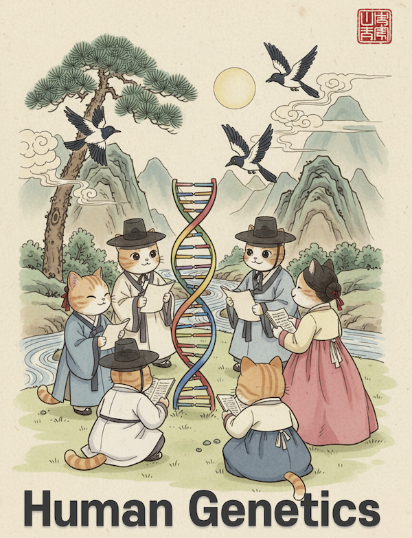

# Introduction

Welcome to **Human Genetics**

Author: *Joon-Yong An*, Korea University  

Version: Draft (Under Construction)

---

## About This Book

This textbook introduces the foundation and cutting edge of human genetics — from Mendel's early concept of *heritable factors* to the modern era of genome sequencing and large-scale cohort discovery. It is designed for undergraduate students in biology and biomedical sciences, particularly those interested in pursuing careers as data scientists in large-scale genomics for human disorders.

The field of genetics has been rapidly transformed by next-generation sequencing, large-scale biobank cohorts, and international data sharing initiatives. These advances now allow us to revisit traditional genetic concepts with fresh perspectives and test long-standing models and principles against comprehensive empirical evidence. This textbook takes a broad approach to cover the essential topics that undergraduate students need to master, integrating classical genetic theory with contemporary discoveries and methodologies.

Rather than focusing primarily on model organisms or molecular genetics from a molecular biology perspective, this book centers on the key concepts and emerging insights specific to human genetics. Students will not only learn the facts of genetics, but also develop the evolving perspectives that have shaped — and continue to reshape — our understanding of human heredity and disease.

**Please note that chapters are currently being written and improved. The complete version is expected to be finished by January 2026.**

---

## Table of Contents

* [Getting started](getting-started.md)

## Part 1. The Human Genome Project and NGS
* [Introduction](part1/introduction.md)
* [Chapter 1. The Human Genome Project](part1/chapter1.md)
* [Chapter 2. T2T Genome Project](part1/chapter2.md)
* [Chapter 3. CHM13 Cell Line](part1/chapter3.md)
* [Chapter 4. Human Pangenome Reference Consortium](part1/chapter4.md)
* [Chapter 5. Next-Generation Sequencing](part1/chapter5.md)
* [Chapter 6. NGS Application](part1/chapter6.md)
* [Chapter 7. Annotation & Database](part1/chapter7.md)

## Part 2. Mendelian Genetics in NGS
* [Introduction](part2/introduction.md)
* [Chapter 8. Genetic Variant](part2/chapter8.md)
* [Chapter 9. Transmission](part2/chapter9.md)
* [Chapter 10. Dominant Allele](part2/chapter10.md)
* [Chapter 11. Haploinsufficiency](part2/chapter11.md)
* [Chapter 12. Recessive Allele](part2/chapter12.md)
* [Chapter 13. Structural Variation](part2/chapter13.md)

## Part 3. Polygenic and Genetic Architecture
* [Introduction](part3/introduction.md)
* [Chapter 14. Additive and Dominant Allele](part3/chapter14.md)
* [Chapter 15. Polygenic Model](part3/chapter15.md)
* [Chapter 16. Heritability](part3/chapter16.md)
* [Chapter 17. Partioned Variance](part3/chapter17.md)
* [Chapter 18. GWAS](part3/chapter18.md)
* [Chapter 19. Genetic Architecture](part3/chapter19.md)

## Part 4. Recombination, Linkage and Population
* [Introduction](part4/introduction.md)
* [Chapter 20. Allele Frequency](part4/chapter20.md)
* [Chapter 21. Population Structure](part4/chapter21.md)
* [Chapter 22. Discovery of Linkage](part4/chapter22.md)
* [Chapter 23. Linkage in NGS era](part4/chapter23.md)
* [Chapter 24. Data Type for Alleles and Population](part4/chapter24.md)

## Part 5. Variant to System
* [Introduction](part5/introduction.md)
* [Chapter 25. Forward Genetics](part5/chapter25.md)
* [Chapter 26. Reverse Genetics](part5/chapter26.md)
* [Chapter 27. CRISPRa in human disorder](part5/chapter27.md)
* [Chapter 28. Gene Regulation](part5/chapter28.md)
* [Chapter 29. Methods and Applications](part5/chapter29.md)
* [Chapter 30. QTL](part5/chapter30.md)