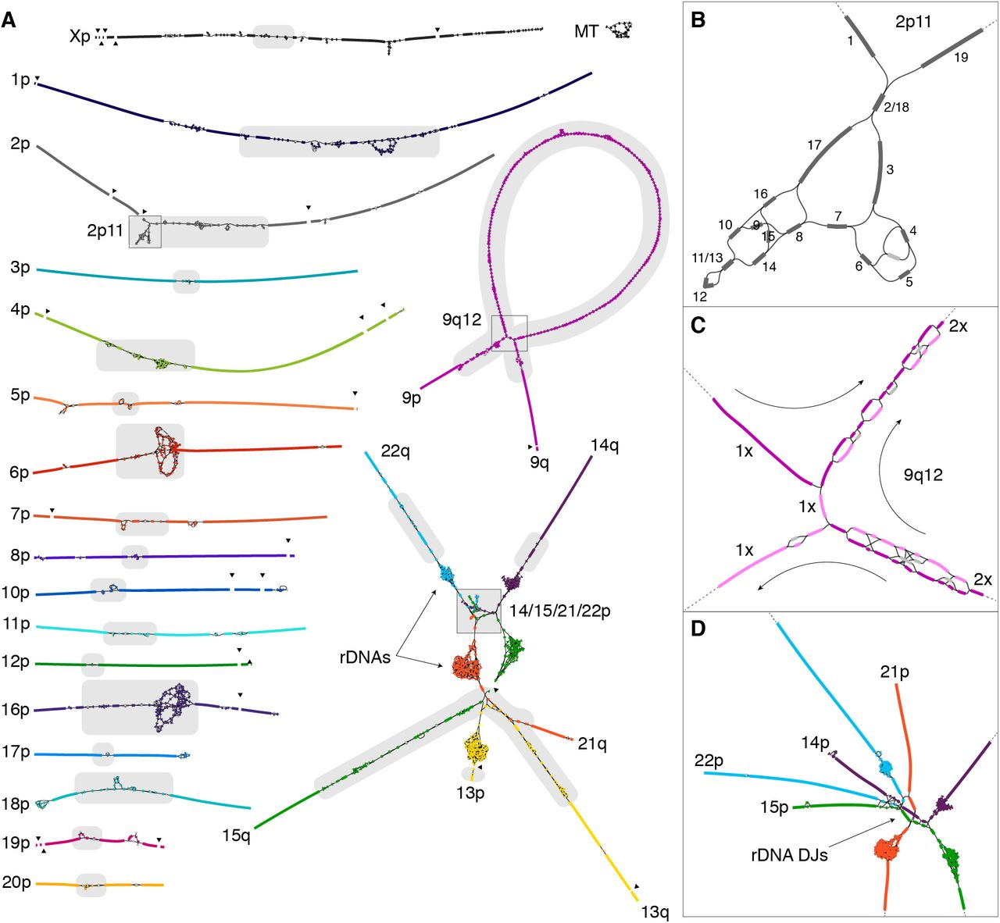
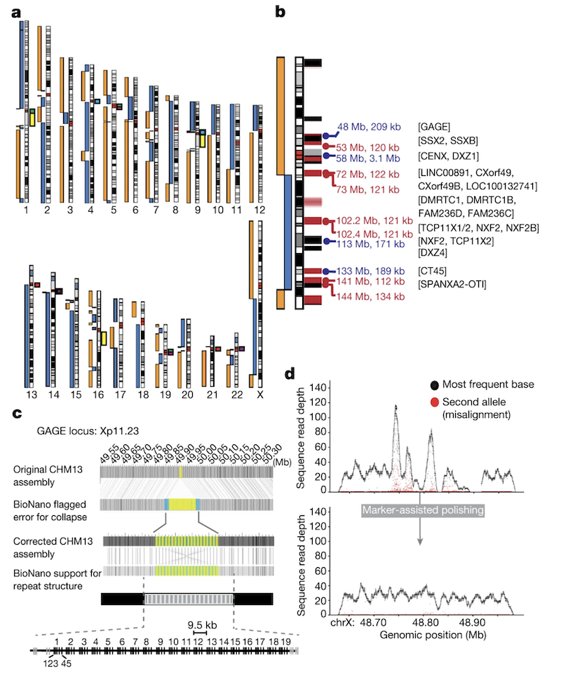
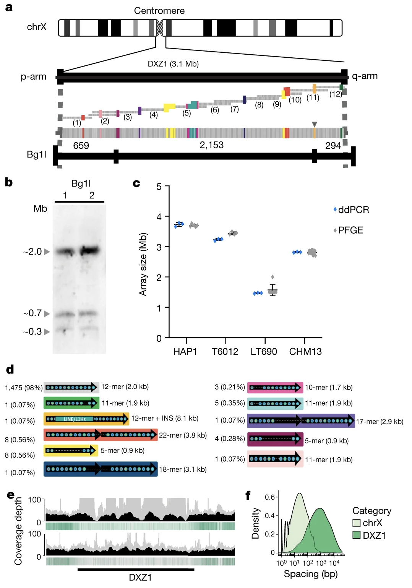
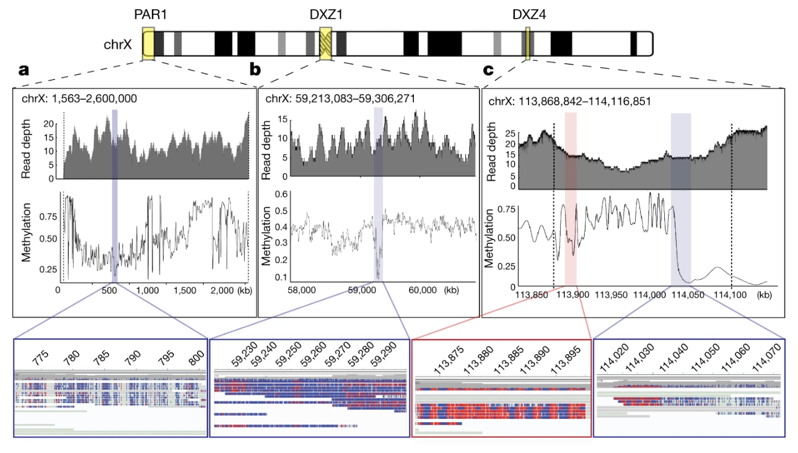
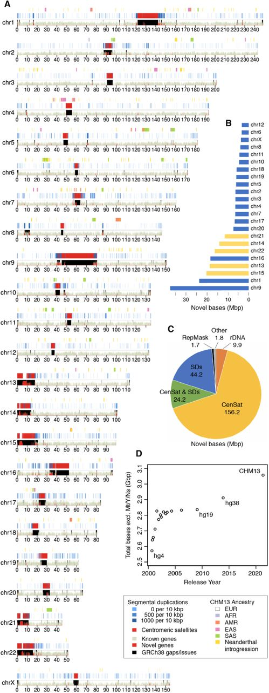
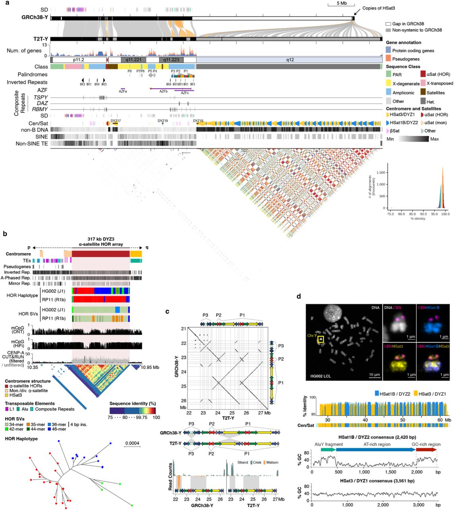

# Chapter 2. The Telomere-to-Telomere Genome Project

When the Human Genome Project (HGP) announced its completion in 2003, it was celebrated as a historic milestone. But here's something surprising: the "complete" human genome wasn't actually complete. About 8% of our genome remained unsequenced—not because scientists didn't want to sequence it, but because the technology at the time simply couldn't handle certain regions.

Think of it like trying to assemble a jigsaw puzzle where some pieces are nearly identical. Early sequencing technologies read short fragments of DNA (around 100–200 base pairs), which worked well for most of the genome. But in highly repetitive regions—where the same sequence appears over and over—these short reads couldn't tell one repeat from another. It's like having dozens of identical puzzle pieces and not knowing where each one goes.

The missing regions weren't random leftovers. They included some of the most functionally important parts of our chromosomes: **centromeres** (the central structures that help separate chromosomes during cell division), **telomeres** (the protective caps at chromosome ends), and **ribosomal DNA arrays** (genes that make the machinery for protein production). These gaps limited our understanding of chromosome stability, cell division, and even how genetic diseases develop.

In 2022, the **Telomere-to-Telomere (T2T) Consortium** changed this. They produced the first truly complete human genome sequence, called **T2T-CHM13**, covering all 3.055 billion base pairs from one end (telomere) to the other end (telomere) of every chromosome—hence the name. This achievement added about 200 million base pairs of new sequence and revealed 1,956 previously unknown gene predictions, 99 of which are predicted to be protein coding ([Nurk et al. 2022, Science](https://pmc.ncbi.nlm.nih.gov/articles/PMC9186530/)).

---

## What Made T2T-CHM13 Possible?

Two major advances enabled the T2T project to succeed where earlier efforts had failed: **new sequencing technologies** and **a special cell line**.

### The Technologies

The T2T Consortium combined several cutting-edge technologies:

- **PacBio HiFi sequencing**: This technology reads much longer DNA fragments—around 20,000 base pairs (20 kb)—with high accuracy. These longer reads can span multiple repeats, making it possible to distinguish one repeat from another.

- **Oxford Nanopore ultra-long-read sequencing**: These reads can exceed 100,000 base pairs, allowing scientists to read through even longer repetitive regions in a single pass.

- **Supporting methods**: Additional techniques like **Illumina short-read sequencing** (for error correction), **Hi-C** (which maps how DNA folds in 3D space), **Bionano optical mapping** (which creates a physical map of the genome), and **Strand-seq** (which tracks which DNA strands came from each parent) all helped ensure accuracy.

### String Graphs: A Tool for Assembly

The assembly process used a **high-resolution string graph**—a powerful computational approach that helped resolve the most complex repetitive regions (see Figure 2 in Nurk et al., 2022). 



**Figure: CHM13 String Graph**. *This diagram shows how the T2T-CHM13 genome was assembled using a string graph approach. Each line represents a DNA sequence, and connections show where sequences overlap. The tangled regions reveal highly repetitive areas like the ribosomal DNA arrays and centromeric satellites. Source: Nurk, S. et al. (2021). The complete sequence of a human genome. bioRxiv. https://doi.org/10.1101/2021.05.26.445798. License: CC-BY 4.0.*


Unlike traditional linear reference genomes that represent a single sequence, a string graph represents DNA as a network where nodes are DNA sequences and edges show how they connect. Think of it like a subway map showing multiple routes between stations—the graph displays all possible connections, then long reads help scientists determine the correct path through repetitive regions.

This approach was critical for handling repeats: when you have many identical DNA sequences (like in centromeres), a linear approach gets confused about which piece connects where. The graph shows all possibilities, and ultra-long reads spanning the repeats reveal the correct connections. The final T2T-CHM13 assembly achieved an exceptionally high accuracy with an error rate of just **1 mistake per 10 million bases**.

While T2T-CHM13 is presented as a linear sequence (because it represents one individual), the future of genomics is moving toward **pangenome references** that better capture human genetic diversity across populations.

---

## The Special Cell Line: CHM13

The T2T project used DNA from a unique cell line called CHM13, which came from a **complete hydatidiform mole**—a rare type of tissue that forms when an egg without genetic material is fertilized by a sperm that duplicates its own genome. This means CHM13 has two identical copies of each chromosome from the father and none from the mother.

Why does this matter? In a typical human genome, you inherit one set of chromosomes from each parent, making assembly more complex because you have to distinguish between similar but not identical sequences. CHM13's duplicated genome simplified assembly—it's like solving a puzzle where you know matching pieces should be identical. However, CHM13 lacked a Y chromosome, which remained the last piece of the puzzle.

---

## The First Complete Human Chromosome: X (2020)

While the full T2T-CHM13 genome was announced in 2022, the project achieved its first major milestone in **2020 by completing the human X chromosome**—the first chromosome to be assembled telomere-to-telomere with no gaps ([Miga et al. 2020, Nature](https://www.nature.com/articles/s41586-020-2547-7)).

### Why Start with X?

The research team chose the X chromosome as their first target for several strategic reasons:
- **High initial continuity**: In the whole-genome assembly, the X chromosome was broken in only **three places**—the centromere and two large segmental duplications
- **Well-characterized centromere**: The X centromere (DXZ1) had been extensively studied, providing validation benchmarks
- **Medical importance**: The X chromosome is disproportionately involved in genetic diseases
- **Technical advantage**: Using the CHM13 cell line (46,XX), they had two copies of X but no Y, making X more accessible



**Figure: Initial CHM13 X Chromosome Assembly**. *(See Figure 1b) The X chromosome was initially broken at three locations: the centromere (artificially collapsed in the assembly), a 120-kb segmental duplication (DMRTC1B), and a 134-kb segmental duplication with a paralogue on chromosome 2. Black bars indicate gaps in the GRCh38 reference, and red bars show known segmental duplications. Source: Miga, K.H. et al. (2020). Telomere-to-telomere assembly of a complete human X chromosome. Nature, 585, 79-84. https://doi.org/10.1038/s41586-020-2547-7. License: CC-BY 4.0.*

### Finishing the Breaks

The two segmental duplications were resolved by finding **ultra-long reads that completely spanned the repeats** and were uniquely anchored on both sides. This allowed confident placement in the assembly. 

The centromere presented a greater challenge—it's a **3.1 Mb array of highly repetitive alpha satellite DNA** where standard polishing methods failed. Initial attempts to polish the centromeric assembly actually **decreased quality** because reads were incorrectly placed due to the extreme repetitiveness.

### The Innovation: Marker-Assisted Polishing

The team developed a novel **marker-assisted polishing** strategy to finish the large repetitive regions:

**1. Catalogue unique markers**: They identified short (21 bp), unique sequences present only once in the genome. Remarkably, even within the DXZ1 centromeric array, there was enough variation between repeat copies to create unique markers at semi-regular intervals.

```
Genome-wide: average spacing = 66 bp between markers
DXZ1 array:  average spacing = 2.3 kb between markers
Longest gap in DXZ1: 42 kb
```

**2. Anchor reads precisely**: These markers guided the correct placement of long reads during polishing, preventing the quality degradation that occurred with standard methods.

**3. Iterative polishing**: Multiple rounds of polishing were performed with Nanopore, then PacBio, then Illumina data, each improving accuracy.


**Figure: Marker-Assisted Polishing Improves Assembly Quality**. *(See Figure 1d) Example from the GAGE locus showing coverage depth before (top) and after (bottom) marker-assisted polishing. Black dots indicate primary allele coverage, red dots show secondary alleles. The uniform coverage and elimination of secondary alleles after polishing demonstrates the dramatic quality improvement achieved by this method. Source: Miga, K.H. et al. (2020). Telomere-to-telomere assembly of a complete human X chromosome. Nature, 585, 79-84. https://doi.org/10.1038/s41586-020-2547-7. License: CC-BY 4.0.*

### Validating the X Centromere

The 3.1 Mb DXZ1 centromeric array consists of approximately 1,408 copies of a ~2,057-bp "higher-order repeat" (HOR) unit. This canonical repeat is made of 12 divergent alpha satellite monomers (each ~171 bp) arranged in a specific order. The team validated this structure through multiple independent methods:

**Experimental validation:**
- **Pulsed-field gel electrophoresis (PFGE)**: Confirmed array size of 2.87 Mb ± 0.16
- **Droplet digital PCR (ddPCR)**: Counted 1,408 ± 41 copies of the 2,057-bp repeat unit
- **Optical mapping**: Confirmed the restriction enzyme patterns matched predictions

**Sequence-based validation:**
- **PacBio HiFi reads**: Showed uniform coverage across the entire array
- **Ultra-long Nanopore reads**: Many reads spanned >100 kb of the centromere
- **Completeness check**: All HiFi reads matching DXZ1 were explained by the assembly



**Figure: Complete Structure of the 3.1 Mb X Centromere**. *The DXZ1 array consists of approximately 1,408 copies of a ~2-kb higher-order repeat unit. (a) Predicted restriction map showing the array structure. (b) Experimental PFGE Southern blots matching the in silico prediction. (c) ddPCR copy number estimates across multiple cell lines. (d) Catalogue of 33 structural variants identified within the array. Source: Miga, K.H. et al. (2020). Telomere-to-telomere assembly of a complete human X chromosome. Nature, 585, 79-84. https://doi.org/10.1038/s41586-020-2547-7. License: CC-BY 4.0.*

The assembly catalogued **33 different structural variants** within the DXZ1 array, including:
- 1,475 canonical 12-mer units (98% of all units)
- Various altered units (11-mers, 22-mers, 18-mers, etc.)
- One 8.1-kb LINE/L1 insertion

This level of detail was impossible with previous technologies and provides insights into centromere evolution and function.

### Achievements of the Complete X

The complete X chromosome assembly:
- **Closed 29 gaps** from GRCh38, totaling 1,147,861 bp of previous N-bases
- Achieved **99.991% accuracy** (estimated from BAC sequences) or **99.995%** (from Illumina data)
- Met the original **Bermuda Standards for finished genomic sequences** (>99.99% accuracy, <1 error per 10,000 bases)
- Added complete sequences of medically important gene families:
  - **GAGE** genes: 19 complete + 2 partial copies (9.5 kb each)
  - **CT45** genes: 6 copies
  - **CT47** genes: 7 copies
- Revealed the complete structure of the **pseudoautosomal regions (PAR1 and PAR2)**
- Provided the first complete view of cancer-testis gene families that were previously fragmented

### Methylation Discovery

The precisely anchored ultra-long reads enabled **chromosome-wide methylation mapping** at single-base resolution—even across complex repeats that were previously invisible to methylation studies. This revealed several surprising patterns:

- **Hypomethylation in PAR regions** (consistent with their escape from X-inactivation)
- **A 93-kb hypomethylated region within the DXZ1 centromere** (chrX: 59,217,708–59,279,205)—potentially marking the site where kinetochore proteins bind during cell division
- **Distinct methylation bands within the DXZ4 macrosatellite array**—the repeat that partitions X chromosome topology into two large superdomains



**Figure: Methylation Patterns Across the Complete X Chromosome**. *Nanopore sequencing captured methylation patterns across the entire chromosome. (a) Hypomethylation in PAR1, with detailed view showing unmethylated bases (blue) and methylated bases (red). (b) A 93-kb hypomethylated region within the DXZ1 centromere. (c) The DXZ4 macrosatellite array showing a transition from methylated to unmethylated regions. Source: Miga, K.H. et al. (2020). Telomere-to-telomere assembly of a complete human X chromosome. Nature, 585, 79-84. https://doi.org/10.1038/s41586-020-2547-7. License: CC-BY 4.0.*

The hypomethylated centromeric region was particularly intriguing. To test whether this was unique to the X or a general centromeric feature, the team manually assembled the centromere of chromosome 8 (D8Z2, ~2.02 Mb) and found a **similar hypomethylated region**, suggesting this may be a conserved feature marking functional centromeres.

### Impact

This 2020 achievement demonstrated that **completing an entire human chromosome was possible** and established the methods that would be used to complete all other chromosomes:

1. **Ultra-long-read sequencing** can span even megabase-scale repeats
2. **Marker-assisted polishing** is essential for accurate assembly of large tandem repeats
3. **Multiple orthogonal validation methods** (PFGE, ddPCR, optical mapping, HiFi reads) ensure accuracy
4. **Nanopore methylation calling** works even in highly repetitive regions

The complete X chromosome became the foundation for finishing the rest of the human genome.

---

## What's New in T2T-CHM13? (2022)

Building on the success of the X chromosome, the T2T Consortium completed the remaining chromosomes to produce the full T2T-CHM13 genome. This assembly includes several types of regions that were missing or incomplete in the previous reference genome (GRCh38):



**Figure: T2T-CHM13 Assembly Ideogram**. *(See Figure 1a) This ideogram shows what's new in T2T-CHM13 compared to GRCh38. Red areas highlight newly added regions, including complete centromeres and the short arms of five acrocentric chromosomes (13, 14, 15, 21, and 22). The track at the top shows that CHM13 has primarily European genetic ancestry. Source: Nurk, S. et al. (2021). The complete sequence of a human genome. bioRxiv. https://doi.org/10.1101/2021.05.26.445798. License: CC-BY 4.0.*

Let's explore the main types of regions that T2T-CHM13 finally completed. Each was challenging to sequence for different reasons, and each plays an important role in how our cells work.

### Region 1: Centromeric Satellite Arrays

#### What Are They?

Imagine each chromosome as having a "waist"—a pinched middle section. This is the **centromere**, and it's made of highly repetitive DNA called **satellite arrays**. In humans, the most common type is **alpha satellite DNA**, where a short sequence (about 171 base pairs) repeats hundreds or thousands of times in a row.

#### Why Do We Need Them?

During cell division, chromosomes need to be pulled apart and distributed equally to daughter cells. The centromere acts as a handle where proteins called **kinetochores** attach. These proteins connect to spindle fibers—molecular ropes that pull chromosomes to opposite ends of the dividing cell.

If centromeres don't work properly, chromosomes can be distributed incorrectly, leading to cells with too many or too few chromosomes (called **aneuploidy**). This can cause serious problems: most aneuploid embryos don't survive, and in cells that do survive, aneuploidy is linked to cancer and genetic disorders like Down syndrome.

#### What Did T2T-CHM13 Reveal?

T2T-CHM13 fully sequenced all centromeric regions, showing their complete structure for the first time. Each centromere has unique features:
- Sizes range from ~366 kb (chromosome Y) to several megabases
- Different chromosomes use different alpha satellite variants
- Some centromeres (like those on chromosomes 1, 5, and 19) share similar sequences, suggesting recent exchanges of DNA between them

### Region 2: Segmental Duplications

#### What Are They?

**Segmental duplications** are large chunks of DNA—often thousands to millions of base pairs long—that appear in multiple places in the genome. These copies are usually 90–99% identical to each other. Think of them as long paragraphs that have been copied and pasted elsewhere in a document, with only minor edits.

#### Why Do We Need Them?

Segmental duplications are major drivers of genetic diversity and evolution. Because they're nearly identical, they can accidentally pair up during DNA replication or recombination, creating **structural variants**—duplications, deletions, or rearrangements of DNA.

Some structural variants are beneficial. For example, having extra copies of the **AMY1** gene (which makes an enzyme that digests starch) helps people digest starchy foods better—populations that historically ate more starch tend to have more AMY1 copies.

But structural variants can also cause disease. Certain duplications are linked to **facioscapulohumeral muscular dystrophy (FSHD)**, a muscle-weakening disorder, and many other genetic conditions.

#### What Did T2T-CHM13 Reveal?

T2T-CHM13 added substantial amounts of segmental duplication sequence and corrected many errors in GRCh38. The complete assembly revealed that about **6.61% of the genome** consists of segmental duplications (201.93 Mb), compared to only 5.00% that could be properly identified in GRCh38. This includes many medically relevant genes that were previously incomplete or incorrectly assembled.


### Region 3: Short Arms of Acrocentric Chromosomes

#### What Are They?

Five of our chromosomes—numbers 13, 14, 15, 21, and 22—are called **acrocentric** because their centromeres are located very close to one end. This creates a short arm (called the "p" arm) and a much longer arm (the "q" arm).

These short arms contain clusters of **ribosomal DNA (rDNA)**—genes that encode **ribosomal RNA (rRNA)**, a key component of ribosomes. Ribosomes are the molecular machines that read messenger RNA (mRNA) and build proteins. Each rDNA unit is about 45,000 base pairs long and is repeated dozens to hundreds of times.

#### Why Do We Need Them?

Without ribosomes, cells can't make proteins, and without proteins, life stops. The rDNA arrays on acrocentric chromosomes cluster together to form the **nucleolus**—a structure inside the nucleus where ribosomes are assembled.

Interestingly, the number of rDNA copies varies between individuals. CHM13 has about 400 copies, but other people might have more or fewer. Scientists are still investigating whether this variation affects how efficiently cells make proteins, and whether it influences traits like growth, aging, or susceptibility to diseases like cancer.

#### What Did T2T-CHM13 Reveal?

T2T-CHM13 provided the first complete view of the short arms of all five acrocentric chromosomes, totaling **66.1 Mb** of new sequence. These regions follow a similar structure: from telomere to centromere, they contain distal repeat arrays, the rDNA array, and proximal repeat arrays including various satellite sequences. 

Remarkably, these short arms show about **98.7% identity** to each other, suggesting frequent exchange of DNA between them. This high similarity is probably because these chromosomes cluster together in the nucleolus during interphase.

---

## Completing the Y Chromosome (2023)

Although T2T-CHM13 was a major achievement, it had one limitation: CHM13 is a 46,XX cell line, meaning it has no Y chromosome. The Y chromosome had been notoriously difficult to sequence because of its complex repeat structure, including long palindromes (sequences that read the same forwards and backwards), tandem repeats, and segmental duplications. In fact, more than half of the Y chromosome was missing from GRCh38.

In 2023, the T2T Consortium completed this final piece of the puzzle by sequencing the Y chromosome from a different genome, HG002, which is commonly used for benchmarking ([Rhie et al. 2023, Nature](https://www.nature.com/articles/s41586-023-06457-y)). The resulting assembly, called **T2T-Y**, is 62,460,029 base pairs long with no gaps—adding over 30 million base pairs of sequence compared to GRCh38-Y.



**Figure: Complete Structure of the Human Y Chromosome**. *(See Figure 1a) This comprehensive view shows alignment of T2T-Y to GRCh38-Y, locations of protein-coding genes with clusters of ampliconic genes highlighted, organization of palindromic sequences and inverted repeats, and detailed structure of centromeric and satellite DNA regions. The bottom panel shows a dotplot revealing the highly repetitive nature of this chromosome. Source: Rhie, A. et al. (2022). The complete sequence of a human Y chromosome. bioRxiv. https://doi.org/10.1101/2022.12.01.518724. License: CC0 (US Government work).*

### What Makes the Y Chromosome Special?

The Y chromosome carries genes critical for male development and fertility:

**1. SRY**: The master gene that determines male sex

**2. Ampliconic genes**: These genes exist in multiple copies and are important for sperm production:
- **TSPY**: The largest gene family on the Y, with **45 protein-coding copies** in HG002 (compared to only 7 in GRCh38-Y)
- **DAZ**: Four copies involved in sperm production
- **RBMY**: 34 copies, also critical for spermatogenesis

**3. AZF regions** (Azoospermia Factors): Three regions (AZFa, AZFb, AZFc) where deletions can cause male infertility

### The Y Centromere

Like other chromosomes, the Y has a centromere, but T2T-Y revealed unique features:


**Figure: Structure of the T2T-Y Centromere**. *(See Figure 1b) The Y centromere spans 366 kb and consists of the DYZ3 alpha satellite array with three different variants, no transposable elements within the main array, two regions of hypomethylation where CENP-A proteins bind, and a dotplot showing that the repeat units are 99.5-100% identical, demonstrating extreme homogeneity. Source: Rhie, A. et al. (2022). The complete sequence of a human Y chromosome. bioRxiv. https://doi.org/10.1101/2022.12.01.518724. License: CC0 (US Government work).*

The centromere spans 366 kb and consists of highly similar alpha satellite repeats. Interestingly, the T2T-Y centromere shows **two distinct hypomethylated regions** where kinetochore proteins bind—a pattern also seen in some other chromosomes.

### The Heterochromatic Region (Yq12)

Perhaps the most mysterious part of the Y chromosome is Yq12, the large heterochromatic region on the long arm that was almost entirely missing from GRCh38 (represented as a single 30+ megabase gap). T2T-Y finally revealed what's inside: over **30 million base pairs** of alternating blocks of two satellite families:

- **DYZ1 (HSat3)**: Blocks ranging from 80 kb to 1,600 kb (median 370 kb)
- **DYZ2 (HSat1B)**: Blocks ranging from 20 kb to 1,200 kb (median 230 kb)


**Figure: The Mysterious Yq12 Region Revealed**. *(See Figure 1d) Fluorescence microscopy images show the Y chromosome with different colored probes. A map showing 86 large blocks alternating between DYZ2 and DYZ1, with nearly all repeat units being over 98% identical to consensus. Sequence composition shows DYZ2 contains an ancient AluY fragment. A phylogenetic tree shows that AluY fragments in HSat1B cluster together, suggesting this satellite family originated on the Y. Source: Rhie, A. et al. (2022). The complete sequence of a human Y chromosome. bioRxiv. https://doi.org/10.1101/2022.12.01.518724. License: CC0 (US Government work).*

These satellite blocks show evidence of recent duplication events—some duplications span up to 5 megabases and include multiple DYZ1 and DYZ2 blocks. Interestingly, **HSat1B is almost unique to the Y chromosome** and the short arms of acrocentric chromosomes, while HSat3 is found on many chromosomes.

---

## Quick Reference: Complex Genomic Regions

| **Region** | **What It Is** | **Why It Matters** | **Why It Was Hard to Sequence** | **Size in T2T** |
|------------|----------------|-------------------|----------------------------------|-----------------|
| **Centromeric Satellite Arrays** | Repetitive DNA (171-bp alpha satellite repeats) at the chromosome's central "waist" | Acts as a handle for proteins to pull chromosomes apart during cell division; errors can cause aneuploidy, cancer, or developmental disorders | Short reads couldn't distinguish between identical repeats; long reads (20–100+ kb) finally resolved them | Varies by chromosome; Y centromere is 366 kb; X centromere is 3.1 Mb |
| **Segmental Duplications** | Large DNA chunks (thousands to millions of bp) copied across the genome with 90–99% similarity | Drive genetic diversity through structural variants; can affect traits (e.g., starch digestion) or cause disease (e.g., muscular dystrophy) | Near-identical sequences confused short-read technology; long reads distinguished them and revealed true variation | 6.61% of genome (201.93 Mb) vs 5.00% in GRCh38 |
| **Short Arms of Acrocentric Chromosomes** | Repetitive rDNA arrays (45,000-bp units repeated dozens to hundreds of times) on chromosomes 13, 14, 15, 21, 22 | Encode ribosomal RNA for ribosomes; essential for protein synthesis; copy number varies between people (~400 in CHM13) | Repetitive arrays were indistinguishable with short reads; long reads and specialized assembly algorithms mapped complete copies | Total 66.1 Mb across all five chromosomes |
| **Y Chromosome Heterochromatin (Yq12)** | Alternating blocks of HSat1B/DYZ2 and HSat3/DYZ1 satellite repeats | Unknown function, but shows recent structural rearrangements; highly variable between individuals | Extremely long tandem repeats spanning 30+ Mb were impossible to sequence with short reads | Over 30 Mb (was a single gap in GRCh38) |

---

## Summary: Why These Regions Matter

Before the T2T project, these regions—centromeric satellite arrays, segmental duplications, acrocentric short arms, and the Y chromosome—were often called genomic "dark matter" because they remained largely invisible to sequencing technologies. They left massive gaps in earlier reference genomes like GRCh37 (hg19) and GRCh38 (hg38).

By using long-read sequencing technologies and innovative computational methods like marker-assisted polishing, the T2T Consortium finally illuminated these regions:

- **T2T X chromosome (2020)**: First complete human chromosome, established key methods
- **T2T-CHM13 (2022)**: Completed 22 autosomes and chromosome X, adding about 200 million base pairs
- **T2T-Y (2023)**: Completed the Y chromosome, adding over 30 million base pairs

Together, these assemblies were combined to create **T2T-CHM13v2.0** (also called T2T-CHM13+Y), providing the first truly complete sequence of a human genome—all 24 chromosomes from telomere to telomere with no gaps.

These advances improve our understanding of:
- **Chromosome function**: How centromeres ensure accurate cell division
- **Genetic diversity**: How segmental duplications and structural variants contribute to differences between individuals
- **Cellular machinery**: How rDNA arrays support protein synthesis and how variation in these arrays might affect health
- **Male fertility**: How ampliconic genes on the Y chromosome function and how rearrangements can cause infertility
- **Evolution**: How satellite sequences spread between chromosomes and how the Y chromosome has changed over time
- **Epigenetics**: How methylation patterns organize across centromeres and other complex regions

These insights are already improving **variant calling** (identifying genetic differences) in large-scale studies, supporting **precision medicine** by identifying disease-causing mutations, and helping us understand **male infertility** and other Y-linked conditions.

---

## Looking Forward

The T2T assemblies represent major advances, but the work continues. Because these genomes represent specific individuals (CHM13 and HG002), they don't capture the full spectrum of human genetic diversity. That's where projects like the **Human Pangenome Reference Consortium (HPRC)** come in—by assembling genomes from hundreds of individuals from different populations, researchers are building references that reflect the true diversity of humanity.

The complete human genome isn't an ending—it's a new beginning. With these complete references, we can now:
- **Detect variants we previously missed**: Many structural variants in centromeres and segmental duplications were invisible before
- **Study chromosome function**: Complete centromeres allow us to understand how they work and why they sometimes fail
- **Improve clinical diagnostics**: Complete gene sequences help identify disease-causing mutations more accurately
- **Understand human diversity**: Comparing complete genomes from different populations reveals how humans have adapted to different environments

As sequencing technologies continue to improve and become more affordable, we'll be able to study these complex regions in even more detail, uncovering new insights into human health, evolution, and what makes us human.