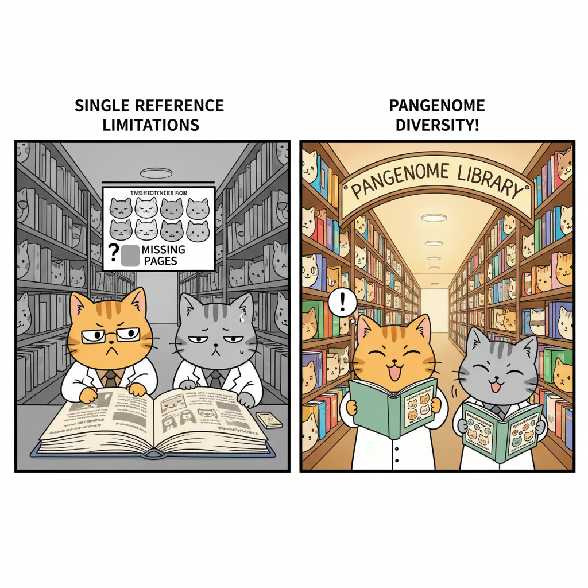

# Chapter 4. From Single Reference to Pangenome

T2T-CHM13 is a remarkable achievement—the first complete, gapless human genome. But it has a fundamental limitation: it represents only one person's DNA. Or more precisely, one father's duplicated DNA from a complete hydatidiform mole.

Why is this a problem? Because humans are incredibly diverse genetically. If you compare your genome to someone else's, you'll find millions of differences—small changes in single DNA letters (called **SNPs**, or single nucleotide polymorphisms), along with larger changes where chunks of DNA are inserted, deleted, duplicated, or rearranged. These differences are called **structural variants (SVs)**.

Here's a concrete example of why this matters. Imagine researchers are studying a genetic disease that's more common in people of African ancestry. They sequence DNA from affected individuals and compare it to the reference genome to find disease-causing mutations. But what if the reference genome is based primarily on European ancestry DNA? Many normal variants common in African populations might appear as "mutations" simply because they differ from the reference, leading to false leads. Meanwhile, real disease-causing variants that happen to match the reference might be missed entirely.

This issue is called **reference bias**—when using a single reference genome systematically misses or misinterprets genetic variation in populations that differ from that reference. It's a form of scientific bias that can affect the accuracy of genetic research and clinical diagnoses, particularly for underrepresented populations.

The solution? Don't use just one reference genome. Use many.

---

## What Is a Pangenome?

A **pangenome** is a collection of multiple complete genome sequences from diverse individuals, designed to capture the full range of genetic variation in a population. Instead of comparing everyone's DNA to a single reference, you compare it to a set of high-quality genomes representing different ancestries.

Think of it this way: if a single reference genome is like having one textbook, a pangenome is like having a library. Different books might explain the same concept in different ways, include different examples, or contain sections the others don't have. By consulting multiple books, you get a more complete understanding than you would from any single text.

In 2023, the **Human Pangenome Reference Consortium (HPRC)** released the first draft human pangenome. It includes complete, high-quality genome sequences from **47 individuals** carefully selected to represent global genetic diversity. Because humans are diploid (we have two copies of each chromosome, one from each parent), these 47 individuals provide **94 haplotypes**—94 distinct chromosome sequences.

**Figure: Genetic Diversity in the HPRC Pangenome**. The left panel shows a principal component analysis (PCA)—a way of visualizing genetic differences between individuals. Each dot represents one person, and dots that are closer together are more genetically similar. The colors indicate different ancestral populations: African (yellow/orange), Asian (purple/blue), American (red/pink), and European (green). The right panel shows where these individuals' ancestors came from geographically, including populations like Yoruba (Nigeria), Punjabi (India/Pakistan), and Peruvian.

---

## What the Pangenome Revealed

### More DNA Than We Thought

When the HPRC team assembled these 47 genomes, they made a striking discovery: collectively, these genomes contain about **119 million base pairs** of DNA that isn't in the GRCh38 reference genome at all. That's roughly 4% more DNA than the single reference showed us.

This "new" DNA isn't junk—it includes sequences in gene-rich regions (called **euchromatic** regions) where genetic variation is common. About **90 million base pairs** of this comes from structural variants—large insertions, deletions, or rearrangements that change the structure of the genome.

### Gene Copy Number Variation

One of the most important findings was the discovery of **1,115 gene duplications** that vary between individuals. Some people have multiple copies of certain genes, while others have just one or two.

**Figure: Gene Copy Number Variation**. This figure shows genes where different people have different numbers of copies. Each row is a different gene, and each column represents one of the 94 haplotypes in the pangenome. The colors indicate how many copies of each gene are present: blue means fewer copies, red means more copies. Some genes, like GPRIN2 (involved in brain function) and SPDYE2, show dramatic variation across individuals.

Why does this matter? Gene copy number can affect how much protein a cell makes. Having more copies of a gene might mean more of its protein product, which could influence traits or disease risk. For example:

- **AMY1** (the starch-digesting enzyme gene we mentioned earlier) varies from 2 to 15+ copies, affecting how efficiently people digest starchy foods.
- **GPRIN2**, shown in the figure, is involved in brain development and function. Variation in copy number might affect neurological traits.
- Genes in immune system pathways often show copy number variation, potentially affecting how different people respond to infections.

The pangenome lets us see these variations clearly for the first time, rather than assuming everyone has the same number of gene copies as the reference.

---

## How Was the Pangenome Built?

Building high-quality genomes for 47 individuals required the same advanced technologies used for T2T-CHM13:

### Sequencing Technologies

- **PacBio HiFi sequencing**: Long, accurate reads (~20,000 base pairs)
- **Oxford Nanopore sequencing**: Ultra-long reads (>100,000 base pairs)
- **Bionano optical mapping**: Physical maps showing large-scale genome structure
- **Hi-C**: Maps showing how DNA folds in 3D space
- **Illumina sequencing**: Short, highly accurate reads for error correction

### The Assembly Process

Unlike CHM13, which is functionally haploid (both chromosome copies are identical), these 47 individuals are diploid—each has two different versions of every chromosome. This makes assembly more challenging because you need to keep the maternal and paternal chromosomes separate.

The HPRC used an assembler called **Trio-Hifiasm**, which uses DNA from both parents (when available) to help distinguish maternal and paternal sequences. The result is **phased assemblies**—meaning they successfully separated the two haplotypes for each individual.

The quality is impressive. The average **NG50**—a measure of assembly contiguity that indicates how connected and continuous the assembled sequences are—is 40 million base pairs. To put that in perspective, GRCh38's NG50 is 56 million base pairs. So the pangenome assemblies, while individually slightly less contiguous than the single reference, are remarkably complete and accurate.

A quality control pipeline called **Flagger** checked each assembly and found that only 0.88% of sequences were unreliable—mostly in the extremely repetitive regions that are still challenging even with long-read sequencing.

---

## Why the Pangenome Is Better for Research

The pangenome improves genetic research in several concrete ways:

### 1. Reducing Reference Bias

When you use GRCh38 as your reference, genetic variants common in non-European populations often get flagged as "different" simply because they're not in the reference. The pangenome reduces this bias by including variants from diverse populations.

This matters for clinical genetics. If a patient of African ancestry gets their genome sequenced, the pangenome will catch disease-causing mutations that might be missed or misclassified when using GRCh38 alone.

### 2. Better Variant Detection

The HPRC showed that using the pangenome improves:

- **Small variant discovery** by 34%—meaning one-third fewer errors when identifying SNPs and small insertions/deletions
- **Structural variant detection** by 104% per haplotype—more than doubling the accuracy of finding large DNA changes

Why such a big improvement? Because when you compare a person's DNA to multiple references, you're more likely to find the right match. If someone has a structural variant that's common in their population, it's probably already represented in one of the pangenome haplotypes.

### 3. Understanding Disease-Relevant Variation

Many genetic diseases are caused by structural variants, not just single-letter changes. Conditions like:

- **Autism spectrum disorders**: Often linked to duplications or deletions of DNA segments
- **Schizophrenia**: Associated with copy number variants in multiple genes
- **Obesity**: Can be influenced by structural variants affecting metabolic genes
- **Neurological disorders**: May involve complex rearrangements in brain development genes

The pangenome's improved detection of structural variants helps researchers identify these disease-causing changes more accurately.

---

## Current Limitations and Future Directions

The draft pangenome represents major progress, but it's not yet complete:

### What's Still Missing

About 4.4% of the T2T-CHM13 genome—mostly centromeric satellite arrays and ribosomal DNA arrays—couldn't be aligned across all 47 individuals. These regions are so repetitive and variable that even long-read sequencing struggles to compare them reliably between people.

This isn't a failure of the technology; it reflects the genuine complexity of these regions. They vary dramatically between individuals, making alignment challenging. Future computational methods may help resolve these regions.

### Expanding Coverage

The HPRC's long-term goal is to sequence 350 individuals from diverse global populations, providing 700 haplotypes. This expanded pangenome will:

- Cover even more rare variants
- Better represent populations currently undersampled in genetic databases
- Provide finer resolution for studying population-specific genetic variation

---

## Comparing the Generations of Human Genome References

Let's put all of this in perspective by comparing the different reference genomes that have been developed:

| **Reference** | **Year** | **Completeness** | **Key Achievement** | **Main Limitation** |
|---------------|----------|------------------|---------------------|---------------------|
| **GRCh37/hg19** | 2009 | ~92.5% | First widely-used reference from HGP; established coordinate system for genomics | 151 million bp of gaps; errors in repetitive regions; limited diversity (mostly European ancestry) |
| **GRCh38/hg38** | 2013 | ~95% | Improved accuracy; better coverage of centromeres; includes more diverse sequences | Still has ~151 million bp of gaps; reference bias remains; errors in highly repetitive regions |
| **T2T-CHM13** | 2022 | 100% | First gapless human genome; complete centromeres, telomeres, and rDNA arrays; highest accuracy | Represents only one (duplicated paternal) genome; lacks population diversity; not yet standard in most analyses |
| **HPRC Pangenome** | 2023 | >99% per haplotype | 94 haplotypes from diverse populations; captures structural variants; reduces reference bias | Some gaps in most repetitive regions; only 47 individuals so far; computational tools still developing |

---

## Why This Matters for Your Future in Genetics

If you pursue research or clinical work in genetics, you'll be using these references. Understanding their strengths and limitations will help you interpret results correctly.

**For research**: The pangenome lets you study genetic variation more accurately, discover new disease associations, and understand how genes contribute to traits across diverse populations.

**For medicine**: As genomic sequencing becomes routine in clinics, using references that capture diversity will be essential for accurate diagnosis and personalized treatment. A mutation that looks pathogenic in GRCh38 might be a normal variant in certain populations—the pangenome helps distinguish true disease-causing changes from benign population-specific variation.

**For equity**: Using diverse references helps ensure that the benefits of genomic medicine reach everyone, not just populations that have historically been overrepresented in genetic research.

---

## The Book Analogy Revisited

Let's return to our book analogy. 

**GRCh38** is like having one authoritative textbook. It's useful, but it's based mainly on one perspective and has some pages missing (the gaps).

**T2T-CHM13** is like getting the complete, unabridged version of that textbook with all pages included. Now you can read the full story without gaps, but it's still just one perspective.

**The pangenome** is like having a library with 94 different books on the same subject, written from diverse perspectives. Some chapters are nearly identical across all books. Some sections appear in only a few books. Some books have extra chapters that others don't include. By consulting multiple books, you get a richer, more complete understanding than any single text could provide.

That's the future of human genomics—not a single reference, but a rich collection that reflects the true diversity of humanity.