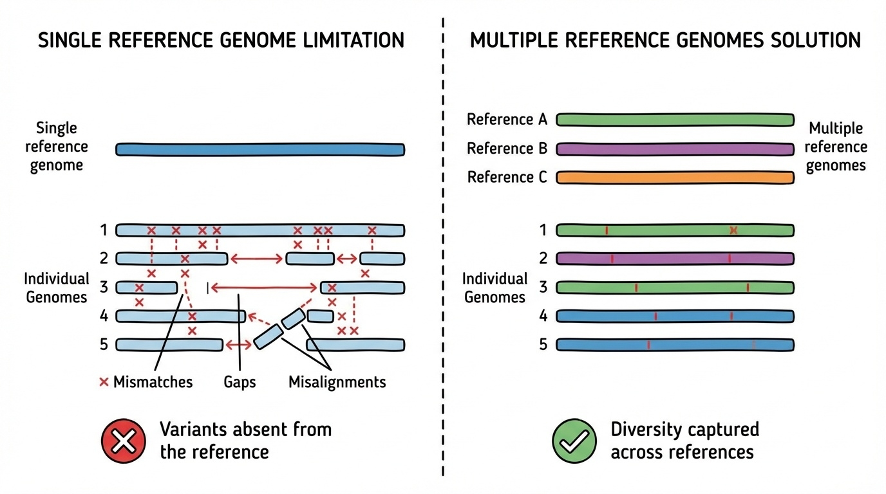
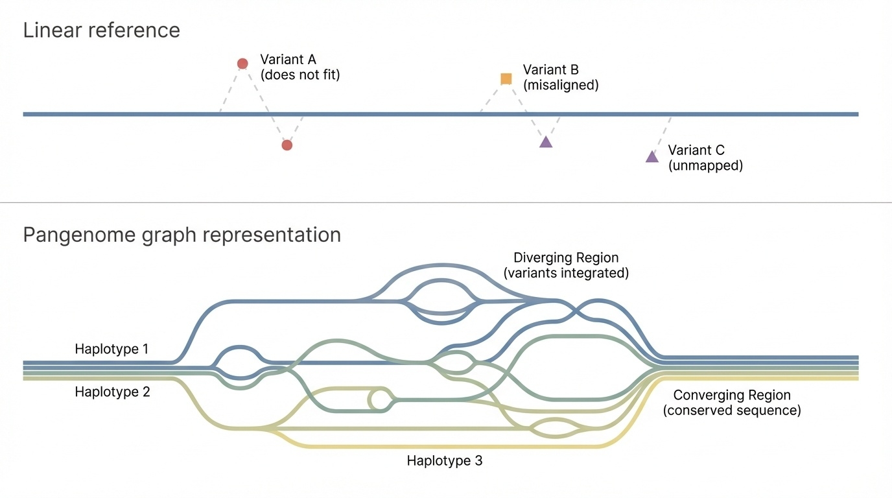
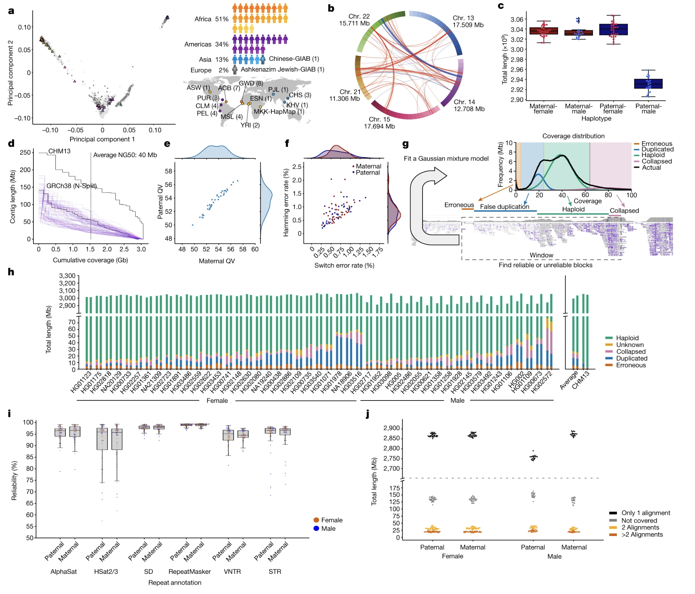
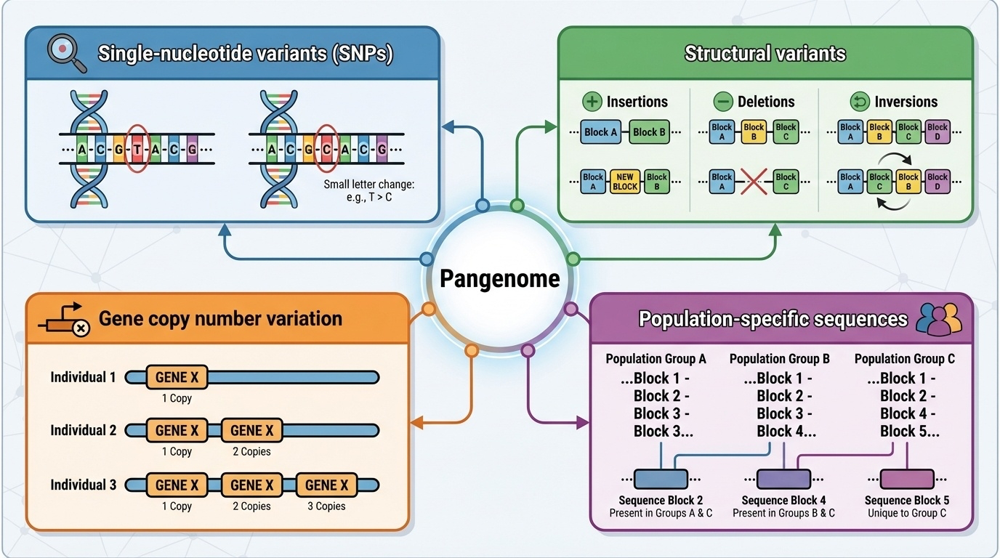
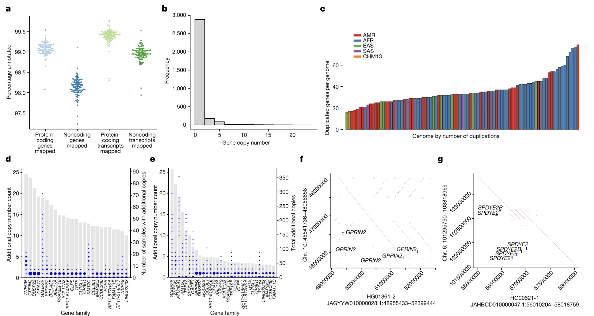
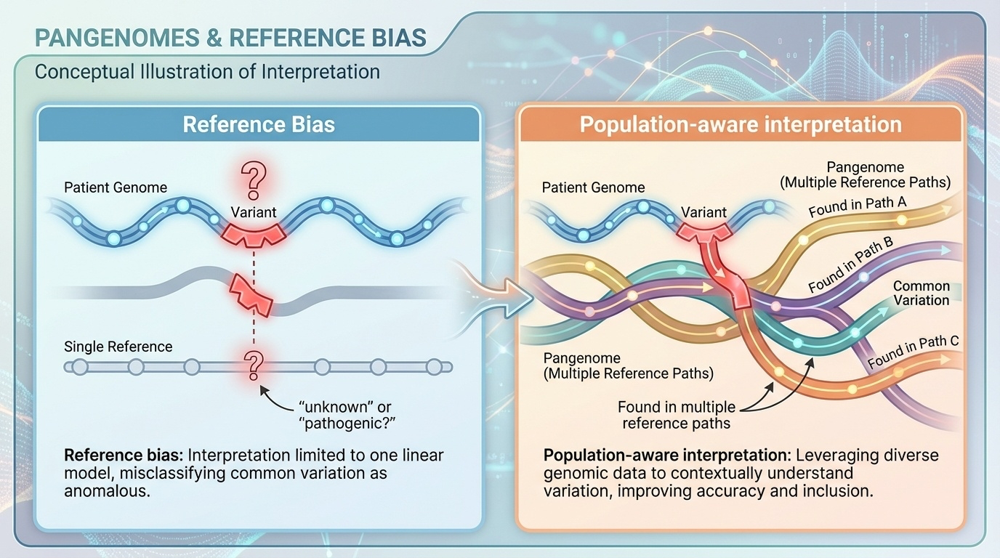

# Chapter 4. From Single Reference to Pangenome

T2T-CHM13 is a remarkable achievement—the first complete, gapless human genome. But it has a fundamental limitation: it represents only one genome source. As we discussed in Chapter 3, this isn't unique to CHM13—*any single genome* can't capture human genetic diversity.

Why does this matter? Because humans are incredibly diverse genetically. If you compare your genome to someone else's, you'll find millions of differences—small changes in single DNA letters (called **SNPs**, or single nucleotide polymorphisms), along with larger changes where chunks of DNA are inserted, deleted, duplicated, or rearranged. These larger changes are called **structural variants (SVs)**.

Here's why a single reference is problematic:

**The medication response problem**: Imagine a drug that works by binding to a specific protein. The gene for this protein has a common structural variant in East Asian populations—a small insertion that slightly changes the protein's shape. If your reference genome doesn't include this variant, you might miss why the drug works differently in these patients.

**The diagnosis problem**: A patient of African ancestry has a large deletion in a gene region. Is this a disease-causing mutation, or a normal variant common in their population? A single reference genome based on European ancestry can't tell you—but a diverse pangenome can.

The solution? Don't use just one reference genome. Use many.

**Figure 4-1. Why a Single Reference Genome Is Not Enough**. When multiple individuals' genomes are aligned to a single reference (left), many variants appear as mismatches or gaps because they differ from that one reference sequence. In contrast, when a pangenome provides multiple reference sequences (right), each individual's genome can align well to at least one reference that shares similar variants, capturing the full spectrum of genetic diversity.

---

## What Is a Pangenome?

A **pangenome** is a collection of multiple complete, high-quality genome sequences from diverse individuals, designed to capture the full range of genetic variation in a population or species. Instead of comparing everyone's DNA to a single reference, you compare it to a set of genomes representing different ancestries.

**The textbook analogy**: If a single reference genome is like having one textbook, a pangenome is like having a library. Different books might explain the same concept in different ways, include different examples, or contain chapters the others don't have. By consulting multiple books, you get a more complete understanding.

**Figure 4-2. Linear Reference vs Pangenome Graph**. A traditional linear reference genome (top) represents DNA as a single path, forcing all variants to be described as deviations from this one sequence. A pangenome graph (bottom) represents DNA as multiple possible paths through the same genomic regions, where each path corresponds to a different haplotype. Branches show where sequences diverge, and paths converge where sequences are identical. This structure naturally captures genetic diversity without forcing one sequence as the "correct" reference.

### The Human Pangenome Reference Consortium (HPRC)

In 2023, the **Human Pangenome Reference Consortium (HPRC)** released the first draft human pangenome ([Liao et al. 2023, Nature](https://www.nature.com/articles/s41586-023-05896-x)). It includes complete, high-quality genome sequences from **47 individuals** carefully selected to represent global genetic diversity:

- **African populations**: 51% (Yoruba, Gambian, Mende)
- **American populations**: 34% (Puerto Rican, Peruvian, Colombian, Mexican)
- **Asian populations**: 13% (Han Chinese, Japanese, Punjabi, Bengali)
- **European populations**: 2% (British, Finnish, Iberian)

Because humans are diploid (we have two copies of each chromosome—one from each parent), these 47 individuals provide **94 haplotypes**—94 distinct chromosome sequences.

**Figure 4-3. Genetic Diversity in the HPRC Pangenome**. *(See Figure 1a) Each dot represents one individual, positioned based on genetic similarity. Dots closer together are more genetically similar. The distribution shows that the pangenome samples were carefully selected to represent major human populations: African (51%), American (34%), Asian (13%), and European (2%). Source: Liao, W.W. et al. (2023). A draft human pangenome reference. Nature, 617, 312-324. https://doi.org/10.1038/s41586-023-05896-x. License: CC-BY 4.0.*

---

## What the Pangenome Revealed

**Figure 4-4. Types of Variation Revealed by Pangenome**. The pangenome captures multiple forms of genetic variation that were difficult to detect with a single reference: (1) single-nucleotide variants (SNPs)—individual DNA letter changes; (2) structural variants—larger insertions, deletions, and inversions; (3) gene copy number variation—different individuals carrying different numbers of gene copies; and (4) population-specific sequences—DNA segments present in some populations but absent in others. Together, these variations account for the 119 million base pairs of DNA missing from single reference genomes.

### 1. We Were Missing A Lot of DNA

When the HPRC team assembled these 47 genomes, they made a striking discovery: collectively, these genomes contain about **119 million base pairs** of DNA sequence that isn't in the GRCh38 reference genome at all. That's roughly **4% more DNA** than the single reference showed us.

This "missing" DNA isn't junk—it includes:
- **Gene sequences**: Complete genes that were missing from GRCh38
- **Regulatory regions**: DNA that controls when and where genes are turned on
- **Structural variants**: Large insertions, deletions, or rearrangements

About **90 million base pairs** of this new sequence comes from structural variants—regions where different people have different DNA structures, not just different letters in the same sequence.

### 2. Genes Come in Different Copy Numbers

One of the most important findings was the discovery of **1,115 gene duplications** that vary between individuals. Some people have multiple copies of certain genes, while others have just one or two.

**Figure 4-5. Gene Copy Number Variation in the Pangenome**. *(See panels b and c) Panel b shows most genes exist in 1-2 copies, but some genes have many more copies—up to 20+ in some individuals. Panel c shows different populations display different patterns of gene duplication. Each bar represents one genome, colored by ancestry: AMR (American, red), AFR (African, blue), EAS (East Asian, teal), SAS (South Asian, purple), and CHM13 (pink). The number and diversity of duplicated genes varies across populations, revealing variation that was invisible in single reference genomes. Source: Liao, W.W. et al. (2023). A draft human pangenome reference. Nature, 617, 312-324. https://doi.org/10.1038/s41586-023-05896-x. License: CC-BY 4.0.*

**Why does copy number matter?** Having more copies of a gene typically means more of its protein product gets made. This can affect:

**Starch digestion**: The *AMY1* gene makes an enzyme that breaks down starch. People whose ancestors ate starch-rich diets tend to have more *AMY1* copies (up to 15+), helping them digest starches more efficiently. People from populations that historically ate less starch might have only 2-4 copies.

**Immune response**: Many immune system genes show copy number variation. Having more copies might provide better protection against certain infections, while having fewer copies might reduce the risk of autoimmune diseases.

**Drug metabolism**: Genes that break down medications can vary in copy number. This affects how quickly drugs are cleared from your body—crucial for determining the right dose.

The single reference genome assumed everyone had the same number of copies. The pangenome shows the truth is much more complex.

### 3. Better Detection of Structural Variants

Structural variants are large changes in DNA structure:
- **Deletions**: A chunk of DNA is missing
- **Insertions**: Extra DNA is added
- **Duplications**: A region is copied one or more times
- **Inversions**: A DNA segment is flipped backwards

These are important because:
- **Many diseases are caused by structural variants**, not just single-letter changes
- **Structural variants affect more DNA** than all SNPs combined
- **They're harder to detect** with a single reference

The pangenome dramatically improves structural variant detection:
- **34% fewer errors** when identifying small variants (SNPs and small insertions/deletions)
- **104% improvement** in detecting structural variants—more than doubling accuracy

Why such improvement? When you compare someone's DNA to multiple references, you're more likely to find the right match. If someone has a structural variant common in their population, it's probably already in one of the 94 haplotypes.

---

## How Was the Pangenome Built?

Building high-quality genomes for 47 individuals required the same technologies used for T2T-CHM13:

### Key Technologies

- **PacBio HiFi sequencing**: Long, accurate reads (~20 kb)
- **Oxford Nanopore sequencing**: Ultra-long reads (>100 kb)
- **Hi-C**: Maps how DNA folds in 3D space, helping separate maternal and paternal chromosomes
- **Illumina sequencing**: Short, highly accurate reads for error correction

### The Challenge: Phasing

Unlike CHM13 (where both chromosome copies are identical), these 47 individuals are diploid—each has two different versions of every chromosome. The assembly must:

1. **Separate the two haplotypes**: Keep maternal and paternal chromosomes distinct
2. **Maintain accuracy**: Ensure each haplotype is correctly assembled
3. **Resolve structural variants**: Correctly place large insertions, deletions, and rearrangements

The HPRC achieved **phased assemblies**—meaning they successfully separated the two haplotypes for each individual. The quality is impressive: the assemblies are nearly as complete as T2T-CHM13, with most gaps only in the most repetitive regions (centromeres and rDNA arrays).

---

## Real-World Impact: Why This Matters

### 1. Clinical Diagnostics

**Before (single reference)**: A patient of African ancestry is found to have a 50-kb deletion in a gene. The clinical report flags it as "likely pathogenic" because it differs from GRCh38.

**With pangenome**: The same deletion is found in 30% of the African haplotypes in the pangenome. It's reclassified as "benign variant, common in African populations." The patient is spared unnecessary worry and invasive testing.

**Figure 4-6. From Reference Bias to Equitable Genomics**. Reference bias occurs when a patient's genetic variant is compared only to a single reference genome (left), leading to uncertain or incorrect clinical interpretation—variants common in certain populations may be wrongly flagged as pathogenic simply because they differ from the reference. With a pangenome (right), the same variant can be compared across multiple diverse references, revealing that it appears in many haplotypes from the patient's ancestry group. This population-aware interpretation reduces false positives and ensures more equitable genetic diagnosis across all populations.

### 2. Drug Development

Pharmaceutical companies test drugs on diverse populations, but analyze the results using a single reference genome. If a drug works differently in certain populations due to structural variants not in the reference, those variants might be missed. The pangenome helps identify these genetic factors, leading to:
- Better dose recommendations for different populations
- Understanding why some people have side effects
- Identifying who will benefit most from a treatment

### 3. Disease Research

Many diseases linked to structural variants were hard to study with single references:
- **Autism spectrum disorders**: Often caused by duplications or deletions
- **Schizophrenia**: Associated with copy number variants
- **Cardiovascular disease**: Some forms linked to structural variants in lipid metabolism genes

The pangenome's improved detection of these variants accelerates research into their causes and potential treatments.

---

## Current Limitations and Next Steps

The 2023 draft pangenome is a major advance, but it's not yet complete:

### What's Still Challenging

**The most repetitive regions** (about 4.4% of the genome):
- Centromeric satellite arrays
- Ribosomal DNA arrays  
- Some heterochromatic regions

These regions vary dramatically between individuals and are still difficult to align and compare. This isn't a failure—it reflects the genuine biological complexity of these regions.

### Future Expansion

The HPRC's long-term goal is to sequence **350 individuals** from diverse global populations, providing **700 haplotypes**. This expanded pangenome will:

- **Cover more rare variants**: Better represent genetic diversity within populations
- **Include underrepresented populations**: Current genetic databases are biased toward European ancestry; expansion will improve equity
- **Enable finer-scale studies**: Understand variation at the population and subpopulation level

Additionally, other species are getting pangenomes:
- **Plant crops** (wheat, rice, maize): To improve breeding and understand disease resistance
- **Livestock** (cattle, pigs, chickens): For agricultural improvement
- **Model organisms** (mice, fruit flies): For biomedical research

---

## Comparing Genome References: The Evolution

Let's see how genome references have evolved:

| **Reference** | **Year** | **Coverage** | **Key Achievement** | **Main Limitation** |
|---------------|----------|--------------|---------------------|---------------------|
| **GRCh38** | 2013 | ~95% | Most widely used; established standard for clinical and research genomics | ~151 Mb of gaps; represents mosaic of mostly European individuals; reference bias in diverse populations |
| **T2T-CHM13** | 2022 | 100% | First complete genome; no gaps; resolved all centromeres, telomeres, and rDNA arrays | Single genome source; doesn't capture human diversity |
| **HPRC Pangenome (draft)** | 2023 | >99% per haplotype | 94 haplotypes from diverse populations; captures structural variants; reduces reference bias | Some gaps in most repetitive regions; 47 individuals (goal: 350) |
| **HPRC Pangenome (future)** | ~2026-27 | >99% per haplotype | 700 haplotypes; comprehensive diversity; improved tools for clinical use | Most repetitive regions may remain challenging to compare |

---

## The Path Forward: From Reference to Resources

The future of genomics isn't about choosing *one* reference—it's about using the *right* reference(s) for your question:

**For studying genome structure**: T2T-CHM13 is ideal—it shows the complete architecture with no gaps.

**For clinical diagnostics**: The pangenome reduces false positives from reference bias and improves variant interpretation across populations.

**For population genetics**: The pangenome reveals patterns of variation that were invisible with single references.

**For evolutionary studies**: Comparing human pangenomes to those of other primates reveals what makes us uniquely human.

Think of it as having different maps for different purposes:
- A **detailed street map** (T2T-CHM13): Shows every street, building, landmark—the complete structure
- An **atlas with many maps** (pangenome): Shows how different cities differ, capturing diversity
- A **historical map series**: Shows how things have changed over time (evolution)

---

## Why This Matters for You

If you pursue research or medicine involving genetics, understanding these references is essential:

**For researchers**: The pangenome enables more accurate studies of genetic variation, disease associations, and trait evolution across diverse populations.

**For clinicians**: As genome sequencing becomes routine in medicine, using references that capture diversity ensures accurate diagnoses and personalized treatments for all patients, not just those of European ancestry.

**For equity**: Using diverse references helps ensure that genomic medicine benefits everyone. Historically, genetic research has focused on populations of European ancestry, creating disparities in the quality of genetic medicine available to other populations. The pangenome is a step toward fixing this inequity.

**For understanding humanity**: The pangenome shows us how humans are similar and different at the most fundamental level—our DNA. It's not just about medicine; it's about understanding what makes us human and how we adapt to different environments.

---

## Summary: One Map to Many Maps

The journey from single reference to pangenome represents a fundamental shift in how we think about genomes:

**GRCh38**: One map with gaps—useful but incomplete and biased toward certain populations

**T2T-CHM13**: One complete map with no gaps—shows the full structure but only one genome

**HPRC Pangenome**: Many complete maps—captures human diversity and reduces bias

The pangenome doesn't replace these earlier references; it complements them. T2T-CHM13 showed us what a complete human genome looks like. The pangenome shows us how humans differ.

Together, they provide the foundation for precision medicine, equitable healthcare, and a deeper understanding of human biology. As the pangenome expands to 700 haplotypes and beyond, it will become an increasingly essential resource for genomics research and clinical practice.

**The future isn't one reference genome—it's a rich, diverse collection that reflects the genetic reality of humanity.**