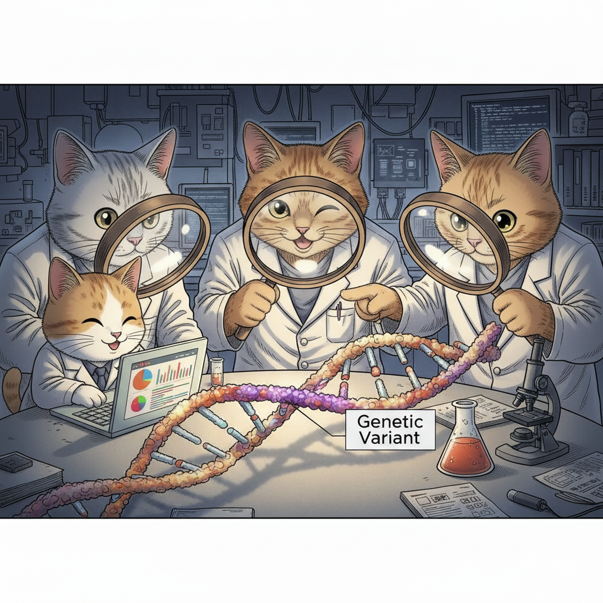

# Chapter 5. The Emergence of Next-Generation Sequencing Technologies

## The Bottleneck of Sanger Sequencing

When the Human Genome Project finished in 2003, it was an extraordinary achievement. But let's be honest about what it took: over a decade of work, contributions from sequencing centers around the world, and approximately $300 million. All of that effort produced one reference genome.

The method used was **Sanger sequencing**, developed in the 1970s by Frederick Sanger (who won his second Nobel Prize for it). Sanger sequencing is remarkably accurate—error rates of less than 0.1%—but it has a fundamental limitation: it reads one DNA fragment at a time.

**Figure: Sanger sequencing**. *This diagram illustrates how Sanger sequencing works. Source: [Microbe Notes](https://microbenotes.com/illumina-sequencing/)*

Imagine you're trying to transcribe a million books, but you can only read and copy one sentence at a time before moving to the next. That's essentially what Sanger sequencing does. For the Human Genome Project, this meant reading 3 billion letters of DNA code one fragment at a time. Even with hundreds of sequencing machines running 24/7, it took years.

After the HGP, it became clear that genomics couldn't progress at this pace. Scientists wanted to sequence not just one genome, but thousands—comparing genomes from healthy and sick individuals, studying genetic variation across populations, identifying disease-causing mutations in patients. At $300 million and a decade per genome, this was impossible.

The field needed a revolution: faster sequencing, cheaper sequencing, more sequencing. The answer came with **Next-Generation Sequencing (NGS)**.

---

## What Makes NGS "Next-Generation"?

The key innovation of NGS is simple but powerful: **parallelization**. Instead of reading one DNA fragment at a time, NGS reads millions of fragments simultaneously.

Let's return to our book transcription analogy. Instead of one person copying sentences sequentially, imagine you have a million people, each transcribing a different sentence at the same time. Suddenly, what took years can be done in days.

That's NGS. By 2007, the first NGS platforms were commercially available, and by 2014, the cost of sequencing a human genome had dropped to around $1,000—a 300,000-fold reduction in just over a decade. Today, you can sequence a genome for about $600-$1,000 in a matter of hours or days.

This dramatic cost reduction, which has outpaced even Moore's Law (the exponential improvement in computer technology), made genomics practical for large-scale research and clinical medicine.

---

## Understanding the Basics: Key Concepts in NGS

Before we dive into specific technologies, let's clarify some terms you'll encounter throughout this chapter and in genomics research.

### Sequencing Reactions and Reads

When we sequence DNA, we break it into fragments and determine the order of bases (A, C, G, T) in each fragment. Each successfully sequenced fragment produces a **read**—literally, a "reading" of that fragment's sequence.

Different technologies produce different **read lengths**:
- Illumina (a common NGS platform) produces reads of 50–300 base pairs
- PacBio Revio produces reads of ~15,000–20,000 base pairs
- Oxford Nanopore can produce reads exceeding 1 million base pairs

### Coverage and Depth

Two related but distinct concepts measure how thoroughly we've sequenced a genome:

**Coverage** tells us what percentage of the target DNA (like a genome or a specific gene region) we've sequenced at all. For example, 95% coverage means we successfully read 95% of the genome, but 5% has no data—usually in very repetitive regions that are hard to sequence.

**Depth** (or coverage depth) tells us how many times, on average, each base was sequenced. If we sequence a genome at 30× depth (pronounced "30-times depth"), each base position is covered by an average of 30 different reads.

Why does depth matter? Because sequencing isn't perfect. Every technology makes occasional errors, and biological samples can contain multiple DNA molecules with slight differences. By sequencing each position multiple times, we can distinguish real genetic variants from sequencing errors through statistical confidence. A variant supported by 20 out of 30 reads is much more believable than one supported by 1 out of 2 reads.

For most applications, 30× depth is considered the minimum for reliable variant detection in humans.

### Base Quality Scores

Every base call (identifying whether a position is A, C, G, or T) comes with a **quality score** that reflects the sequencer's confidence. These are usually expressed as Q scores:

- Q20 = 99% confidence (1% error rate)
- Q30 = 99.9% confidence (0.1% error rate)
- Q40 = 99.99% confidence (0.01% error rate)

High-quality bases (Q30 or higher) are critical for reliable variant detection, especially when looking for rare mutations.

### Libraries and Adaptors

Before sequencing, DNA must be prepared into a **library**—a collection of fragments with short, known sequences called **adaptors** attached to both ends. These adaptors serve as handles that allow the sequencing machine to grab and amplify the DNA fragments. Different NGS platforms require different library preparation methods, but the concept is universal.

### Alignment and Variant Calling

Once you have millions of reads, you need to figure out where they came from in the genome. This is called **alignment** or **mapping**—computationally comparing each read to a reference genome (like GRCh38) to determine its original location.

After alignment, you can identify **variants**—positions where the sequenced DNA differs from the reference. Variants include:
- **Single nucleotide polymorphisms (SNPs)**: one-letter changes (e.g., A→G)
- **Insertions and deletions (indels)**: added or missing bases
- **Structural variants**: large-scale changes like duplications or rearrangements

---

## The NGS Technology Landscape

NGS platforms fall into two main categories: **second-generation** (short-read, high-throughput) and **third-generation** (long-read, single-molecule). Each has distinct strengths and uses.

### Illumina: The Workhorse of Genomics (Second-Generation)

**How It Works:**

Illumina sequencing uses a clever method called **sequencing by synthesis**. Here's the process simplified:

1. DNA fragments are attached to a flat surface called a **flow cell**, which contains millions of tiny spots
2. Each fragment is amplified into a cluster of identical copies (imagine making thousands of photocopies of each fragment)
3. The sequencing machine adds fluorescently labeled nucleotides one at a time. Each of the four bases (A, C, G, T) has a different colored fluorescent tag
4. A camera takes a picture after each addition, recording which color (and therefore which base) appeared at each spot
5. The fluorescent tag is removed, and the process repeats for the next base

This happens simultaneously for millions of clusters, generating billions of bases of sequence data in a single run.

**Figure: Illumina Sequencing by Synthesis (SBS)**. *This diagram illustrates how Illumina sequencing works. (Top) DNA fragments are attached to a flow cell surface and amplified into clusters through bridge amplification. (Middle) During sequencing, fluorescently labeled nucleotides are added one at a time, and a camera captures the color signal from each cluster. (Bottom) The fluorescent tag is cleaved off, allowing the next nucleotide to be added. This cycle repeats to build up the complete sequence. Source: [Microbe Notes](https://microbenotes.com/illumina-sequencing/)*

**Strengths:**
- **High throughput**: Can generate hundreds of billions of bases per run
- **Low cost**: About $600–$1,000 for a complete human genome at 30× coverage
- **High accuracy**: Error rates around 0.1%, comparable to Sanger sequencing
- **Well-established**: Widely used with mature analytical tools

**Limitations:**
- **Short reads**: Typically 150–300 base pairs, making it difficult to resolve repetitive regions or complex structural variants
- **PCR amplification**: The clustering step can introduce biases

**When to Use It:**

Illumina is the default choice for most genomics applications: whole-genome sequencing (WGS), whole-exome sequencing (WES—sequencing just the protein-coding regions), identifying SNPs and small indels, RNA sequencing, and clinical diagnostics. If you need to sequence many samples affordably and accurately, Illumina is usually the answer.

### PacBio Revio: Long Reads with High Accuracy (Third-Generation)

**How It Works:**

Pacific Biosciences (PacBio) uses **Single-Molecule Real-Time (SMRT) sequencing**. Unlike Illumina, which sequences amplified clusters, PacBio sequences individual DNA molecules in real time.

Here's the concept:

1. A single DNA polymerase enzyme (the molecular machine that copies DNA) is placed at the bottom of a tiny well called a **zero-mode waveguide (ZMW)**
2. A single DNA molecule threads through this polymerase
3. As the polymerase adds bases to the growing DNA strand, fluorescently labeled nucleotides flash briefly as they're incorporated
4. A detector at the bottom of the well records these flashes in real time, determining the sequence

**Figure: PacBio Single-Molecule Real-Time (SMRT) Sequencing**. *This diagram shows the key components of PacBio sequencing. A DNA polymerase is fixed at the bottom of a zero-mode waveguide (ZMW)—a tiny well that allows detection of just the molecules at the bottom. As the polymerase incorporates fluorescently labeled nucleotides into the growing DNA strand, brief flashes of light are detected and recorded in real time. The circular DNA template (SMRTbell) allows the polymerase to sequence the same molecule multiple times, improving accuracy. Source: [Microbe Notes](https://microbenotes.com/pacbio-sequencing/)*

The newest PacBio system, **Revio** (released in 2022), contains 25 million ZMWs per chip—25 million DNA molecules being sequenced simultaneously. The system uses improved chemistry (called SPRQ) that requires less starting DNA and achieves higher accuracy.

PacBio produces what are called **HiFi reads** (High-Fidelity reads). By sequencing each DNA molecule multiple times in a circular fashion (the DNA is formed into a loop), the technology achieves both long read length (~15,000–20,000 base pairs) and high accuracy (>99.9%, or Q30).

**Strengths:**
- **Long, accurate reads**: Resolves repetitive regions that defeat short-read sequencing
- **Structural variant detection**: Can span and accurately sequence large insertions, deletions, or rearrangements
- **Epigenetic information**: Can detect DNA methylation patterns while sequencing
- **No PCR amplification**: Sequences native DNA molecules, avoiding amplification biases

**Limitations:**
- **Higher cost**: About $500 per genome, more expensive than Illumina
- **Lower throughput**: Can't sequence as many genomes simultaneously as Illumina
- **More DNA required**: Library preparation typically needs more starting material

**When to Use It:**

PacBio excels at *de novo* genome assembly (building a genome from scratch without a reference), detecting structural variants, sequencing through repetitive regions (like centromeres and telomeres), and studying complex genetic regions. The T2T-CHM13 genome relied heavily on PacBio HiFi reads to complete previously inaccessible regions.

### Oxford Nanopore: Ultra-Long Reads and Portable Sequencing (Third-Generation)

**How It Works:**

Oxford Nanopore takes a completely different approach. Instead of using chemical or optical detection, it uses electrical current.

The concept:

1. A protein structure called a **nanopore** (a tiny hole) is embedded in a membrane
2. An electrical current flows through the pore
3. A single strand of DNA is threaded through the nanopore
4. As each base passes through, it disrupts the current in a characteristic way
5. The pattern of current changes reveals the DNA sequence

**Figure: Oxford Nanopore Sequencing Technology**. *This illustration shows how nanopore sequencing works. (Left) A nanopore protein is embedded in a membrane with an electrical current flowing across it. Motor proteins (shown in purple) control the movement of a DNA strand through the nanopore. (Right) As different nucleotides pass through the nanopore, they cause characteristic disruptions to the electrical current. These current changes (shown as different colored signals) are measured in real time and decoded by software to determine the DNA sequence. Source: [Microbe Notes](https://microbenotes.com/oxford-nanopore-sequencing/)*

**Strengths:**
- **Ultra-long reads**: Can produce reads exceeding 1 million base pairs—the longest of any sequencing technology
- **Real-time analysis**: Data streams in as sequencing happens, allowing immediate analysis
- **Portable devices**: The MinION sequencer is about the size of a USB drive and can sequence anywhere (used in Ebola outbreak monitoring, Antarctic research, even on the International Space Station)
- **No amplification or special preparation**: Can sequence native DNA with minimal processing

**Limitations:**
- **Higher error rate**: Historically 5–10%, though newer base-calling algorithms using machine learning have improved this significantly
- **Less mature technology**: Still rapidly evolving compared to Illumina or PacBio

**When to Use It:**

Nanopore shines in situations requiring rapid results, ultra-long reads, or field sequencing—outbreak monitoring, rapid clinical diagnostics, environmental sampling, resolving extremely complex genomic regions, and research where sample preparation facilities are limited. The T2T project used ultra-long Nanopore reads to span entire repetitive regions and provide scaffolding for the assembly.

---

## Comparing the Technologies

| **Platform** | **Read Length** | **Accuracy** | **Cost per Genome** | **Key Strength** | **Best For** |
|--------------|-----------------|--------------|---------------------|------------------|--------------|
| **Illumina** | 150–300 bp | ~99.9% (Q30) | $600–$1,000 | High throughput, low cost, proven reliability | Routine WGS/WES, variant calling, most clinical applications |
| **PacBio Revio** | 15,000–20,000 bp | ~99.9% (Q30) HiFi | ~$500 | Long reads + high accuracy | Genome assembly, structural variants, repetitive regions |
| **Oxford Nanopore** | Up to >1 million bp | ~95–99% (improving) | Variable | Ultra-long reads, real-time, portable | Complex regions, rapid diagnostics, field sequencing |

---

## How NGS Changed Genetics

### From Gene-by-Gene to Genome-Wide

Before NGS, sequencing a single gene in multiple patients was a major research project. NGS made it routine to sequence all ~20,000 genes (whole-exome sequencing) or the entire 3 billion base pairs (whole-genome sequencing) in thousands of individuals.

This enabled **genome-wide association studies (GWAS)**, where researchers compare genetic variants across thousands of people with and without a disease to identify risk factors. Diseases like diabetes, heart disease, schizophrenia, and hundreds of others now have known genetic risk variants identified through NGS-based GWAS.

### The Variant Catalog

NGS enabled systematic cataloging of human genetic variation. The **dbSNP** database now contains over 1.1 billion recorded variants—a comprehensive map of how humans differ genetically. This redefined our concept of genes: rather than viewing genes as fixed sequences, we now understand them as loci with many possible alleles (variant forms).

### Clinical Diagnostics

NGS brought genomic medicine from research to the clinic. Whole-exome sequencing (WES) is now a standard diagnostic tool for rare genetic diseases, successfully identifying the cause in 25–50% of cases. 

A famous early example: in 2010, researchers used WES to identify the cause of Miller syndrome in just four siblings by comparing their exomes to their healthy parents. The gene **DHODH** had never been linked to the disease before. What might have taken decades with traditional methods took months with NGS.

PacBio's long reads have further improved diagnostics by revealing structural variants and mutations in complex genomic regions that short-read sequencing misses.

### Completing the Genome

Perhaps most dramatically, NGS—specifically long-read sequencing from PacBio and Nanopore—finally completed the human genome. The T2T-CHM13 project used these technologies to fill the 8% of the genome the HGP couldn't sequence, resolving centromeres, telomeres, and other highly repetitive regions.

---

## The Economics of Sequencing

One way to appreciate NGS's impact is through cost:

- **2001** (HGP draft): ~$300 million per genome
- **2007** (first NGS platforms): ~$10 million per genome
- **2010**: ~$50,000 per genome
- **2014**: ~$1,000 per genome
- **2024**: ~$500 per genome (Illumina), ~$2000 (PacBio for research)

**Figure: The Cost of Sequencing a Human Genome Over Time**. This graph from the National Human Genome Research Institute shows the dramatic decrease in sequencing costs from 2001 to 2022. The blue line shows the actual cost per genome, while the dotted line represents Moore's Law (the rate at which computer technology improves). Notice that after 2008, when NGS technologies became widely available, sequencing costs dropped far faster than Moore's Law—a remarkable achievement. The vertical axis uses a logarithmic scale, so each step down represents a 10-fold cost reduction. Source: [NHGRI Genome Sequencing Program](https://www.genome.gov/about-genomics/fact-sheets/DNA-Sequencing-Costs-Data)

This exponential cost reduction—far faster than the improvement in computer technology (Moore's Law)—transformed genomics from an elite research endeavor to a clinical reality.

---

## Practical Considerations

When you encounter NGS data in research or the clinic, consider:

**What sequencing platform was used?** This determines read length, error characteristics, and what types of variants can be reliably detected.

**What's the coverage depth?** Higher depth (30×+) gives more confidence in variant calls, especially for rare variants or somatic mutations in cancer.

**What's the target?** Whole-genome, whole-exome, or targeted panels? Each approach has different coverage patterns and sensitivity.

**What reference genome was used for alignment?** Results aligned to GRCh38 might differ from those using T2T-CHM13 or the pangenome, especially in complex regions.

Understanding these details will make you a more sophisticated consumer and producer of genomic data—critical skills as NGS becomes ubiquitous in modern biology and medicine.

---

## Looking Forward

Sequencing technologies continue to improve. Illumina is developing longer reads and more accurate chemistry. PacBio is improving throughput and reducing costs. Oxford Nanopore is dramatically improving accuracy through better machine learning algorithms.

The next frontiers include:
- **Single-cell sequencing**: Sequencing individual cells to understand tissue heterogeneity
- **Long-read RNA sequencing**: Capturing full-length transcripts
- **Epigenetic profiling**: Mapping DNA modifications alongside sequence
- **Real-time clinical sequencing**: Same-day genome sequencing for critically ill patients

NGS didn't just make sequencing faster and cheaper—it fundamentally changed what questions we can ask and answer about genetics, disease, and human diversity. Every chapter that follows in this book builds on the foundation NGS created.