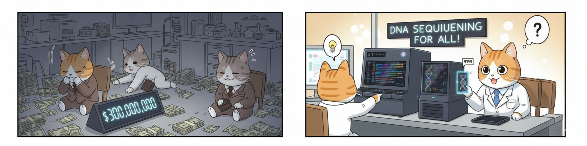

# Part 1. The Human Genome Project and Next-Generation Sequencing: A Revolution in Modern Biology

## From Invisible Factors to Readable Genomes

In the 1860s, Gregor Mendel discovered that traits like pea flower color don't blend—they remain discrete, passing from generation to generation as distinct units he called **"factors."** He couldn't see these factors or measure them directly, but by counting offspring and analyzing patterns, he deduced they must follow specific rules.

Mendel was doing genetics without seeing genes—like discovering planets by observing gravitational effects without ever seeing them through a telescope.

For over a century, genetics remained this way. Scientists could map genes to chromosomes and study mutations, but they couldn't directly read the genetic information itself. Then came the molecular biology revolution: Watson and Crick revealed DNA's structure in 1953, Sanger sequencing in the 1970s made it possible to read hundreds of DNA bases, and by the 1990s, automated sequencing could read thousands.

But reading an entire human genome—3.2 billion letters long—seemed impossible.

The **Human Genome Project** said: let's do it anyway.

---

## What This Chapter Is About

This chapter tells the story of how genetics transformed from an observational science into a digital one—how we went from inferring genes to directly reading them, base by base.

You'll learn about the technological and conceptual advances that made this revolution possible:

### The Foundation: Reference Genomes

**The Human Genome Project (2003)** provided the first map of human DNA, revealing where genes are located and creating a reference sequence for comparing individual genomes.

**Reference genome evolution** progressed from the initial GRCh37/hg19 to GRCh38/hg38, culminating in the complete, gapless **T2T-CHM13** genome in 2022—finally filling all the gaps.

**The pangenome** addresses a fundamental limitation: a single reference can't represent human diversity. The Human Pangenome Project builds a collection of genomes from diverse populations to capture the full spectrum of human variation.

### The Technology: Sequencing Platforms

**Next-Generation Sequencing (NGS)** dropped sequencing costs from $300 million per genome to under $1,000 in two decades—100,000-fold reduction, far exceeding Moore's Law.

**Platform comparison:**
- **Illumina**: Short reads (150-300 bp), high accuracy, dominates clinical applications
- **PacBio**: Long reads (10-30 kb), excellent for repetitive regions and structural variants
- **Oxford Nanopore**: Ultra-long reads (100+ kb), portable, real-time sequencing

### The Strategy: What to Sequence

**WGS vs. WES**: Should you sequence the entire genome or just protein-coding regions? Each approach has distinct advantages:

| Approach | Coverage | Cost | Best For |
|----------|----------|------|----------|
| **WES** | ~2% of genome (exons) | Lower | Mendelian diseases, clinical diagnostics |
| **WGS** | Entire genome | Higher | Structural variants, regulatory regions, research |

### The Interpretation: Making Sense of Data

**Variant annotation** adds biological context: Is this variant in a gene? Does it change the protein? Is it common or rare? Has it been seen in disease?

**Databases** provide the knowledge: dbSNP catalogs variants, gnomAD shows population frequencies, ClinVar links variants to disease.

---

## Connecting to Mendel: From Ratios to Sequences

Mendel's "factors" are DNA sequence variants. When he crossed purple and white pea plants:
- **Mendel saw**: 3 purple : 1 white ratio in offspring
- **Modern interpretation**: One DNA sequence produces pigment (purple), another has a mutation breaking the gene (white)

Today, instead of inferring genes from phenotype ratios, we read the DNA directly:

```
Mendel's approach:      Modern approach:
Purple × White          Sequence both plants
     ↓                       ↓
Count offspring        Compare DNA sequences  
     ↓                       ↓
Infer factors         Find the exact G→T mutation
     ↓                       ↓
3:1 ratio             Same 3:1 ratio explained molecularly
```

The patterns Mendel discovered remain valid. We've just moved from observing effects to observing causes.

---

## The Democratization of Genomics



**2001**: First human genome cost ~$100 million, took months  
**2024**: Genome sequencing costs ~$600-1,000, takes days

This 100,000-fold cost reduction has transformed genomics from elite research into a clinical tool:

**Medicine:**
- Diagnose rare genetic diseases (ending years of diagnostic odyssey)
- Guide cancer therapy based on tumor mutations
- Predict disease risk for early intervention
- Enable pharmacogenomics (right drug, right dose)

**Research:**
- Trace human evolution and migration
- Discover new disease genes
- Understand gene function
- Study population diversity

But this revolution required more than cheaper sequencing. It needed reference genomes to compare against, computational tools to analyze billions of bases, databases to interpret variants, and new ways of thinking about genetics as a data science.

---

## How to Approach This Chapter

This chapter differs from traditional textbooks—it tells a story of technological evolution rather than presenting concepts to memorize.

### Key Themes to Watch For

**1. Technology enables new questions**  
Once sequencing became affordable, impossible questions became routine. This pattern repeats throughout the chapter.

**2. Better references, better answers**  
The same sequencing data yields more accurate results with improved reference genomes (GRCh37 → GRCh38 → T2T-CHM13 → Pangenome).

**3. No single "right" approach**  
WGS vs. WES? Short reads vs. long reads? It depends on your question, budget, and sample. Modern genetics requires choosing the right tool for the job.

**4. We're still learning**  
Even with complete genomes, we don't fully understand what most DNA does. Interpreting non-coding variants remains challenging. The field evolves rapidly.

### Focus on Understanding

Rather than memorizing technical details, focus on:
- **What problem** each technology solved
- **What became possible** that wasn't before
- **What limitations** remain
- **When to use** each approach

---

## The Paradigm Shift

### Before HGP and NGS
- Study individual genes or small regions
- Use indirect methods (linkage analysis)
- Work with model organisms (human genetics too slow)
- Focus on simple Mendelian traits

### After HGP and NGS
- Study entire genomes simultaneously  
- Directly measure genetic variation
- Routine human genome sequencing in clinics
- Understand complex multi-gene traits
- Integrate genomics with other biological data

This shift—from studying genes one at a time to studying complete genomes—is as profound as the shift from studying individual stars to mapping entire galaxies.

Mendel's laws still apply. But now we can see those genes, read their sequences, track variants across populations, and understand how sequence differences create trait differences.

---

## Learning Objectives

By the end of this chapter, you should be able to:

1. **Explain how Mendel's "factors" connect to modern DNA variants**, understanding how the same biology can be studied at different levels

2. **Describe the Human Genome Project's impact**, including what it achieved, what remained unfinished, and why reference genomes matter

3. **Compare reference genome versions** (GRCh37 → GRCh38 → T2T-CHM13 → Pangenome) and explain why diverse references are needed

4. **Distinguish NGS platforms** (Illumina, PacBio, Nanopore) by their principles, strengths, limitations, and appropriate applications

5. **Compare WGS and WES**, knowing when each approach is appropriate for research or clinical use

6. **Explain the sequencing workflow** from DNA sample to variant calls, including library prep, sequencing, alignment, and variant calling

7. **Understand variant interpretation** using databases (dbSNP, gnomAD, ClinVar) and why population data distinguishes benign from pathogenic variants

8. **Think critically about genomic data**, recognizing that raw sequences require quality control, appropriate references, and careful interpretation

---

## Let's Begin

In 1990, scientists embarked on what seemed impossible: reading all 3 billion letters of the human genome. They didn't know exactly how they'd do it, how long it would take, or whether existing technology could achieve it.

But they knew it needed to be done.

What followed transformed biology—turning genetics from an observational science into a data science, from studying inheritance patterns to reading the inherited information directly.

This is the story of that transformation.