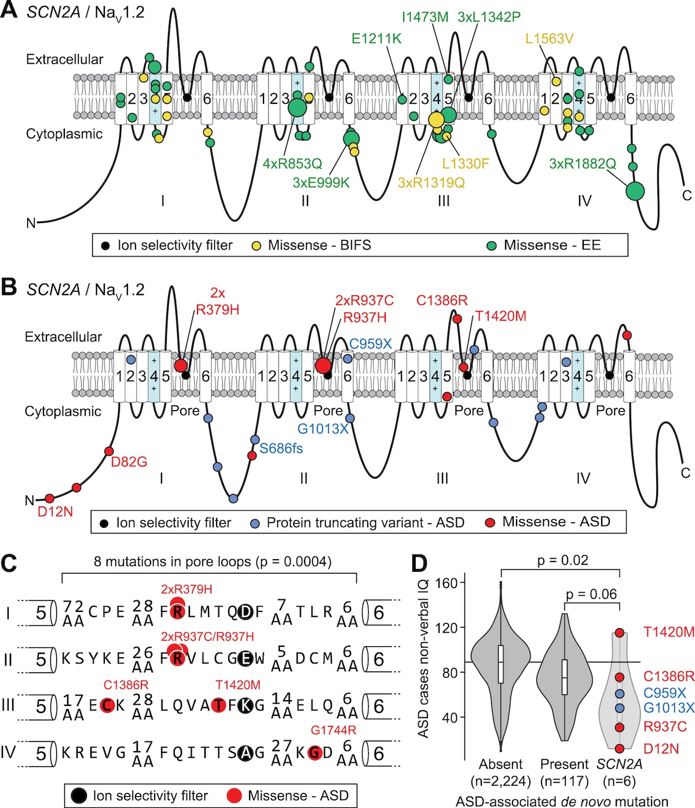
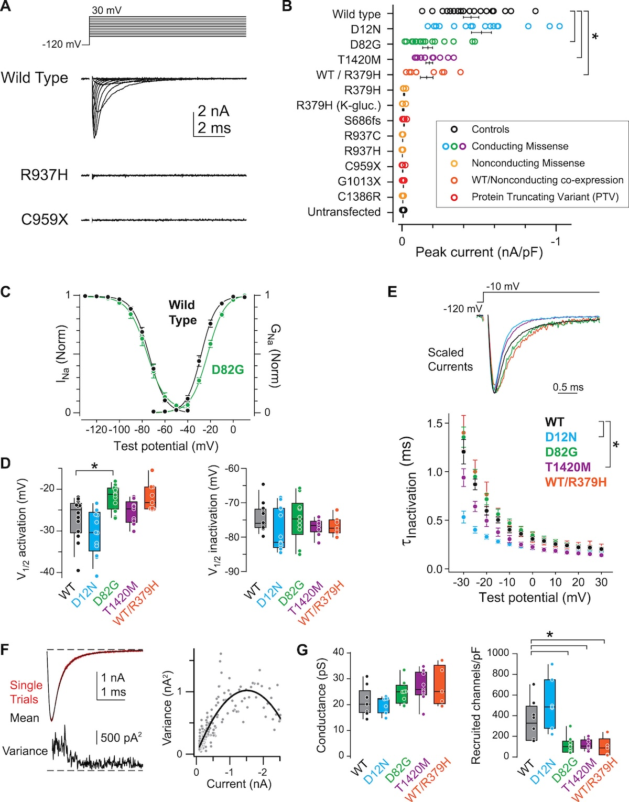
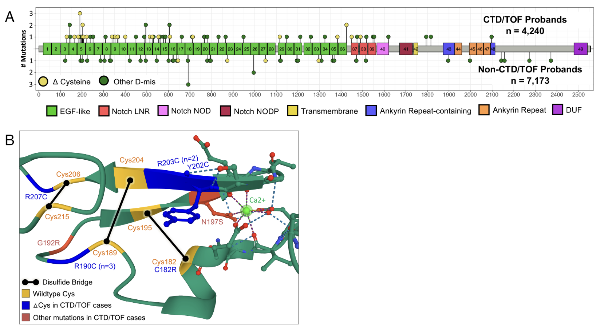
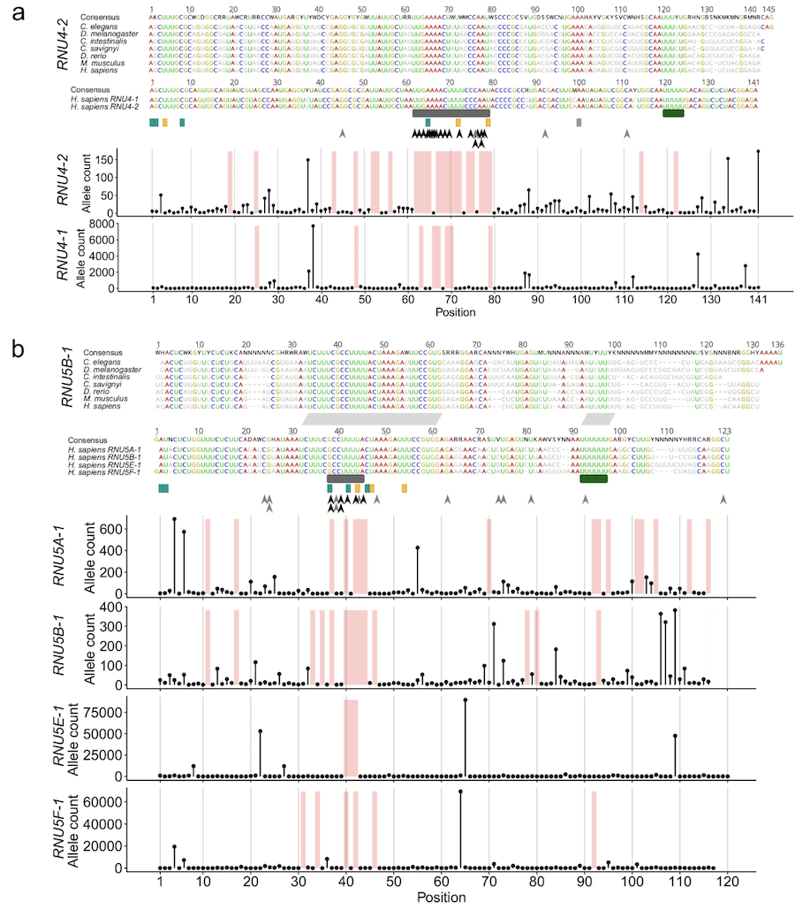

# Chapter 10. Dominant Allele in Human Disorders
When you hear "dominant allele" in genetics, you might think back to Mendel's peas—where one version of a gene masks the other. In medical genetics, dominance means something more specific: **a single mutated copy of a gene is enough to cause disease**, even when the other copy is perfectly normal. This contrasts with recessive diseases, where you need mutations in both copies to see a phenotype.
Why does one bad copy matter so much? Usually, the mutation disrupts the gene's function in a way that one good copy can't fully compensate for. **WES** and targeted sequencing have made it much easier to find these dominant alleles by letting us scan protein-coding regions (or specific non-coding regions) for rare variants that cause disease. 
This section walks through how dominant alleles cause disease, focusing on two main types of mutations: **protein-truncating variants (PTVs)** that cut proteins short, and **missense variants** that swap one amino acid for another. We'll look at real examples from Kabuki syndrome, autism, seizures, congenital heart disease, and neurodevelopmental disorders caused by mutations in small RNA genes. Each example shows how sequencing, combined with smart filtering for rare variants and predictions of which changes are harmful, helps us connect a dominant allele to a disease.
## Molecular Mechanisms of Dominant Alleles
So how does a single mutant copy—in what we call a **heterozygous** genotype (one mutant, one normal)—cause disease? Two main mechanisms:
**Protein-Truncating Variants (PTVs)**: These are mutations that chop proteins short. **Nonsense mutations** introduce a premature stop sign in the genetic code, while **frameshift mutations** shift the reading frame, scrambling everything downstream. Both produce incomplete, usually nonfunctional proteins. The result is often **haploinsufficiency**—one good copy can't make enough protein to keep things running smoothly. Think of a developmental gene: if you don't have enough of its product, critical processes during embryonic development can go wrong, leading to birth defects.
**Missense Variants**: These swap out a single amino acid in the protein. Depending on where and what gets swapped, this can have dramatic effects. Some missense mutations create a protein with a new, harmful function—a **gain-of-function**. Others produce a defective protein that gums up the works by interfering with the normal version—a **dominant-negative effect**. For instance, a missense mutation in an ion channel gene might disrupt the channel's ability to open and close properly, throwing off cellular signaling in neurons and causing neurological problems.
These mechanisms explain why dominant alleles are, well, dominant: one mutant copy can overpower the normal one, affecting everything from embryonic development to brain function to heart formation. Let's see how this plays out in specific diseases.

---

## Kabuki Syndrome: PTVs in *KMT2D*
Kabuki syndrome is a developmental disorder that shows us PTVs in action. **WES** was used to figure out what was going wrong at the genetic level, revealing that mutations in the *KMT2D* gene (formerly called *MLL2*) were the culprit—and these mutations behave as dominant alleles ([Ng et al 2010, Nature Genetics](https://pmc.ncbi.nlm.nih.gov/articles/PMC2930028/)).

### Finding *KMT2D* Mutations with WES

The study started with ten people who had Kabuki syndrome but were unrelated to each other. WES was used to sequence all the protein-coding parts of their genomes—about 1-2% of the total genome, but the part where most disease-causing mutations hide. 
To zero in on disease-causing variants, **allele frequency filtering** was applied: any variant that was common in databases like dbSNP129 and the 1000 Genomes Project was removed. The logic? If a variant causes a serious developmental disorder, it shouldn't be common in the general population. This filtering pointed straight to *KMT2D*, where novel mutations were found in nine out of ten individuals.
To confirm this wasn't a fluke, *KMT2D* was sequenced in 43 more people with Kabuki syndrome, with mutations found in 26 of them. That's pretty convincing evidence that *KMT2D* is a major player in this disease.

What kinds of mutations were found? Mostly **nonsense** and **frameshift** mutations—both PTVs. Nonsense mutations turn a "keep going" signal into a "stop here" signal, while frameshifts shift the three-letter reading frame of the genetic code, producing gibberish. The result in both cases: a truncated, useless protein instead of the full-length histone methyltransferase that *KMT2D* normally encodes.

See Figure 1 from Ng et al., which maps out where these mutations sit in the *KMT2D* gene. The gene is huge—54 exons—with several important functional domains. Of the 32 mutations shown, 20 are nonsense mutations and 7 are frameshifts. Notice how most of them cluster before the SET domain at the end of the gene, which is critical for the enzyme's methylation activity. If you cut the protein off before you get there, you lose function.

Interestingly, seven of the nine mutations in the initial group were **de novo**—they appeared spontaneously in the affected individuals and weren't present in either parent. The other two were inherited from an affected parent. Both scenarios make sense for a dominant disorder: you only need one mutant copy to have the disease.

### How It Causes Disease

The mechanism here is **haploinsufficiency**. *KMT2D* encodes a histone methyltransferase—an enzyme that adds methyl groups to histones, the proteins that DNA wraps around. This modification is like a dimmer switch for genes: it helps control which genes are turned on or off during development.

When you have a PTV in one copy of *KMT2D*, you lose about half of the enzyme. That doesn't sound too bad, but development is incredibly sensitive to gene dosage. One good copy just can't make enough enzyme to maintain normal gene expression patterns. The result? Abnormal development, particularly affecting the face, skeleton, heart, and brain—the hallmarks of Kabuki syndrome.
Look at Figure 1 again: most PTVs hit before the SET domain, meaning the truncated protein is missing the key part that does the methylation. Even if the cell tries to make protein from the mutant allele, it's useless. You're left with just the output from one functioning allele, and that's not enough.

This is textbook dominant inheritance: one mutant copy is sufficient to cause disease. The prevalence of de novo mutations explains why most cases are sporadic (parents are unaffected, but the child has the disorder). When mutations are inherited, it's from an affected parent, confirming the dominant pattern. WES, combined with careful filtering and validation, made it possible to nail down *KMT2D* as the culprit gene, showing how dominant PTVs can derail development by disrupting critical molecular processes.

---

## Autism and Seizures: Diverse *SCN2A* Variants

The *SCN2A* gene gives us a more complex story. It encodes NaV1.2, a sodium channel protein that's essential for neurons to fire properly. Mutations in *SCN2A* can cause several different neurological problems—autism spectrum disorder (ASD), benign infantile familial seizures (BIFS), and epileptic encephalopathy (EE)—depending on exactly how the mutation affects the protein. Again, we're talking about dominant alleles: one mutant copy in a heterozygous individual is enough to cause disease. **WES** was used to find these mutations, and their effects were then tested in cells to understand how they work ([Ben-Shalom et al 2017, Biological Psychiatry](https://www.biologicalpsychiatryjournal.com/article/S0006-3223(17)30041-0/fulltext)).

### Finding *SCN2A* Variants with WES

The study used WES on people with ASD, BIFS, and EE, focusing on protein-coding regions where disease-causing mutations are likely to hide. To filter out noise, **allele frequency filtering** was applied: any variant that showed up more than 10 times per million alleles (frequency > 10⁻⁵) in the ExAC database was excluded. This meant the focus was on extremely rare variants—the kind that might cause severe disease.
For **missense variants** (which change one amino acid), prediction tools like SIFT and PolyPhen were used to figure out which ones were likely to be harmful. These tools look at how important each amino acid is based on evolution—if an amino acid has been conserved for millions of years across species, changing it is probably bad news.

What was found? In ASD, about half the mutations were PTVs (52%) and half were missense variants (48%), and almost all were **de novo**—new mutations in the affected child. In BIFS and EE, the vast majority (95-96%) were missense variants. BIFS variants were often inherited from a parent who also had seizures, while EE variants were mostly de novo.

These mutations map onto the NaV1.2 protein structure in a revealing pattern. The protein has four repeating domains (I-IV), each with six transmembrane segments. ASD variants (PTVs in blue, missense in red) cluster around the pore loop—the channel's ion selectivity filter. BIFS variants (yellow) and EE variants (green) cluster in the voltage sensor region (segments 4-5), which controls whether the channel opens or closes.
The named variants like C959X (a nonsense mutation causing ASD) and R1319Q (a missense mutation causing BIFS) show how different types of mutations in different locations lead to different diseases.



**Figure: SCN2A/NaV1.2 genotypes and phenotypes**. *This figure maps SCN2A variants onto the NaV1.2 sodium channel protein structure. PTVs (blue) and missense variants (red) associated with ASD, missense variants for BIFS (yellow) and EE (green) are shown across the four protein domains (I-IV). Circle size indicates the number of individuals carrying each variant. ASD variants cluster in the pore loop region (the channel's ion selectivity filter), while BIFS and EE variants cluster in the voltage sensor segments. This location difference explains why they cause different diseases—ASD variants reduce channel function, while BIFS/EE variants increase it. Source: Ben-Shalom, R. et al. (2017). Opposing Effects on NaV1.2 Function Underlie Differences Between SCN2A Variants Causing Intellectual Disability or Infantile Seizures. Biological Psychiatry. https://www.biologicalpsychiatryjournal.com/article/S0006-3223(17)30041-0/fulltext. License: CC-BY-NC-ND.*

### How They Cause Disease

Here's where it gets interesting. The study didn't just find the mutations—it tested them in cells to see what they actually do to the channel.
In ASD, PTVs like C959X cause **haploinsufficiency**: you lose half your functional sodium channels because one allele makes a truncated, useless protein. But the ASD missense variants (like R379H in the pore loop) also reduce channel function, just through a different mechanism—**loss-of-function**. The mutant channel either doesn't conduct sodium ions properly or doesn't get to the cell surface. Either way, neurons don't fire as readily as they should during development, which apparently contributes to ASD.

In contrast, BIFS and EE missense variants (like R1319Q in the voltage sensor) cause **gain-of-function**: the mutant channel is hyperactive. It opens too easily or stays open too long, making neurons fire excessively. The result? Seizures. The difference between BIFS (relatively mild seizures in infancy that usually go away) and EE (severe, treatment-resistant seizures) seems to relate to how much the channel is hyperactivated and when in development the mutation exerts its effects.

These opposing effects are illustrated schematically below. In ASD (top), PTVs and loss-of-function missense variants reduce sodium current, decreasing neuronal excitability. In BIFS and EE (bottom), gain-of-function missense variants increase sodium current, boosting excitability and causing seizures.



**Figure: Schematic of NaV1.2 channel function in SCN2A variants**. *In ASD, PTVs and missense variants reduce or eliminate sodium current (haploinsufficiency or loss-of-function), decreasing neuronal excitability. In BIFS and EE, missense variants increase sodium current (gain-of-function), making neurons hyperexcitable and causing seizures. Same gene, opposite functional effects, different diseases. Source: Ben-Shalom, R. et al. (2017). Opposing Effects on NaV1.2 Function Underlie Differences Between SCN2A Variants Causing Intellectual Disability or Infantile Seizures. Biological Psychiatry. https://www.biologicalpsychiatryjournal.com/article/S0006-3223(17)30041-0/fulltext. License: CC-BY-NC-ND.*

Why are these dominant alleles? Because one mutant copy is enough to cause disease. In ASD, you lose half your channel function from PTVs, or the mutant missense protein disrupts things even in the presence of the normal protein. In BIFS and EE, the hyperactive mutant channels throw off the balance even though you still have normal channels from the other allele. The mutant allele dominates the cellular phenotype.

The prevalence of de novo mutations in ASD and EE explains why these are usually sporadic cases—the parents don't have the mutation. In BIFS, inherited mutations show classic dominant inheritance: an affected parent passes it to a child. WES, combined with functional testing in cells, revealed how the same gene can cause different diseases depending on where and how it's mutated—a great example of genetic complexity.


---

## Congenital Heart Disease: Multiple Dominant Genes

Congenital heart disease (CHD)—structural heart defects present at birth—can be caused by mutations in many different genes. A massive study looked at over 11,000 people with CHD using **WES** and targeted sequencing, identifying 60 genes where rare variants significantly increased disease risk ([Sierant et al 2025, PNAS](https://www.pnas.org/doi/10.1073/pnas.2420343122)).

### Finding CHD Genes with WES and Targeted Sequencing

The study analyzed 11,555 people with CHD, using WES to scan the whole exome and targeted sequencing to zoom in on 248 genes already suspected of causing heart defects. **Allele frequency filtering** focused on rare variants—those with frequencies below 10⁻⁵ (one in 100,000 or rarer) in gnomAD and BRAVO databases. For missense variants, SIFT and PolyPhen were used to predict which ones were likely damaging. This effort identified 60 genes with significant burdens of PTVs and damaging missense variants, explaining about 10% of CHD cases. About half of the damaging variants were **de novo** (new mutations in the child), and half were inherited from a parent. Three genes stood out as major contributors: *NOTCH1*, *KMT2D* (the same Kabuki syndrome gene—it also causes heart defects), and *MYH6*. *NOTCH1* missense variants were particularly common in tetralogy of Fallot, a specific type of CHD. *KMT2D* PTVs caused both heart and neurodevelopmental problems. *MYH6* missense variants often caused isolated heart defects without affecting the brain.

The relationship between CHD and neurodevelopmental disorders (NDD) varies dramatically across these 60 genes. Some genes, like *MYH6*, rarely cause NDD (about 4% risk)—the mutation mainly affects the heart. Others, like *CHD7*, almost always cause NDD in addition to heart defects (95% risk). *NOTCH1* and *KMT2D* fall in between. This spectrum makes sense: some genes are expressed mainly in the heart, while others are critical for both heart and brain development.



**Figure: CHD genes and neurodevelopmental disorder risk**. *This figure shows the relationship between the 60 identified CHD genes and the risk of neurodevelopmental disorders (NDD). Genes like MYH6 (around 4% NDD risk) primarily affect the heart through missense variants that disrupt cardiac myosin function. At the other end, genes like CHD7 (around 95% NDD risk) cause syndromic CHD with severe neurodevelopmental problems through PTVs that impair chromatin regulation. NOTCH1 (missense variants in signaling domains) and KMT2D (PTVs causing haploinsufficiency) fall in between, affecting both cardiac and neural development. This demonstrates how dominant alleles in different genes can have varying effects beyond the heart, depending on where and when the gene is normally active. Source: Sierant, M.C. et al. (2025). Congenital heart disease genetics uncovers context-dependent organization between genome and phenome. PNAS. https://www.pnas.org/doi/10.1073/pnas.2420343122. License: CC-BY.*

### How They Cause Disease
The three main mechanisms mirror what we've seen before:

**Haploinsufficiency** (*KMT2D*): PTVs in *KMT2D* produce truncated, nonfunctional histone methyltransferases. One working copy can't make enough enzyme to properly regulate the genes needed for heart development. *KMT2D* mutations also frequently cause neurodevelopmental problems because the same chromatin regulation is critical in the developing brain.

**Dominant-negative effects** (*NOTCH1*): Many *NOTCH1* missense variants, especially those affecting cysteine residues in EGF-like domains, produce defective signaling proteins. These mutant proteins interfere with normal NOTCH signaling, which is essential for cardiac cell differentiation during heart formation. Even with normal NOTCH1 protein from the other allele, the defective protein disrupts the pathway enough to cause structural heart defects like tetralogy of Fallot.

**Altered protein function** (*MYH6*): Missense variants in *MYH6*, which encodes cardiac myosin, likely alter the motor protein's ability to contract properly. The exact mechanism might involve gain-of-function (abnormal contractile activity) or dominant-negative effects (interfering with normal myosin), but either way, one mutant copy is enough to disrupt heart muscle development and function.

The statistical enrichment of PTVs and damaging missense variants across these 60 genes confirms that a single mutant allele significantly increases CHD risk. In a heterozygous individual, one bad copy of *KMT2D*, *NOTCH1*, or *MYH6* is sufficient to disrupt heart development. De novo mutations explain many sporadic CHD cases, while inherited mutations (especially in *MYH6*) show classic dominant inheritance patterns.
This study demonstrates the power of large-scale sequencing: by analyzing over 11,000 individuals, dozens of dominant CHD genes could be statistically validated, improving genetic diagnosis and revealing the molecular diversity underlying congenital heart defects.

---

## Neurodevelopmental Disorders: Non-Coding Variants in *RNU4-2*, *RNU5B-1*, and *RNU5A-1*

All the examples so far have been in protein-coding genes. But what about mutations outside of exons? A striking example comes from neurodevelopmental disorders caused by mutations in small nuclear RNA (snRNA) genes like *RNU4-2*, *RNU5B-1*, and *RNU5A-1*. These genes don't encode proteins—they encode RNA molecules that are part of the spliceosome, the cellular machine that cuts and pastes pre-mRNA to make mature mRNA. Genome sequencing (not WES, since these genes are non-coding) was used to identify these mutations in 23,649 people with rare disorders ([Nava et al 2025, Nature Genetics](https://www.nature.com/articles/s41588-025-02184-4)).

### Finding snRNA Variants with Genome Sequencing
Since WES only covers protein-coding regions, full genome sequencing was needed to examine snRNA genes. **Allele frequency filtering** focused on rare variants—specifically, those with 10 or fewer alleles in the gnomAD database, making them extremely rare in the general population. For **pathogenicity** assessment, traditional protein prediction tools like SIFT don't work because there's no protein. Instead, conservation scores (is this nucleotide unchanged across species?) and structural analysis (does the mutation disrupt the RNA's folded structure?) were used. snRNAs fold into specific 3D shapes to function properly, and mutations that disrupt these structures are likely harmful.

The study found 145 people with pathogenic variants in *RNU4-2* (causing something called ReNU syndrome) and 21 with variants in *RNU5B-1* or *RNU5A-1*. Almost all were **de novo** mutations—new in the affected child. The variants were mostly single nucleotide changes or small insertions. The pathogenic variants in *RNU4-2* map onto the U4 snRNA secondary structure, clustering in critical regions like stem III and the T-loop/quasi-pseudoknot—parts of the RNA that are essential for the spliceosome to work. One insertion, n.64_65insT, was found repeatedly in 78% of *RNU4-2* cases, suggesting it's a hotspot.



**Figure: Locations of RNU4-2 variants in U4 snRNA**. *This figure maps pathogenic variants in RNU4-2 onto the U4 snRNA's secondary structure (how the RNA folds). The recurrent insertion n.64_65insT and other variants cluster in stem III and the T-loop/quasi-pseudoknot—regions critical for the U4/U6 interaction needed for splicing. These structural disruptions explain how non-coding variants act as dominant alleles by breaking the spliceosome machinery. Source: Nava, C. et al. (2025). Pathogenic variants in spliceosomal snRNA genes cause neurodevelopmental disorders. Nature Genetics. https://www.nature.com/articles/s41588-025-02184-4. License: CC-BY-NC-ND 4.0.*


### How They Cause Disease

These variants disrupt RNA structure and function directly. The mutant snRNA is incorporated into spliceosomes, where it interferes with pre-mRNA splicing. For example, the *RNU4-2* n.64_65insT insertion alters the T-loop structure, disrupting how U4 interacts with U6 (another snRNA component). This impairs recognition of splice sites in pre-mRNA, leading to mis-splicing across the genome. The result? Thousands of genes produce abnormal mRNA isoforms, many of which encode nonfunctional proteins or no protein at all.

RNA sequencing showed that people with *RNU4-2* variants have altered splicing patterns, particularly at 5′ splice sites. Similarly, *RNU5B-1* and *RNU5A-1* variants disrupt U5's role in aligning exons during splicing. Unlike the haploinsufficiency we saw with *KMT2D* or the gain-of-function in *SCN2A*, this is more like throwing a wrench into a complex machine. The mutant snRNA acts as a dominant allele not because there isn't enough functional RNA (there's still one good copy), but because the defective RNA actively disrupts spliceosome function. The result is global splicing errors that particularly affect the developing brain, causing neurodevelopmental disorders like ReNU syndrome.
Why dominant? One mutant copy of *RNU4-2* produces enough defective snRNA to mess up splicing, even in the presence of normal snRNA from the other allele. The prevalence of de novo mutations explains why these disorders are usually sporadic. The recurrent n.64_65insT insertion shows that this particular change is especially potent—one bad allele is all it takes. This example expands our understanding of dominant alleles beyond proteins to include non-coding RNAs, showing that WES alone isn't enough for comprehensive genetic diagnosis. Genome sequencing is necessary to catch these non-coding culprits.

---

## Genetic Variant as Allele Leading to Phenotypic Changes
Let's zoom out for a moment and connect this back to what Mendel discovered with his peas. Mendel figured out that traits are determined by **alleles**—different versions of a gene. In his experiments, a purple flower allele dominated over a white flower allele. In modern terms, those alleles are **genetic variants**—specific DNA sequences at a genomic location that differ from a reference sequence or from other versions in the population. A genetic variant is an allele. In dominant disorders, one mutant allele in a **heterozygous** individual (one mutant, one normal) is sufficient to cause disease. According to the **central dogma** of molecular biology (DNA → RNA → protein → cellular function → tissue function → organism phenotype), changes in DNA propagate through this cascade to produce observable traits or diseases. This section traces how dominant alleles travel through the central dogma, from variant to phenotype, using our examples.

### Variants as Alleles in the Central Dogma
A genetic variant acts as an allele by changing the DNA sequence, which then affects everything downstream. In dominant disorders, one mutant allele disrupts this molecular cascade enough to cause disease, even with a normal allele present. In Kabuki syndrome, a mutant *KMT2D* allele alters the DNA sequence, producing defective mRNA (with a premature stop codon or frameshifted sequence), which is translated into a truncated, nonfunctional protein. Without enough functional histone methyltransferase, chromatin regulation goes awry in developing cells and tissues, leading to the developmental defects characteristic of Kabuki syndrome. In ASD, a mutant *SCN2A* allele affects the sodium channel protein, altering how neurons fire during brain development. In CHD, mutant *NOTCH1* alleles produce defective signaling proteins that disrupt heart formation. In ReNU syndrome, mutant *RNU4-2* alleles create defective snRNA, causing global splicing errors that affect neuronal proteins and brain development.

### Codon Changes in Coding Regions
When a variant occurs in an exon (protein-coding region), it changes the **codon**—the three-nucleotide unit that specifies an amino acid. These changes affect RNA and protein in specific ways:

**Nonsense Variants**: A codon for an amino acid (like CAG for glutamine) is changed to a stop codon (like TAG). This produces an mRNA with a premature termination signal, leading to a truncated protein. The result is usually **haploinsufficiency**: the cell makes half as much functional protein as it should. In Kabuki syndrome, nonsense variants in *KMT2D* create mRNAs that encode truncated methyltransferases. These shortened proteins lack the critical SET domain and can't methylate histones. One functioning allele can't produce enough enzyme to maintain normal gene expression during development, leading to facial, skeletal, cardiac, and neurological abnormalities.

**Missense Variants**: One codon is changed to another, swapping one amino acid for a different one (like GAA for glutamic acid to GCA for alanine). Depending on where this happens and which amino acids are involved, the effect can range from harmless to devastating. In CHD, *NOTCH1* missense variants often alter cysteines in EGF-like domains. These cysteines form disulfide bonds that stabilize the protein's structure. Changing them produces a misfolded protein that can't signal properly—a **dominant-negative effect**. The mutant protein interferes with normal NOTCH1 signaling, even though cells still make normal protein from the other allele, disrupting cardiac cell differentiation during heart development.

**Frameshift Variants**: Insertions or deletions that aren't multiples of three nucleotides shift the reading frame downstream of the mutation. This scrambles the amino acid sequence and usually introduces a premature stop codon shortly after. In ASD, *SCN2A* frameshift variants produce mRNAs encoding aberrant NaV1.2 proteins that are non-functional. This reduces the number of working sodium channels in developing neurons, decreasing excitability and contributing to neurodevelopmental abnormalities.

### Non-Coding Variants and Splicing Disruption

Not all variants affect codons. Non-coding variants in regulatory regions can also act as dominant alleles by disrupting RNA processing.
In neurodevelopmental disorders, variants in *RNU4-2* alter the DNA sequence of an snRNA gene. The transcribed snRNA is defective—its secondary structure is disrupted. When this mutant snRNA is incorporated into spliceosomes, it can't properly recognize splice sites in pre-mRNA. This causes widespread mis-splicing across the genome, producing aberrant mRNAs and dysfunctional proteins, particularly in neurons. For example, the *RNU4-2* insertion n.64_65insT alters the T-loop structure, disrupting the U4/U6 interaction critical for splicing. Even though the cell has normal U4 snRNA from the other allele, the mutant snRNA disrupts enough spliceosomes to cause widespread splicing errors, leading to ReNU syndrome. This is a dominant-negative effect at the RNA level.

---

## Dominant Alleles Shape Phenotypes

In dominant disorders, a single mutant allele drives disease by disrupting the flow from DNA to phenotype:

In Kabuki syndrome, 
```
KMT2D nonsense variants → defective mRNA → truncated protein → 
	impaired chromatin regulation in developing cells → abnormal gene expression in tissues → 
		developmental defects (facial features, heart structure, brain development).
```

In *SCN2A*-related disorders,
```
missense or PTV variants → altered or absent NaV1.2 protein → 
	disrupted sodium channel function in neurons → 
		abnormal brain cell excitability → 
			ASD or seizures, depending on whether channels are under- or over-active.
```

In CHD,
```
NOTCH1 missense variants → misfolded signaling protein → 
	disrupted cardiac cell differentiation → abnormal heart tissue formation → 
		structural heart defects.
```

In ReNU syndrome,
```
RNU4-2 variants → defective snRNA → 
 impaired spliceosome function → widespread mis-splicing → 
   dysfunctional neuronal proteins → brain development abnormalities → 
   	neurodevelopmental disorder
```

These examples show how dominant alleles—whether PTVs, missense variants, or non-coding variants—cause disease by disrupting the molecular cascade from DNA to phenotype. One mutant copy is sufficient because the mutation either prevents adequate protein production (haploinsufficiency), creates a harmful new function (gain-of-function), or actively interferes with normal cellular processes (dominant-negative). Understanding this molecular path helps us connect genetic variants to disease and explains why sequencing technologies like WES and genome sequencing are so powerful for diagnosis and research.