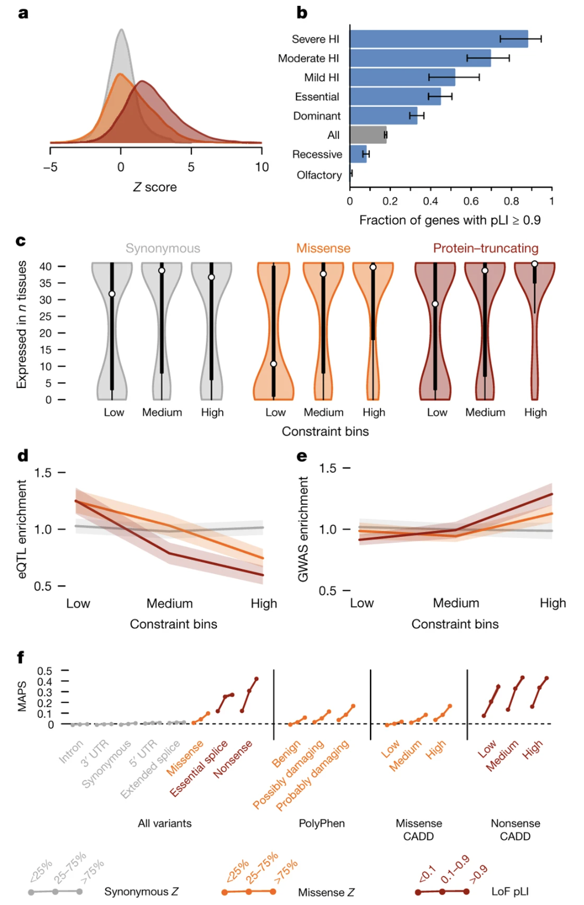
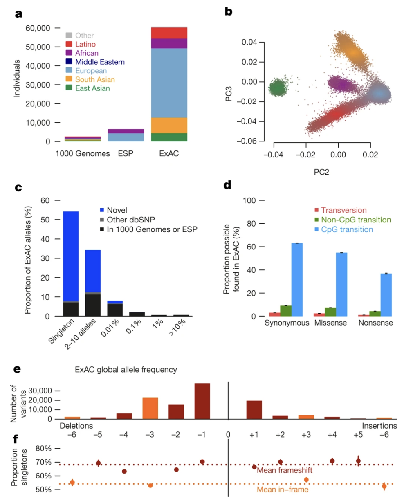

# Chapter 11. Haploinsufficiency

Here's a fundamental question: if we have two copies of each gene—one from Mom, one from Dad—why do we need both? For many genes, the answer is we don't. One working copy makes plenty of protein to keep things running smoothly. But some genes are pickier. They're called **haploinsufficient** genes, and they need both copies churning out protein to maintain normal function. Break one copy with a **protein-truncating variant (PTV)**, and you don't make enough protein—leading to problems like developmental disorders or cancer.

Not all genes are this sensitive, though. Some can lose one or even both copies without causing any noticeable harm. They're **loss-of-function tolerant**, acting like backup systems in our genome. How do scientists figure out which genes fall into which category? They use tools called **pLI** and **LOEUF** that essentially count how many PTVs show up in large populations compared to how many we'd expect by chance. If a gene has way fewer PTVs than expected, that's a sign that evolution has been weeding them out—a process called **purifying selection**—because they reduce **fitness** (the ability to survive and have kids).

This section explains haploinsufficiency, why some genes tolerate loss better than others, and how we measure these differences using population-scale data.

---

## Haploinsufficient Genes vs. Haplosufficient Genes

Let's start with definitions. **Haploinsufficiency** happens when one copy of a gene gets knocked out (usually by a PTV), and the remaining copy can't produce enough protein to maintain normal function. The result? Disease or abnormal traits.

Think of it like baking a cake that requires two cups of sugar. If you only have one cup, you might still get something cake-like, but it won't taste right and the texture will be off. Haploinsufficient genes are like that recipe—they really need both copies to work.

In contrast, **haplosufficient** genes are fine with one functional copy. It's like a recipe that works perfectly well with one cup of sugar because it's more forgiving. Some genes go even further—they're **loss-of-function (LoF) tolerant**, meaning you can completely inactivate one or both copies without causing health problems. These genes often have backup copies elsewhere in the genome, or they're simply not critical for survival and reproduction.

Haploinsufficient genes are exquisitely sensitive to **gene dosage**—the amount of protein being produced. Cut that in half, and things go wrong. But here's the interesting part: even though PTVs are serious mutations that destroy gene function, healthy people walk around carrying about 100 PTVs each. Analysis of 185 genomes found that most of these PTVs sit in LoF-tolerant genes that don't affect health ([MacArthur et al 2012, Science](https://pmc.ncbi.nlm.nih.gov/articles/PMC3299548/)). So the mere presence of a PTV doesn't mean disaster—it depends entirely on which gene got hit.

**See Figure 1 from MacArthur et al 2012** for a comparison of PTV frequencies across different filtering criteria in healthy adults. The data shows how high-confidence PTVs (after filtering out sequencing errors and other artifacts) are much rarer than the unfiltered set. This is partly because many apparent PTVs are actually mistakes, but also because real PTVs often occur in LoF-tolerant genes that don't matter much for health. The genes that really matter—the haploinsufficient ones—rarely carry PTVs in healthy people.

---

## Natural Selection and Purifying Selection

Why are PTVs in haploinsufficient genes so rare? The answer is **natural selection**—the process that favors traits improving **fitness** (survival and reproduction) while weeding out harmful traits over generations.

Think of it as a very slow-motion race. If you have a mutation that helps you survive and have kids—say, better disease resistance—that mutation spreads through the population. If you have a mutation that reduces your chances—say, a PTV in a gene critical for brain development—you might not survive to reproduce, and that mutation dies with you. This is how evolution shapes which variants stick around.

**Purifying selection** is a specific type of natural selection focused on removing harmful mutations. It's the genome's quality control system. PTVs in haploinsufficient genes are harmful because they cause diseases, reduce survival, or impair reproduction. Purifying selection actively removes these variants from the population, which is why they're rare when we look at large datasets of healthy people.

On the flip side, PTVs in LoF-tolerant genes are more common because they don't harm fitness. Take olfactory receptor genes—we have hundreds of them for detecting smells. Losing one doesn't matter much, so PTVs in these genes are relatively frequent. No selective pressure, no removal.

This interplay between mutation (which constantly generates new PTVs) and purifying selection (which removes harmful ones) is key to understanding why some genes appear "intolerant" to loss-of-function mutations while others don't care.

---

## Measuring Haploinsufficiency with pLI and LOEUF

So how do scientists actually identify haploinsufficient genes? The trick is to look at large populations and ask: "How many PTVs does this gene have compared to how many it *should* have?" If a gene has far fewer PTVs than expected, purifying selection has probably been removing them because they're harmful. That gene is likely haploinsufficient.

Two massive datasets—the **Exome Aggregation Consortium (ExAC)** and the **Genome Aggregation Database (gnomAD)**—developed scoring systems called **pLI** and **LOEUF** to quantify this intolerance. Let's walk through each.

### The ExAC Study and pLI

Exome sequences from 60,706 adults were analyzed to identify patterns of loss-of-function intolerance ([Lek et al 2016, Nature](https://pmc.ncbi.nlm.nih.gov/articles/PMC5018207/)). Crucially, these were adults without severe developmental disorders—essentially a healthy population baseline. The exome covers the protein-coding parts of the genome, where most disease-causing mutations hide.

#### What is pLI? 

pLI stands for **probability of being loss-of-function intolerant**. It's a score from 0 to 1 that tells you how sensitive a gene is to PTVs. A pLI ≥ 0.9 means the gene is highly intolerant—it has way fewer PTVs than expected, suggesting it's haploinsufficient and critical for normal function. A pLI near 0 means the gene tolerates PTVs just fine, like LoF-tolerant genes.

#### How is pLI Calculated? 

The calculation starts with an expectation. Based on a gene's length and the background mutation rate, statisticians can predict roughly how many PTVs that gene *should* accumulate in a population of 60,706 people. This expected number accounts for the fact that bigger genes naturally acquire more mutations.

Then they compare this to the *observed* number of PTVs actually found in the ExAC data. If the observed number is dramatically lower than expected—say, near zero—that's strong evidence that purifying selection has been removing PTVs because they reduce fitness. The study identified 3,230 genes with pLI ≥ 0.9, indicating they're highly intolerant to loss of function. These genes tend to be involved in critical processes like ribosome assembly, chromatin regulation, and cell cycle control.

For example, *SCN2A*—a sodium channel gene critical for brain development—has a pLI of 1.0, the maximum score. The gene is expected to carry about 165.8 PTVs in a large population, but only 18 are actually observed. This dramatic depletion (o/e = 0.11) reflects strong purifying selection removing harmful PTVs because they cause epilepsy and neurodevelopmental disorders.

**Figure: Constraint metrics for the SCN2A gene from gnomAD**. *The table shows expected versus observed variant counts across different categories. For protein-truncating variants (pLoF), SCN2A expects 165.8 variants but only 18 are observed, yielding an observed/expected (o/e) ratio of 0.11 and a pLI score of 1.0. This extreme constraint indicates that PTVs in SCN2A are strongly selected against because they cause disease. The missense Z-score of 8.73 also shows significant depletion of missense variants, reflecting the gene's overall intolerance to functional disruption. Source: gnomAD Browser. https://gnomad.broadinstitute.org/gene/ENSG00000136531?dataset=gnomad_r4.*

**Figure: Proportion of haploinsufficient genes across functional categories**. *This bar chart breaks down different gene categories by their pLI scores. Known haploinsufficient genes (those already linked to dominant disorders) overwhelmingly have high pLI scores (≥0.9), while recessive disease genes are more spread out. This validates pLI as a tool for identifying genes where one broken copy causes problems. The chart also shows that certain functional categories—like transcription factors and chromatin modifiers—are enriched for high pLI genes, reflecting their critical roles. Source: Lek, M. et al. (2016). Analysis of protein-coding genetic variation in 60,706 humans. Nature. https://pmc.ncbi.nlm.nih.gov/articles/PMC5018207/. License: CC-BY 4.0.*

#### Why Focus on Adults Without Developmental Delays? 

This is a smart design choice. Haploinsufficient genes often cause developmental disorders when disrupted. By studying adults who *haven't* been diagnosed with these conditions, the study ensured they were looking at a population where harmful PTVs are rare because affected individuals either didn't survive or didn't reproduce. It's like inspecting a library's intact books to figure out which ones are essential—you won't find torn-up copies of the critical ones because those were removed from circulation.

**Figure: Allele frequency distribution of protein-truncating variants**. *Most PTVs in the ExAC dataset are extremely rare—the vast majority appear only once (singleton variants). This rarity pattern reflects purifying selection at work: harmful PTVs don't stick around long enough to become common. The contrast between PTVs in haploinsufficient genes (almost all singletons) and LoF-tolerant genes (more spread across frequencies) illustrates how selection shapes variant frequency. Source: Lek, M. et al. (2016). Analysis of protein-coding genetic variation in 60,706 humans. Nature. https://pmc.ncbi.nlm.nih.gov/articles/PMC5018207/. License: CC-BY 4.0.*

### The gnomAD Study and LOEUF

In 2020, the **Genome Aggregation Database (gnomAD)** expanded on ExAC's work by analyzing 141,456 individuals—more than double the sample size ([Karczewski et al 2020, Nature](https://pmc.ncbi.nlm.nih.gov/articles/PMC7334197/)). This dataset included both exome and whole-genome sequences, providing even more comprehensive coverage. Like ExAC, it focused on adults without severe developmental disorders.

gnomAD introduced a refined metric called **LOEUF** that improves on pLI in important ways.

#### What is LOEUF? 

LOEUF stands for **Loss-of-Function Observed/Expected Upper-bound Fraction**. Instead of a binary "intolerant or not" classification, LOEUF provides a continuous score that ranks genes on a sliding scale of PTV sensitivity. A **low LOEUF score** (typically <0.35) indicates a gene with very few PTVs—likely haploinsufficient and critical for fitness. A high LOEUF score means the gene tolerates PTVs well.

#### How is LOEUF Calculated? 

The calculation follows a similar logic to pLI: compare observed PTVs to expected PTVs based on gene size and mutation rate. But gnomAD adds sophistication through the **LOFTEE** (Loss-of-Function Transcript Effect Estimator) tool, which filters out false-positive PTVs—things that look like protein-truncating variants but aren't really, like sequencing errors or variants that occur in alternative transcripts where they don't actually truncate the protein.

After identifying 443,769 high-confidence PTVs across the dataset, the observed-to-expected ratio for each gene was calculated, adjusted for statistical uncertainty (hence "upper-bound fraction"). Genes with low LOEUF scores are depleted for PTVs far beyond what chance alone would explain. These tend to be genes critical for DNA repair, cell division, metabolism, and development—functions where losing one copy has serious consequences.

#### Why Continuous Scoring? 

pLI is essentially a yes/no test: a gene either meets the threshold for intolerance (pLI ≥ 0.9) or it doesn't. LOEUF is more like a dimmer switch—it shows *how* intolerant a gene is on a spectrum. This granularity helps identify genes with moderate intolerance that pLI might miss, and it's particularly useful for genes involved in less severe disorders or for prioritizing variants in clinical diagnosis.

**Figure: Distribution of LOEUF scores across gene categories**. *This plot shows how LOEUF scores correlate with other measures of gene importance, like whether knocking out the gene kills mice or causes developmental abnormalities. Genes with low LOEUF scores (left side) are overwhelmingly essential in mouse models, while high-LOEUF genes (right side) can often be knocked out without major consequences. This external validation confirms that LOEUF captures something real about biological importance and links nicely to the concept of fitness—genes you can't lose without reducing survival or reproduction. Source: Karczewski, K.J. et al. (2020). The mutational constraint spectrum quantified from variation in 141,456 humans. Nature. https://pmc.ncbi.nlm.nih.gov/articles/PMC7334197/. License: CC-BY 4.0.*

---

## Summary

Haploinsufficiency reveals a fundamental principle about how genes work: **not all genes are created equal when it comes to dosage sensitivity**. Some genes—like those encoding transcription factors, chromatin modifiers, and structural proteins—operate on a tight budget. They need both copies producing protein at full capacity to maintain normal cellular function. Cut that production in half with a PTV, and the cell can't compensate. The result is disease, often manifesting as developmental disorders because these genes are critical during embryonic growth when cells are dividing rapidly and precise gene expression matters most.

Other genes, by contrast, have built-in redundancy. Maybe they have backup copies elsewhere in the genome, or maybe the cell simply doesn't need that much of their protein product. These LoF-tolerant genes can absorb PTVs without consequence, which is why healthy people carry around 100 of them without even knowing it.

The difference comes down to **evolutionary pressure**. Haploinsufficient genes are under constant surveillance by purifying selection. Any PTV that reduces fitness—by causing death, developmental delay, or reproductive problems—gets filtered out of the population over generations. This is why PTVs in these genes are vanishingly rare in healthy adults. LoF-tolerant genes, meanwhile, face no such pressure. PTVs accumulate freely because they don't affect survival or reproduction.

Tools like **pLI** and **LOEUF** translate this evolutionary signal into practical numbers. By comparing observed versus expected PTVs across tens of thousands of genomes, they identify which genes are haploinsufficient and which aren't. This has immediate clinical applications. When a patient with a genetic disorder undergoes exome sequencing and a rare PTV is identified, clinicians can check the pLI or LOEUF score to assess whether that gene is a likely culprit. A PTV in a gene with pLI = 1.0 or LOEUF = 0.1? That's highly suspicious and warrants further investigation. A PTV in a gene with pLI = 0 or LOEUF = 1.5? Probably not the cause.

There are even cases where PTVs improve health. PTVs in *PCSK9* lower cholesterol levels and reduce heart disease risk. Drug companies developed cholesterol-lowering medications that mimic this effect—essentially "PTVs in a pill." This shows how understanding LoF tolerance can guide therapeutic development.

In summary, haploinsufficiency links gene dosage to disease through the lens of evolution. Some genes tolerate loss; others don't. Purifying selection has spent millions of years sorting out which is which, and by reading that signal in population data, we can now predict disease risk, prioritize diagnostic variants, and even design new therapies.