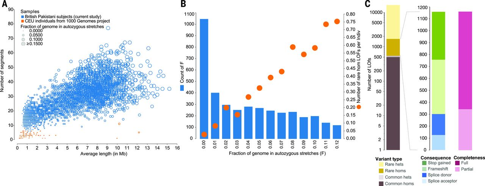
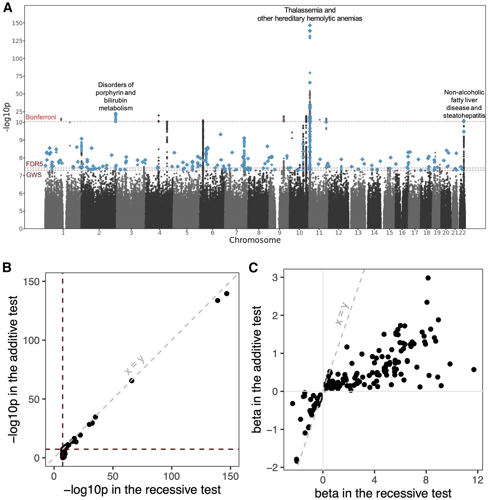
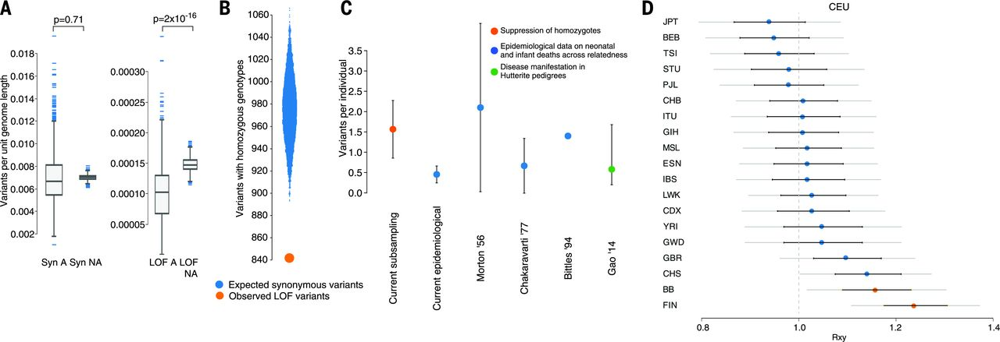

# Chapter 12. Recessive Alleles in Human Disorders

Dominant disorders, as we've seen, need only one broken gene copy to cause problems. Recessive disorders play by different rules: you need **both alleles at a locus** to be disrupted before disease appears. Remember, we're diploid organisms—we carry two copies of every autosomal gene, one from Mom and one from Dad. If both copies fail to produce functional protein, the cell has nothing to fall back on, and disease results.

The catch? People with just one bad copy—**carriers**—are typically perfectly healthy. That single working allele makes enough protein to keep everything running normally. This is why recessive disorders often surprise families: two healthy carrier parents can have an affected child who inherited the bad allele from both sides.

**NGS** technologies like WES and WGS have dramatically improved our ability to find recessive alleles, especially in populations where they're more likely to show up. Studies in British Pakistani and Bangladeshi communities, where marriage between relatives is culturally common, have uncovered hundreds of recessive disease associations that would be nearly impossible to detect in outbred populations ([Narasimhan et al 2016, Science](https://pmc.ncbi.nlm.nih.gov/articles/PMC4985238/); [Bilgüvar et al 2010, Nature](https://pmc.ncbi.nlm.nih.gov/articles/PMC3129007/); [Heng et al 2025, Am J Hum Genet](https://pmc.ncbi.nlm.nih.gov/articles/PMC12256797/)).

---

## Alleles, Genotypes, and Variants

Since we're diploid, every locus contains two alleles—one maternal, one paternal. Let's break down the possibilities at any given locus, using a hypothetical gene we'll call Gene X:

**Homozygous reference** means both alleles match the reference genome—the "standard" sequence we use as a comparison point. You'd write this as Xref/Xref. This is what most people have at most loci.

**Heterozygous** means one allele is reference and the other carries a variant—some change from the reference sequence. Written as Xref/Xalt, where "alt" stands for alternative. This is the carrier state for recessive disorders: you have one working copy and one altered copy.

**Homozygous alternative** means both alleles carry the same variant: Xalt/Xalt. If that variant disrupts gene function—say, it's a nonsense mutation that truncates the protein—you've lost function from both copies. This is when recessive disease appears.

The "variant" itself is usually a **single-nucleotide variant (SNV)**—one DNA base swapped for another—or a small **insertion or deletion (indel)** of a few bases. Let me give you concrete examples.

For an SNV, imagine a position where the reference genome has the base G. A **homozygous reference** individual has G on both chromosomes (G/G). A **heterozygous** individual has G on one chromosome and a variant base—say T—on the other (G/T). A **homozygous alternative** individual has T on both chromosomes (T/T). If that T disrupts the gene—maybe it creates a stop codon—the homozygous alternative person loses function from both alleles.

For an indel, let's say the reference sequence is ATG. A **homozygous reference** individual has ATG/ATG. A **heterozygous** individual might have ATG on one chromosome and ATGT on the other (a one-base insertion: ATG/ATGT). A **homozygous alternative** individual has ATGT/ATGT. If that extra T shifts the reading frame and scrambles the downstream protein sequence, both alleles are now producing nonsense.

### Biallelic Variation

**Biallelic variation**—affecting both alleles—is the key to recessive disorders. This can happen two ways:

**Homozygous**: The exact same variant appears on both alleles. You inherit the same mutant allele from Mom and from Dad. This is especially common when parents are related (consanguineous), because they're more likely to both carry the same ancestral mutation. In a study of 3,222 British Pakistani adults—many with parents who were second cousins or closer relatives—94.9% of rare homozygous loss-of-function (rhLOF) variants occurred within **autozygous segments**: stretches of DNA where both chromosomes are identical because they descended from a recent common ancestor ([Narasimhan et al 2016, Science](https://pmc.ncbi.nlm.nih.gov/articles/PMC4985238/)).

**Compound heterozygous**: Two *different* variants, one on each allele, both disrupt the gene. You might inherit variant A from Mom and variant B from Dad, and both knock out function. This is less common in consanguineous populations (where homozygous variants dominate) but shows up in outbred populations. Studies in Iceland and the ExAC database found 167 and 299 genes, respectively, with compound heterozygous LOF genotypes.

For this discussion, we'll focus mainly on homozygous variants, since they're more prevalent in the consanguineous cohorts that have powered recent recessive disease discoveries.

---

## Consanguinity and Autozygosity

**Consanguinity**—marriage between close relatives like first or second cousins—dramatically increases the chance of recessive disease because it boosts **autozygosity**: regions of the genome where both your chromosomes are identical by descent (IBD) from a recent common ancestor.

Here's why this matters. Imagine your parents are second cousins. They share a pair of great-grandparents. Any rare mutation those great-grandparents carried has a decent chance of being passed down both family lines to your parents, and then to you—giving you two copies of the same mutant allele. It's like inheriting the same broken tool from both sides of the family.

This effect is particularly pronounced in British Pakistani and Bangladeshi communities in the UK, where about 32% of individuals are offspring of second cousins or closer. In a study of 3,222 Pakistani-heritage adults, an average of 5.6% of the coding genome was autozygous—both chromosomes identical by descent. That's orders of magnitude higher than in outbred European populations, where almost no autozygosity exists ([Narasimhan et al 2016, Science](https://pmc.ncbi.nlm.nih.gov/articles/PMC4985238/)).

**Figure: Autozygosity and rare homozygous loss-of-function variants in Pakistani-heritage individuals**. *Panel A compares autozygous segments between Pakistani-heritage subjects in the UK (blue circles) and European individuals from the 1000 Genomes Project (orange dots, CEU population). Each circle represents an individual, with the x-axis showing the average length of autozygous segments and the y-axis showing the number of such segments. Pakistani individuals show dramatically more and longer autozygous segments due to consanguinity—many have over 30 segments averaging 5-10 Mb in length, while Europeans have almost none. Panel B reveals the relationship between autozygosity and rare homozygous loss-of-function (rhLOF) genotypes. Blue bars show the number of individuals binned by the fraction of their genome that is autozygous (x-axis from 0 to 0.12, meaning 0% to 12%). Orange circles track the average number of rhLOF genotypes per individual (right y-axis). As autozygosity increases, individuals carry more rhLOF genotypes—those with ~6% autozygosity (typical for first-cousin offspring) average about 0.5 rhLOF genotypes, while those with 10% have nearly 0.8. Panel C breaks down the 1,111 rhLOF genotypes discovered across 781 genes by variant properties: allele frequency (rare variants dominate), genotype (mostly rare homozygotes, shown in dark colors), predicted protein consequence (frameshift, stop gained, splice donor/acceptor mutations), and whether the LOF prediction applies to all gene transcripts (full) or only some (partial). This shows how consanguinity creates a natural experiment—revealing which genes can tolerate complete knockout and which cannot. Source: Narasimhan, V.M. et al. (2016). Health and population effects of rare gene knockouts in adult humans with related parents. Science 352(6284):aac8624. https://pmc.ncbi.nlm.nih.gov/articles/PMC4985238/. License: CC-BY.*

The consequence? These 3,222 individuals collectively carried 1,111 rare homozygous LOF genotypes across 781 genes. That's a treasure trove for geneticists, because it reveals which genes cause disease when completely knocked out—information that's nearly impossible to get from outbred populations where homozygous knockouts are vanishingly rare.

In a larger study of 44,190 British Pakistani and Bangladeshi individuals, this autozygosity enabled the detection of 185 genetic loci with recessive associations to 898 common diseases. Many of these associations were completely novel, only detectable because of the unique genetic structure of this cohort ([Heng et al 2025, Am J Hum Genet](https://pmc.ncbi.nlm.nih.gov/articles/PMC12256797/)).

**Figure: Genome-wide landscape of recessive associations in British Pakistanis and Bangladeshis**. *This Manhattan plot displays the results from recessive association testing across the genome. Each point represents a genetic variant tested for association with one of 898 diseases from electronic health records. The y-axis shows the strength of the statistical evidence (-log10 p-value), and the x-axis shows the chromosomal position. The dashed horizontal lines mark different significance thresholds: genome-wide significance (GWS; p < 5 × 10⁻⁸, the standard cutoff for GWAS), false discovery rate of 5% (FDR5; p < 3.7 × 10⁻⁸), and Bonferroni-corrected threshold (p < 5.5 × 10⁻¹²) which accounts for multiple phenotypes tested. Blue points highlight variants that reached genome-wide significance and had stronger evidence under a recessive model than an additive model. Diamonds mark the lead variants—the most significant variant at each independent locus. Three clusters of Bonferroni-significant associations are labeled: variants associated with non-alcoholic fatty liver disease (NAFLD) on chromosome 22, disorders of porphyrin and bilirubin metabolism on chromosome 2, and thalassemia and hereditary hemolytic anemias on chromosome 11. This visualization demonstrates how increased homozygosity in consanguineous populations reveals recessive disease architectures that remain hidden in outbred cohorts. Source: Heng, T.H. et al. (2025). Widespread recessive effects on common diseases in a cohort of 44,000 British Pakistanis and Bangladeshis with high autozygosity. Am J Hum Genet. https://pmc.ncbi.nlm.nih.gov/articles/PMC12256797/. License: CC-BY.*

**Figure: Genome-wide landscape of recessive associations in British Pakistanis and Bangladeshis**. *This Manhattan plot displays the results from recessive association testing across the genome. Each point represents a genetic variant tested for association with one of 898 diseases from electronic health records. The y-axis shows the strength of the statistical evidence (-log10 p-value), and the x-axis shows the chromosomal position. The dashed horizontal lines mark different significance thresholds: genome-wide significance (GWS; p < 5 × 10⁻⁸, the standard cutoff for GWAS), false discovery rate of 5% (FDR5; p < 3.7 × 10⁻⁸), and Bonferroni-corrected threshold (p < 5.5 × 10⁻¹²) which accounts for multiple phenotypes tested. Blue points highlight variants that reached genome-wide significance and had stronger evidence under a recessive model than an additive model. Diamonds mark the lead variants—the most significant variant at each independent locus. Three clusters of Bonferroni-significant associations are labeled: variants associated with non-alcoholic fatty liver disease (NAFLD) on chromosome 22, disorders of porphyrin and bilirubin metabolism on chromosome 2, and thalassemia and hereditary hemolytic anemias on chromosome 11. This visualization demonstrates how increased homozygosity in consanguineous populations reveals recessive disease architectures that remain hidden in outbred cohorts. Source: Heng, T.H. et al. (2025). Widespread recessive effects on common diseases in a cohort of 44,000 British Pakistanis and Bangladeshis with high autozygosity. Am J Hum Genet. https://pmc.ncbi.nlm.nih.gov/articles/PMC12256797/. License: CC-BY.*

---

## Recessive Inheritance Patterns in Human Pedigrees

See Figure 2 from Bilgüvar et al 2010, Nature, showing recessive inheritance of *WDR62* mutations in six families (NG26, NG30, NG190, NG294, NG339, NG537). The pedigrees illustrate classic autosomal recessive inheritance, with each chromatogram showing the mutant allele (left, red bases) and the normal sequence (right, green bases). Notice the variety of mutation types—frameshifts (like V1402GfsX12), nonsense mutations (E526X, Q470X), missense variants (W224S, E526K), and small deletions (G1280AfsX21)—all occurring independently in different families. This illustrates genetic heterogeneity: different mutations in the same gene can cause the same disease. All affected individuals are homozygous for their respective mutations, consistent with consanguinity increasing the likelihood of inheriting the same recessive allele from both parents ([Bilgüvar et al 2010, Nature](https://pmc.ncbi.nlm.nih.gov/articles/PMC3129007/)).

---

## Recessive Alleles in Mendelian and Complex Diseases

Traditionally, we think of recessive disorders as **Mendelian diseases**—single-gene conditions with dramatic phenotypes and clear inheritance patterns. Classic examples include cystic fibrosis, sickle cell disease, and Tay-Sachs. Break both copies of the gene, get the disease, with high penetrance (nearly everyone with the genotype shows symptoms).

But NGS studies have revealed that recessive alleles also contribute to **complex diseases**—conditions like hypertension, diabetes, and liver disease where multiple genes and environmental factors interact. The effects are subtler, but they're real and clinically important.

### Mendelian Disorders

A great example comes from WES that identified homozygous recessive mutations in the *WDR62* gene across several consanguineous families. Affected individuals had severe brain malformations: microcephaly (abnormally small heads), pachygyria (unusually thick, simplified brain folds), and lissencephaly (smooth brain, lacking normal folding) ([Bilgüvar et al 2010, Nature](https://pmc.ncbi.nlm.nih.gov/articles/PMC3129007/)).

The mutations varied—one family had a 4-base-pair deletion causing a frameshift, another had a nonsense mutation, others had missense variants—but all resulted in complete loss of *WDR62* function. This protein is critical for neural progenitor cells, which divide to build the developing brain. Without functional *WDR62*, these cells can't proliferate properly, leading to the severe structural defects seen in affected children. The homozygous nature of these mutations, revealed by the consanguineous pedigrees, definitively proved recessive inheritance.

### Complex Diseases

The 44,190-person British Pakistani and Bangladeshi cohort uncovered something more surprising: 185 loci with recessive associations to common diseases. These aren't dramatic Mendelian disorders—they're everyday health conditions ([Heng et al 2025, Am J Hum Genet](https://pmc.ncbi.nlm.nih.gov/articles/PMC12256797/)).

For instance, a missense variant in *SGLT4* (rs61746559) showed a protective effect against hypertension. People homozygous for this variant had an 80% lower risk of high blood pressure (odds ratio = 0.2, p = 3 × 10⁻⁸). That's a huge effect size for a common disease. The variant likely alters how the kidney handles sodium, affecting blood pressure regulation through the renin-angiotensin-aldosterone system.

Another example: a recessive variant in *PNPLA3* (rs66812091) was strongly associated with non-alcoholic fatty liver disease (odds ratio = 1.3, p = 2 × 10⁻¹²). Homozygous individuals had elevated liver enzyme levels and increased disease risk. This variant disrupts fat metabolism in liver cells, causing lipid accumulation.

These findings highlight how recessive alleles can influence complex traits through more modest effects. Traditional GWAS studies, which typically assume additive genetic models, often miss these recessive associations. Only by specifically testing for recessive effects—made possible by the high autozygosity in consanguineous populations—do they become visible.

---

## Population Genetics and Selection

Recessive alleles, especially harmful ones, face **natural selection** when they become homozygous. If a recessive mutation causes severe disease or death, individuals homozygous for it won't survive to reproduce, and that allele gets removed from the gene pool. This is why truly deleterious recessive alleles remain rare, even in consanguineous populations.

**Figure: Natural selection against recessive loss-of-function variants**. *This figure quantifies how natural selection removes harmful recessive variants. Panel A shows that autozygous regions (where variants become homozygous) have significantly fewer LOF variants per unit length compared to non-autozygous regions—a depletion visible when comparing "LOF A" (LOF in autozygous) to "LOF NA" (LOF in non-autozygous). In contrast, synonymous variants (which don't affect protein function) show no such difference, confirming this is selection against harmful variants, not a technical artifact. Panel B demonstrates a 13.7% deficit of rare homozygous LOF genotypes. The study compared 16,708 rare LOF variants to frequency-matched synonymous variants: only 842 rare LOF variants had at least one homozygote (orange circle), versus an expected 975.5 synonymous variants with homozygotes (blue distribution). This missing 13.7% likely represents lethal or severely deleterious variants that prevented carriers from surviving to adulthood. Panel C compares different estimates of recessive lethal load—how many lethal-equivalent mutations each person carries. The direct estimate from rhLOF variants in this study (orange) finds ~1.6 lethal equivalents per person, matching epidemiological estimates from infant mortality data (blue circles) and data from Hutterite pedigrees (green). Panel D shows that Pakistani-heritage populations (BB) have slightly reduced LOF allele burden compared to Europeans (CEU), but less reduction than the Finnish population (FIN), which experienced a severe bottleneck. The y-axis represents the relative frequency of population-specific derived LOF alleles (under neutrality, this ratio should be 1.0). Error bars show standard errors, with significant differences marked by orange circles. This demonstrates that consanguinity increases the efficiency of purifying selection against recessive lethals. Source: Narasimhan, V.M. et al. (2016). Health and population effects of rare gene knockouts in adult humans with related parents. Science 352(6284):aac8624. https://pmc.ncbi.nlm.nih.gov/articles/PMC4985238/. License: CC-BY.*

The Pakistani-heritage study quantified this effect by comparing the observed number of rare homozygous LOF genotypes to the expected number based on allele frequencies and consanguinity rates. A 13.7% deficit was found—there were fewer homozygous knockouts than expected. What happened to the missing ones? They likely caused embryonic or fetal loss, preventing those individuals from reaching adulthood and being counted in the study ([Narasimhan et al 2016, Science](https://pmc.ncbi.nlm.nih.gov/articles/PMC4985238/)).

By modeling this deficit, the study estimated that each person carries approximately 1.6 recessive lethal-equivalent LOF variants. These are mutations that, when homozygous, cause death before birth or severe disease that prevents reproduction. In consanguineous populations, where these variants become homozygous more often, this "genetic load" manifests as increased rates of pregnancy loss and infant mortality.

But here's the nuance: not all recessive knockouts are harmful. The same study found a healthy mother who was homozygous for a LOF mutation in *PRDM9*, a gene involved in meiotic recombination (how chromosomes swap segments during sperm and egg formation). She had three healthy children, indicating that complete loss of *PRDM9* has minimal health impact in humans, even though it's essential in mice.

This shows that "loss of function" doesn't automatically mean "disease." Some genes are dispensable, or have redundant backups, or only matter in specific contexts. The *PRDM9* example reminds us that the effects of recessive alleles span a spectrum from lethal to neutral to occasionally even beneficial.

---

## Summary

Recessive alleles reveal fundamental insights about human biology and disease across a spectrum from rare Mendelian disorders to common complex traits. By studying consanguineous populations where both copies of genes are more likely to be knocked out, we've learned several key lessons about human genetics.

**Gene essentiality varies widely.** Not all knockouts are harmful. The discovery of a healthy, fertile woman with complete *PRDM9* knockout demonstrates that some genes essential in mice are dispensable in humans ([Narasimhan et al 2016, Science](https://pmc.ncbi.nlm.nih.gov/articles/PMC4985238/)). Her three healthy children and alternative meiotic recombination patterns show that humans have compensatory mechanisms not present in other mammals. This teaches us to be cautious when interpreting predicted loss-of-function variants—context matters, and human biology doesn't always follow animal models.

**Selection shapes the genetic landscape.** Each person carries approximately 1.6 recessive lethal-equivalent variants. Natural selection efficiently removes the most harmful recessive alleles when they become homozygous, explaining the 13.7% deficit of expected rare homozygous knockouts in adult populations. This "genetic load" manifests as increased embryonic lethality and infant mortality in consanguineous families, but the exact variants differ between individuals, spreading the burden across the genome.

**Recessive effects extend beyond Mendelian disease.** The identification of 185 loci with recessive associations to common diseases like hypertension and fatty liver disease challenges the additive model that dominates GWAS. Traditional studies miss these effects because they're only detectable when variants are homozygous—rare in outbred populations but common where autozygosity is high. This suggests we've been missing a significant component of disease architecture.

**Clinical applications are emerging.** Severe recessive disorders like *WDR62* brain malformations enable genetic counseling and prenatal diagnosis for at-risk families. But the real excitement lies in protective variants like *SGLT4* for hypertension. If knocking out a gene lowers disease risk without side effects, that gene becomes a drug target. This is "human genetics-guided drug development"—using natural knockouts as proof-of-concept for therapeutic interventions, the same logic behind PCSK9 inhibitors for cholesterol.

**Diverse populations are essential for discovery.** The focus on European-ancestry cohorts has created blind spots in our understanding of human genetics. British Pakistani and Bangladeshi populations, with their unique demographic history, have uncovered hundreds of recessive associations invisible in other cohorts. This isn't just about ancestry—it's about studying populations with different evolutionary histories and demographic structures to build a complete picture of human genetic architecture.

As whole-genome sequencing becomes routine, we'll continue identifying natural human knockouts across diverse populations. Each discovery teaches us which genes are truly essential, which have redundant backups, and which harbor hidden recessive effects on common diseases. The key insight: two broken copies teach us different lessons than one broken copy, and both are essential for understanding human health and designing better therapies.