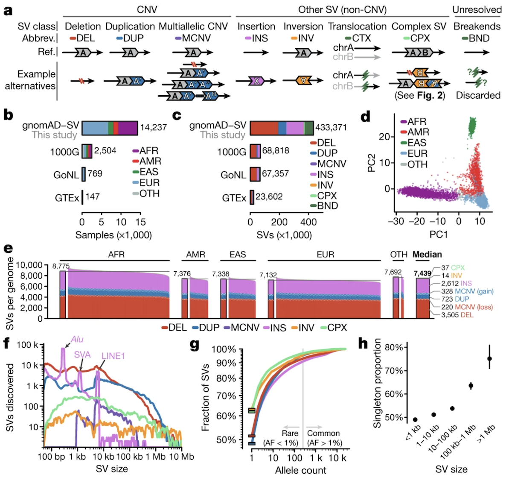
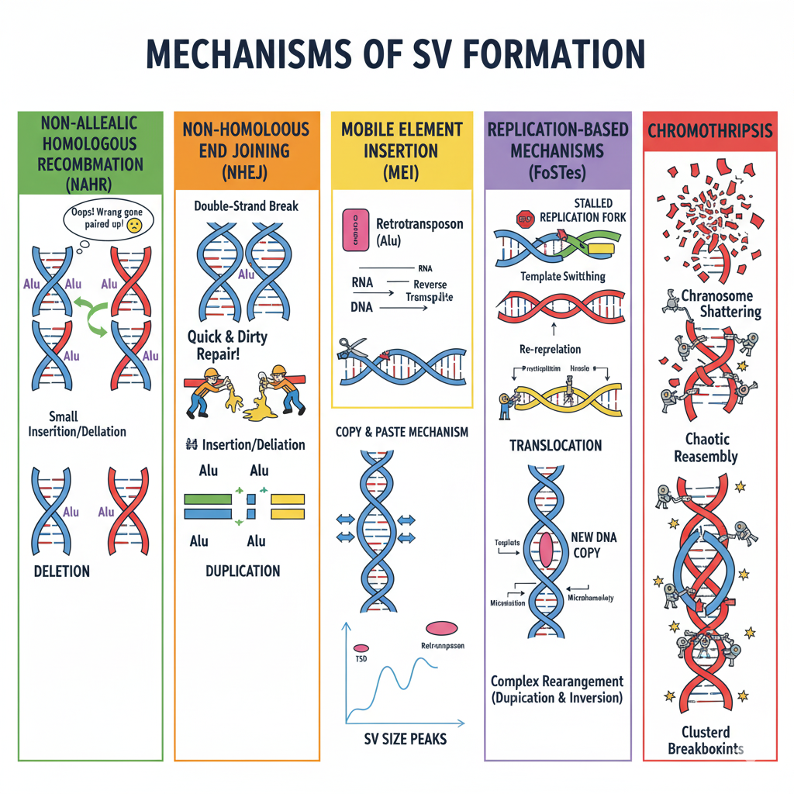
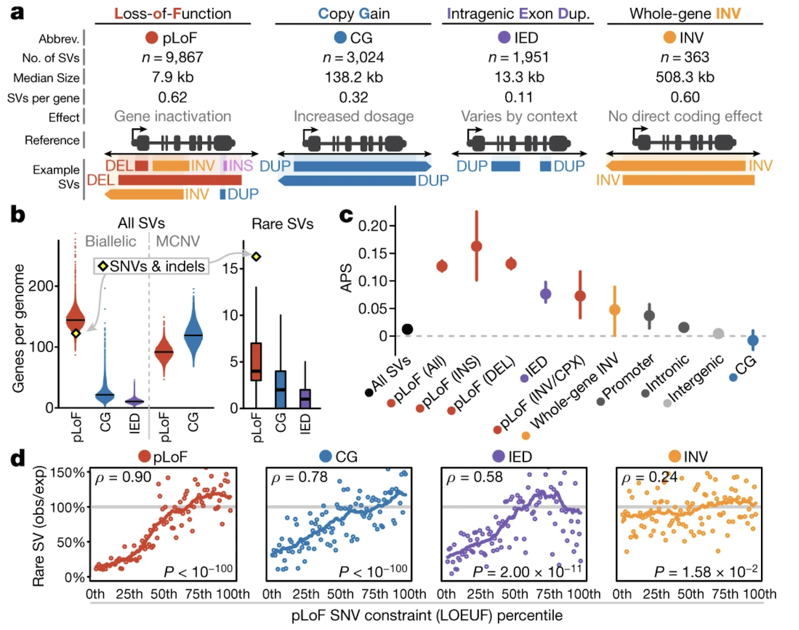

# Chapter 13. Structural Variations in Human Genomes

So far, we've been talking mainly about small changes in DNA—single base swaps (SNVs) or tiny insertions and deletions (indels). But the genome can undergo much bigger rearrangements called **structural variations (SVs)**. These involve chunks of DNA that are 50 nucleotides or longer—sometimes stretching into the thousands or even millions of base pairs.

Think of the genome as a book. SNVs are like single-letter typos: "cat" becomes "bat." But SVs? They're entire paragraphs being cut out, duplicated, flipped upside down, or moved to a different chapter. These large-scale changes can have dramatic effects on gene function, human genetic diversity, and disease risk.

This chapter introduces SVs using insights from a massive study that analyzed 14,891 human genomes to create the gnomAD-SV reference—the most comprehensive catalog of structural variation to date ([Collins et al 2020, Nature](https://www.nature.com/articles/s41586-020-2287-8)). We'll walk through what SVs are, how they're classified, where they occur in the genome, how they form, and what impact they have on health and evolution.

---

## What Are Structural Variants?

**Structural variants** are DNA rearrangements that can include insertions (new DNA added), deletions (DNA removed), duplications (DNA copied), inversions (DNA flipped), or translocations (DNA moved between chromosomes). The key difference from SNVs is scale: while an SNV changes one letter, an SV can affect thousands to millions of letters at once.

These rearrangements can seriously disrupt genes or the regulatory elements that control them. Delete a critical exon, and the gene stops working. Duplicate a gene, and you might produce too much of its protein. Flip a regulatory region, and a gene might get turned on at the wrong time or in the wrong tissue. Understanding SVs is essential for understanding both normal genetic variation and disease.

---

## Classification of SVs

SVs can be grouped based on whether they change the total amount of DNA in the genome—what we call **copy number**. Some SVs add or remove DNA, while others just rearrange it without changing the total amount.

### Copy Number Altering SVs

These variants change how much DNA you have:

**Deletions (DEL)** remove a segment of DNA. If you delete part of a gene, you lose that genetic information, reducing gene dosage—the amount of protein that gene can make. For example, if a deletion removes one copy of a gene in a heterozygous individual, you're left with only one functional copy instead of two.

**Duplications (DUP)** create an extra copy of a DNA segment. Now you have more of that sequence than you should, increasing gene dosage. Some duplications are tandem (the extra copy sits right next to the original), while others insert elsewhere in the genome.

**Insertions (INS)** add new DNA that wasn't there before. Often these come from **mobile elements**—chunks of DNA that can copy themselves and jump to new locations. The three main types are:
- **Alu elements**: Short sequences, about 300 base pairs, that are the most abundant mobile elements in our genome
- **LINE1 (Long Interspersed Nuclear Element 1)**: Longer sequences, around 6,000 base pairs
- **SVA (SINE-VNTR-Alu)**: Composite elements, about 2,100 base pairs, that combine features of other repetitive sequences

These mobile elements leave distinctive signatures in the genome, which we'll see later in the data.

**Multiallelic Copy-Number Variants (MCNVs)** are regions where different people have different numbers of copies. You might have 2 copies of a region, your friend might have 3, and someone else might have 4. These show complex patterns of dosage variation across populations.

### Copy Number Neutral SVs

These variants rearrange DNA without changing the total amount:

**Inversions (INV)** flip a DNA segment 180 degrees. The same bases are there, but they're now in reverse orientation. Imagine reading a sentence backwards—the letters are all present, but the meaning changes.

**Translocations (BND)** swap DNA segments between different chromosomes. You're not losing or gaining DNA overall; it's just being moved around. The abbreviation BND stands for "breakend," referring to where the DNA breaks to make the swap.

**Complex SVs** involve multiple types of rearrangements happening together. For example, you might have an inversion flanked by copy number changes, or **chromothripsis**—a catastrophic event where a chromosome shatters and gets pieced back together in a chaotic way. Depending on how the pieces reassemble, these can be copy number neutral or altering.

**Figure: Classification of structural variant types.** Structural variants fall into two major categories based on whether they alter copy number. Copy number altering variants include deletions (DEL), which remove DNA segments; duplications (DUP), which create extra copies; insertions (INS), which add new sequences often from mobile elements; and multiallelic copy number variants (MCNV), where different individuals carry different numbers of copies at the same locus. Copy number neutral variants include inversions (INV), which flip DNA segments 180 degrees without changing content; translocations (BND for "breakend"), which swap segments between chromosomes; and complex SVs combining multiple rearrangement types. Each SV type has distinct molecular signatures and functional consequences. For instance, deletions and duplications directly alter gene dosage—too little or too much protein product—while inversions can disrupt genes at breakpoints or alter their regulatory context without changing the amount of DNA present. The schematic uses different colors to represent distinct genomic segments, with arrows indicating orientation. Understanding these categories is essential for interpreting how large-scale genomic rearrangements affect human health and evolution. Source: Collins, R.L. et al. (2020). A structural variation reference for medical and population genetics. Nature 581, 444–451. https://www.nature.com/articles/s41586-020-2287-8. License: CC-BY 4.0.

---

## Distribution of SVs

The gnomAD-SV dataset analyzed 14,237 genomes from diverse populations to understand how SVs are distributed across humanity. The cohort was remarkably diverse: 54% of individuals were non-European, including African, Latino, East Asian, and European ancestry groups. This diversity matters because SV patterns differ across populations, reflecting their unique evolutionary histories ([Collins et al 2020, Nature](https://www.nature.com/articles/s41586-020-2287-8)).

### How Many SVs Does Each Person Have?

The study identified 433,371 different SVs across all genomes analyzed. But how many does a typical person carry? The median was **7,439 SVs per genome**—that's a lot more than the 3,441 SVs per genome estimated by the earlier 1000 Genomes Project, which used lower-coverage sequencing that missed many variants.

Think about that number: each of us carries over 7,000 structural rearrangements in our genome. Most don't cause problems—they're just part of normal human genetic variation. But a small fraction can contribute to disease.

### Size Matters

Most SVs are relatively small—under 10,000 base pairs—but there's interesting structure in the size distribution. When you plot the number of SVs at each size, distinct peaks appear at specific lengths. These peaks correspond to mobile element insertions:

- A peak around **300 base pairs** from Alu insertions
- A peak around **2,100 base pairs** from SVA insertions  
- A peak around **6,000 base pairs** from LINE1 insertions

These mobile elements are constantly creating new insertions in human genomes, and their characteristic sizes show up clearly in the data.

### Rare Variants Dominate

Here's a striking finding: **49.8% of all SVs are singletons**—they appear in only one person out of 14,237. Why are so many SVs this rare? Partly because they're recent mutations that haven't had time to spread, and partly because many large SVs disrupt important genes. If an SV knocks out a gene you need for normal development or survival, you're less likely to pass it on. Natural selection keeps these harmful variants rare.

The pattern is clear in the data: larger SVs are rarer than smaller ones. A deletion removing 100 base pairs might be tolerable, but a deletion removing 100,000 base pairs that spans multiple genes? That's more likely to cause problems and less likely to stick around in the population.

### Population Structure

When a **principal component analysis** was performed on 15,395 common SVs (variants found in multiple individuals), people clustered by genetic ancestry—African, European, East Asian, and Latino groups separated in the analysis. This tells us that SV patterns differ across populations, shaped by unique demographic histories like population bottlenecks, expansions, and migrations. Some SVs might be common in one population but rare or absent in another.

---

## Mechanisms of SV Formation

How do these large-scale rearrangements actually happen? Several molecular mechanisms can produce SVs, each leaving characteristic signatures in the genome.

**Figure: Five major mechanisms generate structural variants in human genomes.** NAHR (green) occurs when similar sequences like Alu elements misalign during meiosis, producing deletions on one chromosome and duplications on the other. NHEJ (orange) is a "quick and dirty" repair of double-strand breaks that glues DNA ends together without requiring sequence homology, often introducing small insertions or deletions. MEI (yellow) uses a copy-and-paste mechanism where mobile elements are transcribed to RNA, reverse-transcribed to DNA, and inserted at new locations, creating target site duplications and characteristic size peaks. FoSTeS (purple) results from stalled replication forks switching between DNA templates, generating complex rearrangements with microhomology signatures. Chromothripsis (red) involves catastrophic chromosome shattering into many fragments followed by chaotic reassembly, creating clustered breakpoints—rare in healthy individuals but common in cancer.

### Non-Allelic Homologous Recombination (NAHR)

During meiosis—the cell division that produces sperm and eggs—chromosomes pair up and exchange segments in a process called recombination. Usually this works perfectly: matching sequences on each chromosome (homologous sequences) line up correctly and swap corresponding pieces.

But sometimes things go wrong. If two repetitive sequences that aren't actually at the same position—say, two Alu elements separated by thousands of base pairs—mistakenly pair up, recombination between them produces a deletion on one chromosome and a duplication on the other. This is **non-allelic homologous recombination** (NAHR): homologous sequences that shouldn't recombine do anyway, because they're similar enough to trick the cellular machinery.

NAHR happens most often in regions with **segmental duplications**—large blocks of highly similar sequence scattered throughout the genome. The breakpoints (where the DNA breaks and rejoins) fall within these homologous regions, and the resulting SVs are typically deletions, duplications, or inversions.

### Non-Homologous End Joining (NHEJ)

What happens when a chromosome suffers a double-strand break—both strands of the DNA double helix snap? Cells have repair mechanisms, but they're not always precise. **Non-homologous end joining** (NHEJ) is a quick-and-dirty repair method: the cell just glues the broken ends back together without looking for matching sequences to guide the repair.

This can work fine if the break is clean. But NHEJ often introduces small errors at the junction—tiny insertions or deletions. Sometimes the cell joins the wrong ends together, creating translocations (if pieces from different chromosomes get joined) or complex rearrangements.

NHEJ-mediated SVs show characteristic features: **microhomology** (just 1-10 matching base pairs) or completely blunt junctions at the breakpoints. Depending on what gets joined to what, these SVs can be copy number neutral (like a simple translocation) or altering (if pieces are lost or duplicated).

### Mobile Element Insertion (MEI)

We mentioned Alu, LINE1, and SVA elements earlier. These **retrotransposons** create SVs through a "copy-and-paste" mechanism. Here's how it works:

1. The mobile element gets transcribed into RNA
2. That RNA is reverse-transcribed back into DNA 
3. The new DNA copy inserts into a new location in the genome

The result is a copy number gain—you've inserted new DNA that wasn't there before. These insertions create **target-site duplications** (TSDs): short repeated sequences (2-20 base pairs) flanking the insertion, formed when the insertion machinery cuts the target DNA.

Mobile element insertions are common—we each carry hundreds of them—and they're constantly creating new genetic variation. The distinctive size peaks in the SV distribution we saw earlier come directly from these insertions.

### Replication-Based Mechanisms (Fork Stalling and Template Switching)

DNA replication isn't always smooth. Sometimes the replication fork—the Y-shaped structure where DNA is being copied—stalls. Maybe it hits a difficult-to-replicate sequence, or there's damage in the DNA. When this happens, the replication machinery might switch to a different DNA template to finish copying, then switch back. This is called **fork stalling and template switching (FoSTeS)**.

If the machinery switches to the wrong template or switches multiple times, the result is a complex SV with multiple breakpoints and rearrangements. These can be copy number neutral (like inversions) or altering (like duplications), and they tend to occur in **fragile sites**—regions of the genome that are prone to replication stress.

### Chromothripsis

**Chromothripsis** is the most dramatic mechanism—the name literally means "chromosome shattering." In a single catastrophic event, a chromosome or chromosomal region breaks into dozens or hundreds of pieces. The cell's repair machinery then frantically tries to reassemble the pieces, but not always in the right order. The result is a complex SV with multiple breakpoints clustered in one region, often combining deletions, duplications, and inversions.

Chromothripsis is rare in healthy individuals but more common in cancer, where it can drive tumor evolution by disrupting multiple genes at once. When it does occur, it leaves a distinctive signature: many breakpoints concentrated in a small genomic region, with evidence of chaotic reassembly.

---

## Impact of SVs

SVs don't just passively exist in the genome—they have functional consequences that can affect health and evolution. The impact depends on what type of SV it is and where it occurs.

### Gene Dosage Effects

Copy number altering SVs—deletions and duplications—directly affect **gene dosage**. Deletions and duplications contribute to **25-29% of rare protein-truncating events** ([Collins et al 2020, Nature](https://www.nature.com/articles/s41586-020-2287-8)). That's comparable to the impact of nonsense SNVs! When you delete an entire exon or gene, the result is complete loss of function from that allele, just as devastating as a premature stop codon.

Duplications can be harmful too. More isn't always better—having three copies of a gene instead of two can disrupt tightly regulated processes. Genes intolerant to loss-of-function SNVs (those with high pLI scores that we learned about earlier) are also intolerant to copy number changes. Both too little and too much gene product can be problematic.

### Structural Rearrangements

Copy number neutral SVs—inversions and translocations—don't change gene dosage, but they can still cause problems. An inversion might disrupt a gene by breaking it in the middle, or it might alter gene regulation by moving a gene away from its normal regulatory elements or placing it next to new ones. These effects are generally subtler than complete loss or gain of a gene, and the selection against copy number neutral SVs is weaker.

### Selection Pressure

**Figure: Natural selection acts differently on structural variants based on their functional impact.** This analysis reveals how evolutionary forces shape SV frequencies in human populations. The plot shows selection coefficients (a measure of fitness impact) for different types of SVs across various genomic contexts. Copy number altering SVs—particularly deletions and duplications—that affect protein-coding genes experience strong negative selection, especially in genes intolerant to loss-of-function mutations (high pLI genes). These variants appear at significantly reduced frequencies because they disrupt gene dosage: too little protein from deletions or too much from duplications both impair fitness. In contrast, SVs in noncoding regions such as introns and intergenic sequences face much weaker selection pressure, since disrupting these areas is less likely to affect gene function critically. Copy number neutral SVs like inversions show intermediate selection pressures—they can disrupt genes at breakpoints or alter regulatory landscapes, but the effects are often subtler than complete gene loss or gain. The pattern mirrors what we observe with single nucleotide variants: genes that cannot tolerate protein-truncating SNVs also cannot tolerate copy number changes, because both ultimately result in abnormal gene function. This demonstrates that whether you disrupt a gene with a point mutation or delete it entirely, natural selection acts to remove variants that eliminate essential genes from the population. The data come from comparing observed SV frequencies to those expected under neutral evolution across 14,237 diverse human genomes. Source: Collins, R.L. et al. (2020). A structural variation reference for medical and population genetics. Nature 581, 444–451. https://www.nature.com/articles/s41586-020-2287-8. License: CC-BY 4.0.

Copy number altering SVs in protein-coding genes face strong negative selection—they're kept rare in the population because they reduce fitness. SVs in noncoding regions (like introns or intergenic sequences) face milder selection, since disrupting these regions is less likely to affect gene function.

Interestingly, the pattern mirrors what we see with SNVs: genes that are intolerant to SNVs are also intolerant to SVs. This makes sense—whether you disrupt a gene with a point mutation or by deleting it entirely, the result is loss of function, and selection weeds out variants that eliminate essential genes.

---

## Summary

Structural variations represent a major source of genetic diversity and disease risk in human populations. Unlike SNVs that alter single nucleotides, SVs involve large-scale rearrangements affecting 50 to millions of base pairs—deletions removing DNA, duplications copying it, inversions flipping it, insertions adding new sequences (often mobile elements), and translocations moving chunks between chromosomes.

The gnomAD-SV reference, built from 14,891 diverse genomes, revealed that each person carries a median of 7,439 SVs. Nearly half are singletons found in just one individual, reflecting both recent mutation and purifying selection against harmful variants. The size distribution shows distinctive peaks at 300, 2,100, and 6,000 base pairs—signatures of Alu, SVA, and LINE1 mobile element insertions that continuously generate new variation.

Multiple molecular mechanisms create SVs. Non-allelic homologous recombination (NAHR) occurs when similar but non-corresponding sequences mistakenly pair during meiosis, producing deletions and duplications. Non-homologous end joining (NHEJ) repairs double-strand breaks by gluing ends together without template guidance, sometimes joining wrong ends to create translocations. Mobile element insertions use a copy-and-paste mechanism via RNA intermediates. Replication fork stalling can trigger template switching, generating complex rearrangements. Chromothripsis—catastrophic chromosome shattering—creates clustered breakpoints with chaotic reassembly, common in cancer but rare in healthy genomes.

SVs have profound functional impacts. Copy number altering SVs contribute 25-29% of rare protein-truncating events, matching the impact of nonsense SNVs. Deletions and duplications alter gene dosage—both too little and too much protein can be harmful. Genes intolerant to loss-of-function SNVs are equally intolerant to copy number changes. Natural selection strongly suppresses SVs affecting essential genes, keeping them rare, while SVs in noncoding regions face weaker selection.

Understanding SVs is crucial for medical genetics—many developmental disorders, intellectual disabilities, and cancers involve large deletions, duplications, or complex rearrangements. SVs also shape population genetic diversity, with different patterns across ancestries reflecting unique demographic histories. As sequencing improves and more genomes are analyzed, catalogs like gnomAD-SV enable better interpretation of patients' genomes and deepen our understanding of how large-scale rearrangements shape human biology and disease.