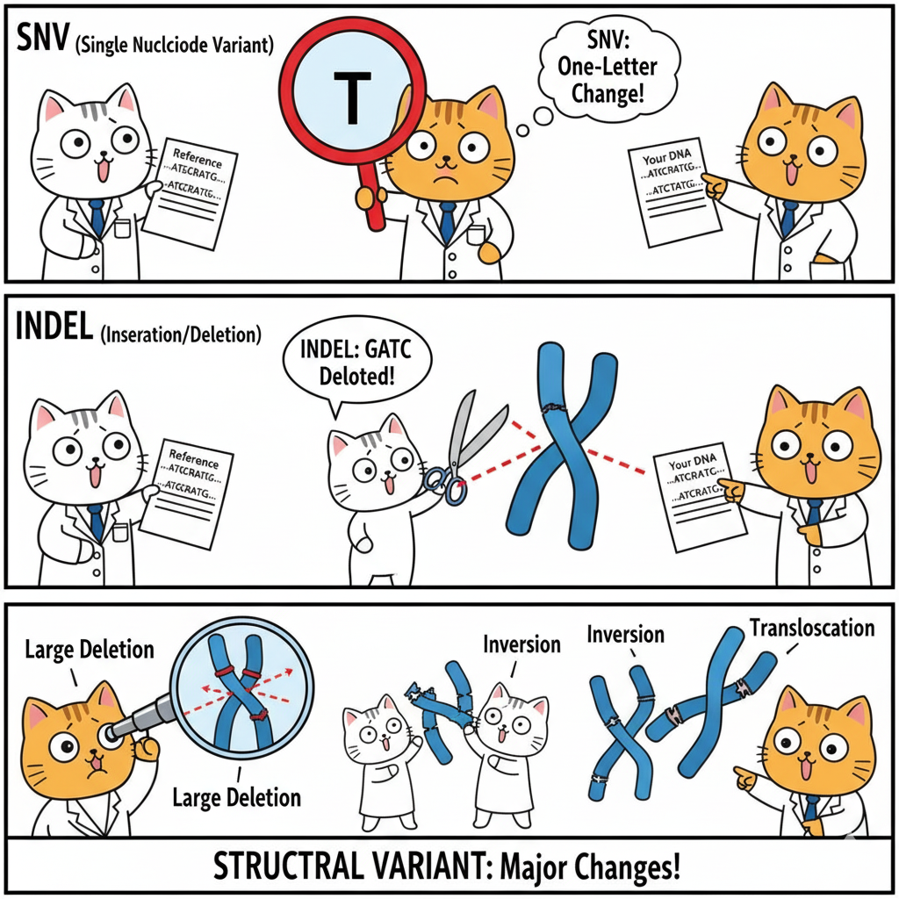

# Chapter 8. Genetic Variants

## The Molecular Basis of "Different"

When Mendel crossed purple and white pea plants, he observed predictable patterns but didn't know what caused the difference. Today, we can answer his question at the molecular level: the difference is a change in DNA sequence—a **genetic variant**.

When you sequence a genome, you don't get one string of As, Ts, Gs, and Cs. You get *millions of differences* from the reference genome. Understanding these differences is the foundation of modern genetics. This chapter explains what variants are, how we classify them, and what effects they have.

---

## Terminology: Quick Reference

The terms **mutation**, **variant**, and **polymorphism** are often used inconsistently. Here's a practical guide:

| Term | Definition | Connotation | When to Use |
|------|------------|-------------|-------------|
| **Variant** | Any DNA sequence difference | Neutral | Default term—safe for any difference |
| **Mutation** | DNA change, especially rare/new | Often implies disease | Rare changes causing disease |
| **Polymorphism** | Common variant (>1% frequency) | Usually benign | Common variation like blood types |
| **SNP** | Single Nucleotide Polymorphism | Common, benign | Pronounced "snip"—common single-base changes |

**The relationship:**
```
        All Variants
       /            \
   Mutations      Polymorphisms
  (rare, often    (common, usually
   harmful)         benign)
```

**Examples:**
- "CFTR mutation" = rare disease-causing change (cystic fibrosis)
- "ABO polymorphism" = common blood type variants
- "Novel variant" = newly discovered difference (unknown significance)

In this chapter, we use "variant" as the default neutral term.

---

## Variant Classification Framework

Understanding variants requires multiple perspectives. The same variant can be described by its size, location, and effect:

### Quick Overview Table

| Classification | Types | Detection | Clinical Importance |
|----------------|-------|-----------|---------------------|
| **By Size** | SNV, indel, structural variant | SNVs easiest; SVs need long reads | Size affects detection and impact |
| **By Location** | Coding, non-coding, regulatory | WES sees coding; WGS sees all | Location determines interpretability |
| **By Effect** | LoF, missense, synonymous | Coding effects predictable; non-coding uncertain | Effect determines pathogenicity |
| **By Frequency** | Common (>1%), rare (<1%) | All methods | Common variants rarely cause severe disease |

---

## Variants by Size

### Single Nucleotide Variants (SNVs)

**Definition:** One base differs from the reference.

```
Reference: ...ATGCGATCG...
Your DNA:  ...ATGCTATCG...
                 ↑
              G→T change
```

**Frequency:** ~4-5 million per genome (one every 600-800 bases)

**Detection:** Easiest to detect with both WGS and WES—the "bread and butter" of variant calling

### Insertions and Deletions (Indels)

**Definition:** Small pieces of DNA added or removed (typically 1-50 bp)

**Deletion example:**
```
Reference: ...ATGCGATCG...
Variant:   ...ATG---TCG... (CGA deleted)
```

**Insertion example:**
```
Reference: ...ATGCGATCG...
Variant:   ...ATGCAAAGATCG... (AAA inserted)
```

**Critical factor—divisible by 3?**
- **Yes (3, 6, 9 bp):** In-frame indel—adds/removes whole amino acids
- **No (1, 2, 4, 5 bp):** Frameshift—scrambles everything downstream

**Frequency:** ~400,000-500,000 per genome

**Detection:** Slightly harder than SNVs, especially in repetitive regions

### Structural Variants (SVs)

**Definition:** Large-scale changes (>50 bp, often >1 kb)

**Types:**
- Large deletions (can remove entire genes)
- Duplications (extra gene copies)
- Inversions (DNA segment flipped)
- Translocations (DNA moved between chromosomes)
- Copy number variants (CNVs)



**Impact:** ~1,000-2,000 SVs per person, affecting more total bases than all SNVs combined

**Detection challenge:**

| Technology | SV Detection Capability |
|------------|------------------------|
| Short-read (Illumina) | Poor—can infer but not confirm |
| Long-read (PacBio/Nanopore) | Excellent—reads span breakpoints |
| WES | Very poor—capture requires intact DNA |
| WGS | Good with long reads |

---

## Variants by Location and Effect

The genome isn't uniform. A variant's effect depends critically on *where* it lands.

### The 98/2 Rule

- **2% coding (exons):** Most known disease variants occur here—effects on proteins are predictable
- **98% non-coding:** Effects on gene regulation are subtle and harder to interpret

**Why coding variants are easier:**
- Direct protein consequence (change amino acid X to Y)
- Predictable functional impact
- Well-studied in databases

**Why non-coding variants are harder:**
- Indirect effects on gene expression
- Tissue-specific or context-dependent
- Limited database information

---

## Coding Variants: Five Main Types

All coding variants affect how DNA is translated into protein. Understanding requires knowing the genetic code reads in 3-base units (codons):

```
DNA:     ATG CAT GCA TTG AAA
Protein: Met-His-Ala-Leu-Lys
```

### Coding Variant Comparison Table

| Type | DNA Change | Protein Effect | Pathogenicity | Example Disease |
|------|------------|----------------|---------------|-----------------|
| **Synonymous** | GAA→GA**G** | Glu→Glu (same) | Usually benign | Rarely disease-causing |
| **Missense** | GAA→G**C**A | Glu→Ala (different) | **Variable** | Sickle cell (HBB) |
| **Nonsense** | CAG→**T**AG | Gln→**Stop** | Almost always harmful | Many CFTR variants |
| **Frameshift** | ATG\|CAT\|GCA → ATG\|CA_\|GCA | Scrambles downstream | Almost always harmful | Duchenne muscular dystrophy |
| **In-frame indel** | ATG\|CAT\|GCA\|TTG → ATG\|CAT\|TTG | Removes/adds amino acid(s) | Variable | EGFR in lung cancer |

### Key Insights

**1. Synonymous (Silent):** 
- ~25% of coding changes due to codon redundancy
- Usually benign but can affect splicing or translation efficiency

**2. Missense (Most Complex):**
- Effect depends on amino acid properties and location
- Conservative changes (similar amino acids) often benign
- Radical changes (charged ↔ hydrophobic) often harmful
- **Challenge:** Many classified as VUS (Variant of Uncertain Significance)

**3. Loss-of-Function (LoF) = Nonsense + Frameshift:**
- Both produce truncated/absent proteins
- Almost always pathogenic (with exceptions for specific genes)
- Subject to nonsense-mediated decay (mRNA destroyed)

**4. In-frame indels:**
- Effect depends on what's added/removed and where
- Example: EGFR deletions in lung cancer make receptor hyperactive

### Visual: Frameshift vs In-Frame

```
Normal:      ATG|CAT|GCA|TTG|AAA
             Met-His-Ala-Leu-Lys

Frameshift   ATG|CA_|GCA|TTG|AAA  (1 base deleted)
(1 bp del):  ATG|CAG|CAT|TGA|AA...
             Met-Gln-His-STOP ← Wrong amino acids, early stop

In-frame     ATG|CAT|___|TTG|AAA  (3 bases deleted)
(3 bp del):  ATG|CAT|TTG|AAA
             Met-His-Leu-Lys ← One amino acid missing, frame preserved
```

---

## Non-Coding Variants: More Complex, Less Understood

### 1. Splice Site Variants: Breaking the Cut-and-Paste

**Background:** Genes have introns (removed) and exons (kept). Splicing happens at precise sequences:
- 5' splice site (donor): GT
- 3' splice site (acceptor): AG

**Canonical splice site variants (GT→AT or AG→AA):**
- Splicing usually fails catastrophically
- Intron retained, exon skipped, or cryptic sites used
- Usually causes loss of function

**Example:** BRCA2 splice site mutations → non-functional protein → hereditary breast cancer

**Near-splice variants:**
- Within ~10-20 bp of splice sites
- Can weaken splicing without breaking it
- Harder to predict effects

### 2. Regulatory Variants: Affecting Gene Expression

**Types and locations:**

| Element | Location | Effect | Example |
|---------|----------|--------|---------|
| Promoter | Near gene start | Affects transcription initiation | HFE promoter → hemochromatosis |
| Enhancer | Can be 100+ kb away | Increases gene expression | MYC enhancer → cancer |
| 5' UTR | Before start codon | Affects translation efficiency | Various |
| 3' UTR | After stop codon | Affects mRNA stability, miRNA binding | TP53 3'UTR → cancer risk |

**Challenge:** Unlike coding variants (direct amino acid change), regulatory effects are:
- Tissue-specific
- Context-dependent
- Difficult to quantify (how much expression change matters?)
- Hard to connect to distant genes

### 3. Deep Intronic and Intergenic Variants

**Most are neutral** but exceptions exist:
- Cryptic splice site creation
- Hidden regulatory elements
- Long-range chromatin interactions

**Bottom line:** These are hardest to interpret—active research area.

---

## Clinical Interpretation: Which Variants Matter?

When you sequence a genome and find millions of variants, you need a systematic filtering approach.

### The Clinical Filtering Pipeline

```
~4-5 million variants detected
         ↓
Filter 1: Frequency (remove common >1%)
         ↓
~50,000-100,000 rare variants
         ↓
Filter 2: Location (focus on coding + splice sites)
         ↓
~5,000-10,000 protein-affecting variants
         ↓
Filter 3: Gene relevance (phenotype match)
         ↓
~100-500 candidates
         ↓
Filter 4: Effect prediction (LoF, pathogenic missense)
         ↓
~5-20 strong candidates
         ↓
Filter 5: Inheritance pattern + family data
         ↓
1-3 likely causal variants
```

### Evidence Integration Framework

**Strong evidence for pathogenicity:**
- ✓ Nonsense or frameshift in disease-relevant gene
- ✓ Rare (<0.01%) or absent in population databases
- ✓ High constraint gene (pLI >0.9)
- ✓ Segregates with disease in family
- ✓ Matches known inheritance pattern
- ✓ Functional studies confirm effect

**Uncertain significance (VUS):**
- ? Missense in relevant gene
- ? Moderate frequency (0.1-1%)
- ? Conflicting computational predictions
- ? Limited family data
- ? Novel variant, no prior reports

**Likely benign:**
- ✗ Common in population (>1%)
- ✗ Synonymous in non-splice region
- ✗ Multiple computational predictions: benign
- ✗ Seen in healthy individuals with same phenotype

---

## Practical Example: Interpreting a Novel Variant

**Case:** Child with developmental delays. WES finds a novel variant in KMT2D gene:

**Step 1—Check frequency:**
- gnomAD: Absent from 140,000+ individuals ✓ (rare)

**Step 2—Check variant type:**
- Nonsense variant (creates premature stop) ✓ (loss-of-function)

**Step 3—Check gene:**
- KMT2D: Known Kabuki syndrome gene ✓ (phenotype match)
- pLI = 1.0 ✓ (extremely intolerant to LoF)

**Step 4—Check inheritance:**
- De novo (not in either parent) ✓ (consistent with dominant disease)
- Kabuki is autosomal dominant ✓ (fits pattern)

**Step 5—Check databases:**
- ClinVar: Other LoF variants in KMT2D classified as pathogenic ✓
- Literature: Many de novo KMT2D LoF variants cause Kabuki ✓

**Conclusion:** Pathogenic variant—likely explains patient's phenotype

---

## WGS vs WES: What Can You Detect?

| Variant Type | WGS | WES | Notes |
|--------------|-----|-----|-------|
| **Coding SNVs/indels** | ✓✓ | ✓✓ | Both excellent |
| **Splice sites (canonical)** | ✓✓ | ✓✓ | WES captures exon boundaries |
| **Deep intronic** | ✓✓ | ✗ | WES misses most introns |
| **Regulatory (promoter/enhancer)** | ✓✓ | ✗ | WES misses non-coding |
| **Structural variants** | ✓ | ✗/? | WES poor; WGS with long reads best |

**Clinical decision:**
- **Start with WES** for suspected Mendelian diseases (coding variants)
- **Use WGS** if WES negative or suspect regulatory/structural causes

---

## Key Takeaways

1. **Variants exist at multiple scales:** SNVs (1 bp), indels (1-50 bp), structural variants (>50 bp)—each requires different detection methods

2. **Location determines interpretability:** Coding variants are easier to interpret than non-coding; 98% of genome is non-coding

3. **Effect on protein predicts pathogenicity:** LoF variants (nonsense/frameshift) almost always harmful; missense variable; synonymous usually benign

4. **Frequency matters:** Common variants (>1%) rarely cause severe disease due to natural selection

5. **Multiple evidence types needed:** No single criterion sufficient—integrate frequency, effect, gene constraint, inheritance, and functional data

6. **Many variants remain uncertain:** VUS (Variant of Uncertain Significance) is common, especially for missense and non-coding variants

7. **Sequencing strategy matters:** WES excellent for coding variants; WGS needed for comprehensive analysis

---

## Looking Ahead

Understanding variant types is foundational. The next sections explore:
- How variants are transmitted through families
- Why some variants are dominant and others recessive
- How population genetics shapes variant frequencies
- How to use variant data to diagnose genetic diseases

All builds on this framework: variants are the molecular basis of alleles, and alleles follow Mendel's rules—but now we see them directly in DNA sequence.