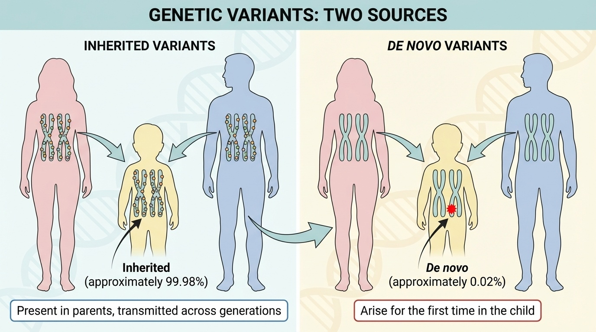
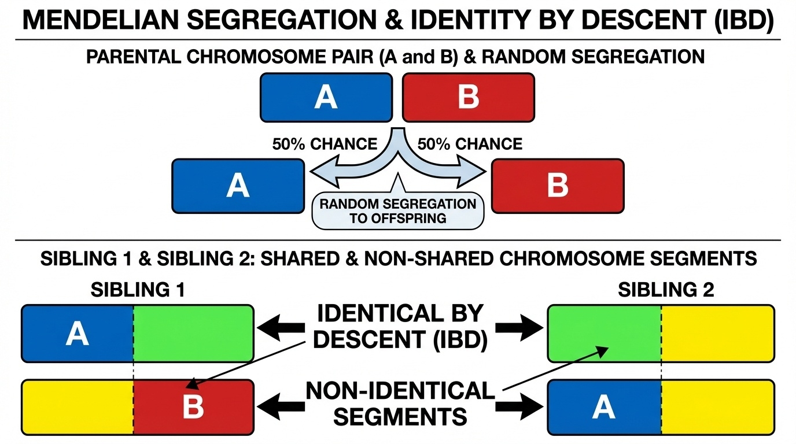
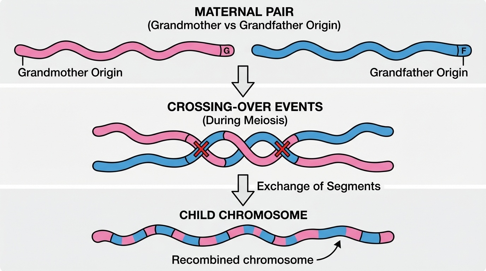
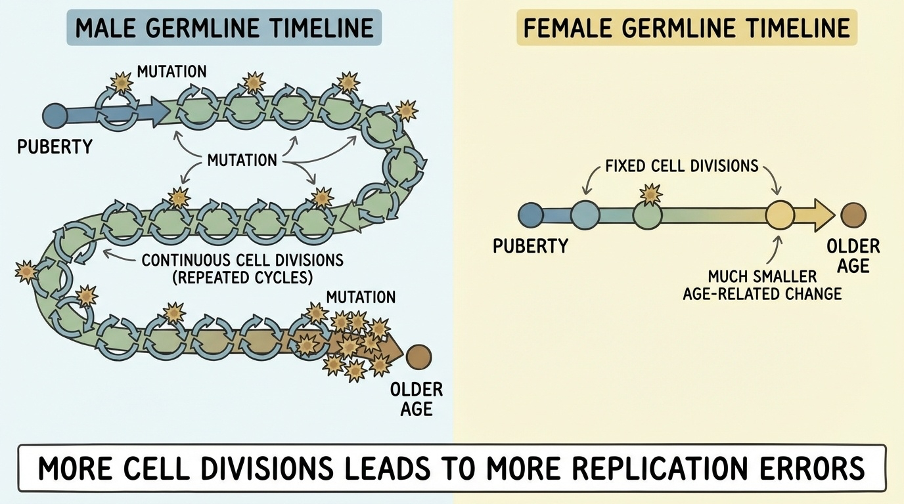

# Chapter 9. Transmission: How Variants Pass Through Generations

## Two Sources of Your Variants

When you were conceived, you received ~3.2 billion base pairs of DNA—half from each parent. Within that DNA are ~4-5 million variants that differ from the reference genome.

Where did they come from?

**Two sources:**

1. **Inherited variants** (~99.98%): Already in your parents' genomes, passed through sperm and egg, traveling through populations for generations

2. **De novo variants** (~0.02%): Brand new mutations—occurred for the first time in you, not present in either parent

Understanding this distinction is crucial for genetics, medicine, and evolution. This chapter explores both.


**Figure 9-1: Two sources of genetic variants: inherited vs de novo.** Inherited variants (approximately 99.98%) are present in parents and transmitted across generations following Mendelian segregation. De novo variants (approximately 0.02%) arise for the first time in the child during gametogenesis or early embryonic development, representing new mutations not present in either parent.

---

## Part 1: Inherited Variants

### Mendelian Segregation at the DNA Level

You received one chromosome copy from each parent at every position. At heterozygous sites (where a parent has two different alleles), you randomly got one or the other.

**Example—CFTR gene position:**

```
Mother: A/G (heterozygous)    You inherit: Either A or G (50% each)
Father: G/G (homozygous)      You inherit: G (100%)

Your possible genotypes:
→ A/G (50% chance)
→ G/G (50% chance)
```

This is **Mendelian segregation** directly observable in DNA sequences.

### Identity by Descent (IBD): Relatedness in DNA

When you inherit a DNA segment, you get an exact copy—**identity by descent (IBD)**. This reveals relationships:

| Relationship | % IBD Shared | Why |
|--------------|--------------|-----|
| Parent-child | 50% | You got one chromosome copy from them at every position |
| Siblings | ~50% (varies) | Each randomly got one of two parental chromosomes |
| Grandparent-grandchild | ~25% | Two generations of 50% transmission |
| First cousins | ~12.5% | Four generations from common ancestor |

**Sibling variation explained:**

At each position, you and a sibling each randomly received one parental chromosome:
- 25%: Same from both parents (identical)
- 50%: Same from one parent (half-identical)  
- 25%: Different from both (non-identical)

Average: 50% IBD, but actual sharing varies (45-55% typical range)


**Figure 9-2: Mendelian segregation and identity by descent (IBD).** During meiosis, each parent randomly transmits one of their two chromosomes at every position (50% chance for each). Siblings inherit different combinations of parental chromosomes, resulting in shared (IBD) and non-shared chromosome segments. On average, siblings share 50% of their genome IBD, but the actual proportion varies (typically 45-55%) due to random segregation.

### Recombination: Shuffling Between Generations

Chromosomes don't pass intact. During meiosis, **recombination** (crossing over) exchanges segments between the two parental chromosomes before transmission.

**Result:** Your mother's chromosome 1 is a mosaic:
```
Position 1-50 Mb:    From maternal grandmother
Position 50-200 Mb:  From maternal grandfather
Position 200-250 Mb: From maternal grandmother
```

**Impact:**
- Creates novel allele combinations
- Explains sibling diversity
- ~1-2 crossovers per chromosome per generation


**Figure 9-3: Recombination creates mosaic chromosomes.** During meiosis, crossing-over events exchange segments between the two parental chromosomes (one from grandmother, one from grandfather). The resulting transmitted chromosome is a mosaic containing segments from both grandparents. Recombination creates novel allele combinations and contributes to sibling genetic diversity, with approximately 1-2 crossover events per chromosome per generation.

### Common vs. Rare Inherited Variants

| Feature | Common Variants (>1%) | Rare Variants (<1%) |
|---------|---------------------|-------------------|
| **Age** | Ancient (thousands-millions of years) | Recent (hundreds-thousands of years) |
| **Selection** | Survived selection → usually benign | May be deleterious, not yet eliminated |
| **Clinical** | Complex trait risk factors | Often cause Mendelian diseases |
| **Example** | ApoE4 (~15% frequency, Alzheimer's risk) | Family-specific BRCA1 nonsense mutations |

---

## Part 2: De Novo Variants

### What Are They?

**De novo variants** are mutations that occurred for the first time in you—not present in either parent.

**Where they arise:**
- **Mostly in gametogenesis:** During sperm/egg formation
- **Sometimes postzygotic:** In early embryonic divisions (→ mosaicism)

**How many:** ~50-200 per person, depending on sequencing technology and what's counted

### Why They Matter

**1. Source of new genetic variation**  
All diversity started as de novo mutations. Evolution in action.

**2. Cause genetic diseases**  
Many severe developmental disorders:
- Autism (often de novo in neurodevelopmental genes)
- Achondroplasia (almost always de novo—affected individuals rarely reproduce)
- Schizophrenia (increased risk with older fathers)

**3. Reveal DNA replication biology**  
Studying where and when mutations occur teaches us about replication errors and repair mechanisms.

---

## The Paternal Age Effect

**Key finding:** Father's age at conception is the dominant factor in de novo mutation rate.

### The Biology

**Why males contribute more mutations:**

| Female (Oogenesis) | Male (Spermatogenesis) |
|-------------------|----------------------|
| All eggs formed before birth | Sperm production starts at puberty |
| Cells arrested until ovulation | Continuous production throughout life |
| ~23 cell divisions total | Divisions every ~16 days |
| **Minimal age effect** | **Strong age-dependent effect** |

**The math:**
- Father age 20: ~150 sperm cell divisions
- Father age 30: ~230 divisions  
- Father age 40: ~330 divisions
- Father age 50: ~430 divisions

Each division = opportunity for replication errors.


**Figure 9-4: The paternal age effect on de novo mutations.** Males show a strong age-dependent increase in de novo mutations due to continuous spermatogenesis throughout life, with cell divisions occurring approximately every 16 days. In contrast, females show minimal age effect because oogenesis involves a fixed number of cell divisions (approximately 23) completed before birth, with oocytes arrested until ovulation. Each cell division represents an opportunity for DNA replication errors, explaining why paternal age is the dominant factor in de novo mutation rate (approximately 1.5 mutations per year of father's age vs approximately 0.4 per year of mother's age).

---

## Quantifying the Effect: Landmark Studies from Iceland

### Kong et al. (2012): The First Direct Measurement

Direct mutation counting in 78 Icelandic families revealed fundamental insights into human mutation rates ([Kong et al. 2012, Nature](https://doi.org/10.1038/nature11396)).

**Core findings:**

1. **Mutation rate:** 1.20 × 10⁻⁸ per base per generation
   - Translates to ~63 de novo SNVs per child (father age ~30)

2. **Paternal age effect:** **+2 mutations per year of father's age**
   ```
   Father age 20: ~55 mutations
   Father age 30: ~75 mutations
   Father age 40: ~95 mutations
   Father age 50: ~115 mutations
   ```

3. **Parent-of-origin ratio:** 4:1 (father:mother)
   - Father: ~55.4 mutations
   - Mother: ~14.2 mutations (appeared age-independent in this study)

4. **Mutation spectrum:**
   - CpG sites: 18× higher mutation rate
   - Transitions (A↔G, C↔T): 67.8%
   - Transversions: 32.2%

5. **Disease associations:**
   - Schizophrenia risk ↑ with paternal age (P = 2×10⁻⁵)
   - Autism risk ↑ with paternal age (P = 5.4×10⁻⁴)

### Jónsson et al. (2017): Expanded Analysis with 1,548 Families

A more comprehensive study from the same Icelandic research group analyzed **1,548 parent-child trios** (20-fold larger than Kong 2012), identifying 108,778 de novo mutations ([Jónsson et al. 2017, Nature](https://doi.org/10.1038/nature24018)). This larger dataset confirmed the paternal age effect and revealed important new findings about maternal contributions.

**Updated findings:**

1. **Paternal mutations:** +1.51 per year of father's age (95% CI 1.45–1.57)
   - Slightly lower than Kong 2012's estimate of +2 per year, but consistent within confidence intervals

2. **Maternal mutations:** +0.37 per year of mother's age (95% CI 0.32–0.43)
   - **Important discovery:** Maternal age effect exists but is ~4× weaker than paternal effect
   - Kong 2012 reported maternal mutations as age-independent, but this larger study revealed a small but significant maternal age effect

3. **Mutation spectrum changes with maternal age:**
   - CpG>TpG mutations: decrease by 0.26% per year of maternal age
   - C>G mutations: increase by 0.33% per year of maternal age
   - These spectral changes are not uniform across the genome

4. **Regional variation:**
   - A 20 Mb region on chromosome 8p shows up to **50-fold higher maternal C>G mutation rate**
   - Similar enrichment found on chromosomes 2p, 7p, 9p, 16p, and 16q
   - This regional pattern is not limited to specific genes but affects entire chromosomal regions

5. **Parent-of-origin ratio:** 75-81% paternal (3-4:1 ratio, consistent with Kong 2012)

**For a visual comparison of paternal vs. maternal age effects across all mutation types, see Figure 1e in Jónsson et al. (2017).**

**Key implications:**

The discovery of maternal age effects and regional mutation hotspots fundamentally changed our understanding of human mutation. While paternal age remains the dominant factor (due to continuous cell divisions in spermatogenesis), maternal age also contributes—particularly for certain mutation types and in specific genomic regions. The regional C>G enrichment suggests distinctive mutational processes in aging oocytes, possibly related to double-strand break repair mechanisms.

### Porubsky et al. (2025): Long-Read Revolution

Recent study measured the most accurate rate of de novo variants (including all variant types) using long read sequencing technologies ([Porubsky et al. 2025, Nature](https://www.nature.com/articles/s41586-025-08922-2)).


**New findings:**

1. **Higher total count:** 98-206 mutations/child
   - 74.5 SNVs in unique DNA
   - 65.3 mutations in repetitive DNA (previously invisible)
   - 7.4 small indels
   - 12.4 Y chromosome mutations (per male)

2. **75-81% paternal contribution** (confirmed with more precision)

3. **16% postzygotic mutations** (arose after fertilization)
   - No parent-of-origin bias
   - Can cause mosaicism

4. **Mutation hotspots:** 32 specific regions with recurrent mutations
   - Tandem repeats (polymerase slippage)
   - Centromeres (satellite DNA)
   - Segmental duplications

5. **No recombination-mutation link** (independent processes)


**Figure 9-5: De novo mutations in CEPH 1463 pedigree**. *The figure shows: (a) Number of de novo germline mutations, postzygotic mutations (PZMs), and indels in G2 parents and G3 children, (b) Allele balance comparison showing germline SNVs cluster near 0.50 while postzygotic SNVs show lower allele balance (<0.25), (c) Strong paternal age effect for germline de novo SNVs (+1.55 DNMs per year) but not for PZMs, (d) Estimated SNV DNM rates by genomic region, showing significant excess in repetitive regions including centromeres and segmental duplications. Source: Porubsky, D. et al. (2025). Human de novo mutation rates from a four-generation pedigree reference. Nature. https://doi.org/10.1038/s41586-025-08922-2. License: CC-BY 4.0.*

---

## Clinical Implications

### For Genetic Counseling

**Paternal age considerations:**

| Father's Age | Additional Risk |
|--------------|----------------|
| <30 | Baseline mutation rate |
| 30-40 | +20 mutations (~35% increase) |
| 40-50 | +40 mutations (~70% increase) |
| >50 | +60+ mutations (>100% increase) |

**Most mutations are harmless**, but risk of specific conditions increases in certain disorders.

### For Clinical Diagnosis

**When a child has a disorder not present in parents:**

**1. Look for de novo mutations:**
```
Sequence trio (child + both parents)
         ↓
Identify variants in child absent from both parents
         ↓
Prioritize: LoF or damaging missense in disease genes
         ↓
Validate: Check for mosaicism in parents
```

**2. Consider sequencing technology:**
- Short-read (Illumina): Misses repetitive regions
- Long-read: Comprehensive, includes centromeres, tandem repeats

**3. Check for mosaicism:**
- Low-level parental mosaicism can explain apparent de novo variants
- Important for recurrence risk counseling

---

## Identifying De Novo Variants: The Trio Approach

**Standard workflow:**

### Trio Sequencing Strategy

```
Sequence:
- Proband (affected child)
- Mother  
- Father

Compare:
- Variants in child
- Variants in parents

De novo candidates:
- Present in child
- Absent in BOTH parents
- Pass quality filters
```

### Quality Control Steps

**Challenge:** Sequencing errors can look like de novo mutations.

**Filters applied:**

| Filter | Purpose | Typical Threshold |
|--------|---------|------------------|
| Read depth | Ensure reliable calls | >20× coverage |
| Allele balance | Check heterozygous ratio | 30-70% variant reads |
| Mapping quality | Avoid mismapped reads | MAPQ >30 |
| Parental absence | Confirm not inherited | 0 variant reads in parents |
| Validation | Confirm by Sanger or PCR | For clinical variants |

**False positive sources:**
- Sequencing errors (especially at low coverage)
- Parental mosaicism (mutation in some parental cells)
- Poor reference alignment in complex regions

---

## Evolutionary Perspective

### Mutation as the Engine of Evolution

**Short-term (per generation):**
- Each person: ~50-200 new mutations
- Most neutral or slightly deleterious
- Rare beneficial mutations

**Long-term (over millennia):**
- Beneficial mutations increase in frequency (positive selection)
- Deleterious mutations decrease (negative selection)  
- Neutral mutations drift randomly

**Today's polymorphisms = Yesterday's de novo mutations**

The common SNPs distinguishing populations were once de novo mutations in individuals thousands of years ago.

### Population-Level Effects

**As average paternal age increases:**

```
1900s Iceland: Average father age = 34.9 years
1980s Iceland: Average father age = 27.9 years  
2010s Iceland: Average father age = 33.0 years
```

**Consequence:** Population-wide mutation rate fluctuates with demographics.

**Debate:** Does delayed reproduction increase disease burden? 
- Pro: More mutations → more genetic disease
- Con: Most mutations harmless; modern medicine compensates

---

## Summary Table: Inherited vs. De Novo

| Feature | Inherited Variants | De Novo Variants |
|---------|-------------------|------------------|
| **Frequency** | ~4-5 million per genome | ~50-200 per genome |
| **Source** | Parents' genomes | New mutations during reproduction |
| **Age** | Can be ancient (millions of years) | Brand new (this generation) |
| **Detection** | Standard variant calling | Trio sequencing required |
| **Inheritance** | Follow Mendelian segregation | Not inherited (absent in parents) |
| **Clinical** | Common → complex traits<br>Rare → Mendelian diseases | Severe developmental disorders<br>Dominant de novo conditions |
| **Selection** | Already filtered by selection | Haven't faced selection yet |

---

## Key Takeaways

1. **Two sources of variants:** Inherited (from parents, following Mendel's laws) and de novo (new mutations in you)

2. **Paternal age effect dominates:** Father's age is the main determinant of de novo mutation rate (~1.5 mutations/year), though maternal age also contributes (~0.4 mutations/year)

3. **Males contribute more:** 75-81% of mutations due to continuous sperm production with repeated cell divisions

4. **Maternal mutations have unique patterns:** Mutation spectrum changes with maternal age, with regional hotspots showing up to 50-fold enrichment

5. **Technology matters:** Long-read sequencing reveals mutations in repetitive DNA invisible to short reads, nearly doubling the total mutation count

6. **Clinical importance:** De novo mutations cause many severe developmental disorders; trio sequencing identifies them

7. **Evolutionary engine:** All genetic diversity started as de novo mutations; today's polymorphisms were once new mutations

---

## Beyond Individual Mutations: An Evolutionary Perspective

We've focused on de novo variants in individuals, but these mutations are also the raw material for evolution. Over long timescales, individual mutations accumulate to create species differences and even entirely new genes.

### From Individuals to Species: Time Scales

| Scale | Timeframe | Example |
|-------|-----------|---------|
| Individual | This generation | Your ~50-200 de novo variants |
| Population | 100-10,000 generations | ABO blood types, lactose tolerance |
| Species | 100,000+ generations | Human-chimp fixed differences (~35M SNVs) |
| New genes | 1-10 million years | Gene duplications, de novo gene birth |

### Three Mechanisms Drive Long-Term Evolution

**1. Accumulation of point mutations**

The same replication errors causing your de novo variants, accumulated over millions of years, create species boundaries ([Montañés et al. 2023, Molecular Biology and Evolution](https://doi.org/10.1093/molbev/msad098)). Humans and chimpanzees differ by ~35 million single-nucleotide changes, each starting as a de novo mutation in some ancestor.

**2. Gene duplication creating new functions**

Genes can be duplicated by unequal crossing-over or retrotransposition. Usually the duplicate copy degrades, but occasionally it evolves a new function. Classic example: the globin gene family (myoglobin, α-globin, β-globin, fetal γ-globin) all arose from ancient duplications of a single ancestral gene. Each duplication allowed functional specialization—fetal hemoglobin has higher oxygen affinity for placental transfer, while adult hemoglobin optimizes oxygen delivery to tissues.

**3. De novo gene birth from non-coding DNA**

Entirely new genes can emerge from previously non-coding sequences. Recent comparative genomics studies show many species-specific genes arose this way, though most (~80%) are rapidly lost. Survivors start small and gradually acquire function under selection (Montañés et al., 2023, Molecular Biology and Evolution).

### Case Study: FOXP2 and Speech Evolution

The **FOXP2** gene illustrates how point mutations can drive major phenotypic changes. Discovered in a British family with severe speech disorder, FOXP2 encodes a transcription factor critical for speech motor control ([Atkinson et al. 2018, Cell](ttps://doi.org/10.1016/j.cell.2018.06.048)). 

Human FOXP2 differs from chimpanzee by only two amino acids (at positions 303 and 325). Originally thought to be a recent selective sweep enabling modern human language, genomic studies revealed these changes were already present in Neanderthals, indicating an older origin (>300,000 years ago). While no evidence exists for recent selection, these ancient changes likely contributed to vocal motor learning in the human lineage (Atkinson et al., 2018, Cell).

Recent work identified additional speech-related genes (CHD3, SETD1A, WDR5) through whole-genome sequencing of children with speech disorders, revealing that speech acquisition involves a regulatory network of genes co-expressed in the developing brain.

### The Connection: Micro to Macro

**Your de novo mutations:**
- ~50-200 new changes this generation
- Most neutral or slightly harmful
- Will likely disappear within a few generations

**Your ancestors' de novo mutations:**
- Some accumulated to distinguish humans from other primates
- Some created new genes through duplication
- Some enabled uniquely human traits like speech

The DNA replication errors adding ~1.5 mutations per year of your father's age (and ~0.4 per year of your mother's age) are the same molecular process that, over evolutionary time, created all genetic diversity—from individual differences to the origin of new species.

---

## Looking Ahead: From Transmission to Pattern

You now understand where variants come from—inherited or arising de novo—and how they connect to evolution across all timescales. The next chapters explore:

**Chapter 10—Dominant Inheritance:** Why does one mutant copy sometimes cause disease? You'll see three molecular mechanisms explaining dominance.

**Chapter 11—Haploinsufficiency:** Why are some genes sensitive to losing one copy? Population-scale metrics predict gene constraint.

**Chapter 12—Recessive Inheritance:** What happens when both copies are mutated? How does family structure reveal recessive alleles?

Understanding transmission is the foundation. Now we examine the patterns those transmitted variants create—the dominant and recessive inheritance that Mendel observed, now explained at the molecular level.