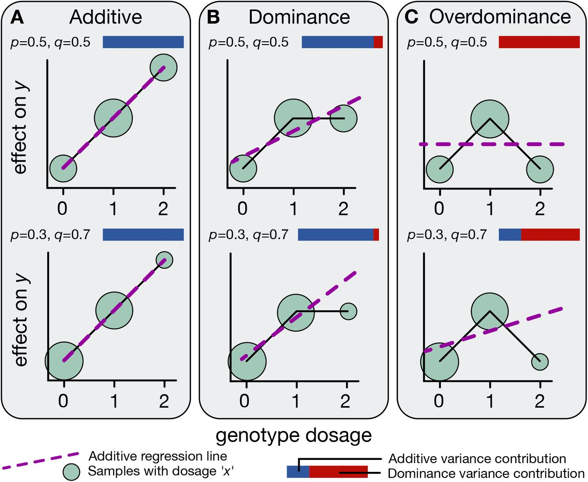
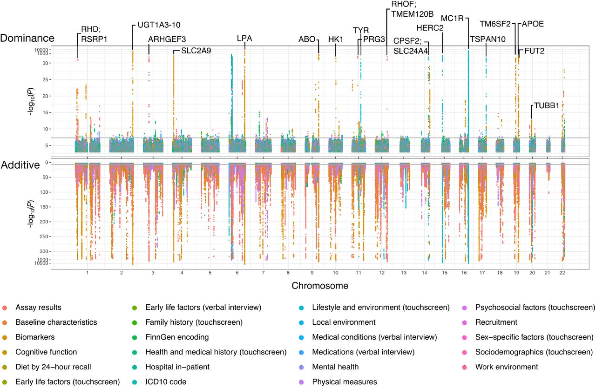

# Chapter 15. Polygenic Model in Traits

In the last section, we saw how dominant alleles like those causing achondroplasia and Marfan syndrome can dramatically alter height with just one mutated copy. But we also learned that most people's height comes from thousands of additive alleles, each nudging the trait up or down by tiny amounts.

Now let's zoom out and ask: Is height unusual, or do most human traits work this way? And how do scientists actually measure whether a trait is shaped more by additive effects or dominant effects?

To answer these questions, we'll look at a massive study from the **UK Biobank**. The study analyzed over 1,000 different human traits—everything from height and weight to disease risks—in more than 360,000 people. The findings confirm what we suspected: most traits are influenced by many genetic variants acting additively, while dominant effects are surprisingly rare.

---

## Most Traits Are Influenced by Additive Alleles

Let's start with a quick refresher on how additive alleles work. Imagine you have a genetic variant with two versions: allele A and allele B. Since you inherit one copy from each parent, you can have three possible genotypes: AA, AB, or BB.

With **additive alleles**, each B allele adds a consistent small effect. Let's use height as an example:
- If you have **AA**, that's your baseline height—let's say 170 cm.
- If you have **AB** (one copy of B), you might be 170.5 cm—half a centimeter taller.
- If you have **BB** (two copies of B), you'd be 171 cm—a full centimeter taller than AA.

Notice the pattern: each additional B allele adds the same amount (0.5 cm). That's what makes it additive. It's like stacking blocks—each block adds the same height.

**Figure: Three modes of allelic effects on traits**. *Panel A shows additive effects, where trait values increase linearly with genotype dosage (0, 1, 2 copies). The effect of having two copies is exactly twice the effect of having one copy. Panel B shows dominance, where heterozygotes (AB) deviate from the additive expectation—having one copy produces most or all of the effect. Panel C shows overdominance, where heterozygotes have more extreme trait values than either homozygote. Each panel shows examples with different allele frequencies (p) and effect sizes (q). The blue-red bars indicate the relative contribution of additive (blue) versus dominance (red) variance. For most human traits, additive effects dominate. Source: Palmer, C. et al. (2021). Quantifying the genetic contribution of dominance in complex traits. bioRxiv. https://www.biorxiv.org/content/10.1101/2021.08.15.456387v2.full. License: CC-BY-NC-ND 4.0.*

Now, here's the key finding. The study examined **361,194 individuals** across **1,060 different traits**—physical measurements like height and BMI, blood biomarkers, disease outcomes, and more. The analysis tested 13.7 million genetic variants to see which traits showed additive versus dominant effects ([Palmer et al. 2023, Science](https://pmc.ncbi.nlm.nih.gov/articles/PMC10345642/)).

The result? About **700 of the 1,060 traits** showed detectable additive heritability. In other words, for roughly two-thirds of the traits examined, genetic variation could be explained by additive alleles acting together. This confirms that most human traits are **polygenic**—shaped by many small-effect variants rather than one or two big ones.

But what about dominant effects? Remember, **dominant alleles** have a strong impact with just one copy. We've seen this with achondroplasia (FGFR3) and Marfan syndrome (FBN1), where a single mutated allele overrides the normal one and causes extreme changes.

The study found **183 genomic loci** with detectable dominant effects. One example is **MC1R**, a gene affecting hair color—having just one copy of certain MC1R variants is enough to influence your hair color noticeably. But here's the kicker: even though 183 loci were identified, dominant effects explained only about **0.5% of the additive genetic variance** on average. They're there, but they're rare and weak compared to the cumulative power of additive effects.

**Figure: Genome-wide distribution of additive and dominance effects across traits**. *This Manhattan-style plot shows the locations of genetic loci with significant additive (bottom, pink/red) and dominance (top, green/blue) effects across all chromosomes. Each vertical line represents a genomic region associated with one or more traits from different categories (cognitive function, physical traits, health biomarkers, etc.). The vast majority of associations show additive effects (bottom panel is densely populated), while dominance effects (top panel) are sparse—only 183 loci detected across all traits examined. Notable genes with dominance effects are labeled (MC1R, APOE, etc.). This visualization confirms that additive genetic architecture dominates human complex traits. Source: Palmer, C. et al. (2021). Quantifying the genetic contribution of dominance in complex traits. bioRxiv. https://www.biorxiv.org/content/10.1101/2021.08.15.456387v2.full. License: CC-BY-NC-ND 4.0.*

---

## How Scientists Measure Additive and Dominant Effects

The UK Biobank is one of the largest genetic datasets in existence. It includes genetic information and health records for over 500,000 people in the United Kingdom. The study used **361,194 participants** and examined **13.7 million genetic variants** to understand how these variants influence traits.

The approach builds on a method called **linkage disequilibrium score regression (LDSC)**. LDSC is a statistical technique that estimates how much of a trait's variation comes from genetics, without needing to identify every single causal variant. The method was extended to separately measure **additive** and **dominance** components of heritability. This new approach was called **dominance LDSC (d-LDSC)**, and it allowed researchers to tease apart how much extra variation dominance effects add beyond what additive effects already explain.

Let's break down how each type of effect is measured.

---

### Measuring Additive Effects

Measuring additive effects is pretty straightforward. You look at how the trait changes as you go from AA to AB to BB. If the trait increases in a steady, predictable way, that's additive.

Let's use a concrete example. Suppose we're measuring height:
- **AA genotype**: You have two copies of allele A. Let's call this your baseline—170 cm.
- **AB genotype**: You have one A and one B. If B is a height-increasing allele, you might be 170.5 cm.
- **BB genotype**: You have two copies of B. You'd be 171 cm.

We can encode this numerically as 0, 1, 2—counting the number of B alleles. AA gets 0, AB gets 1, BB gets 2. If the trait value increases proportionally (0 → 1 → 2), the effect is additive.

The study found that for most traits, this additive pattern captures nearly all the measurable genetic influence. The trait value scales smoothly with the number of effect alleles you carry.

---

### Measuring Dominant Effects

Dominance is trickier to measure. By definition, dominance means that having one copy of a variant (AB) is enough to produce a noticeable effect—you don't need two copies.

Let's think about what complete dominance looks like. Imagine a trait where the B allele is completely dominant over A:
- **AA**: Baseline trait value—let's say 0.
- **AB**: The trait changes—let's say to 1.
- **BB**: The trait stays at 1 (same as AB).

So the pattern is 0–1–1. Having one B is enough; a second B doesn't add anything extra.

But here's the problem: this 0–1–1 pattern overlaps with the additive pattern 0–1–2. When you look at AB, you can't immediately tell whether it's following a dominant pattern or just the halfway point of an additive pattern. The AB genotype could be showing dominance, or it could just be intermediate between AA and BB.

To separate these two possibilities, the study used a trick called **orthogonalized dominance encoding**. This mathematical technique isolates the heterozygote effect so it doesn't overlap with the additive signal.

Here's how it works in practice:
- **Additive encoding**: AA = 0, AB = 1, BB = 2 (the steady increase)
- **Orthogonalized dominance encoding**: AA = 0, AB = 1, BB = 0 (the special heterozygote effect)

Notice the dominance encoding: it's 0–1–0. This captures whether being a heterozygote (AB) gives you something special—something that can't be explained by simply counting alleles. If AB deviates from the linear trend between AA and BB, that's dominance.

The key word here is "orthogonalized." In math, orthogonal means "independent" or "perpendicular"—two things that don't overlap. By orthogonalizing the dominance encoding, the analysis ensures that additive and dominance effects are statistically independent. Each one captures its own unique contribution to the trait.

---

### Explaining "Orthogonalized Dominance" Without Math

Okay, that probably still sounds abstract. Let's try a different analogy.

Imagine you're listening to music through headphones with an equalizer. The equalizer has two controls:
- **Volume slider**: This is like the additive effect. Turn it up, and everything gets louder. The change is smooth and predictable.
- **Bass boost button**: This is like the dominance effect. It adds a special quality—extra bass—that you can't get by just turning up the volume.

If you adjust both controls at once, it's hard to tell how much of the sound change is from volume versus bass boost. So you need to separate them. You set the volume to a baseline level, then test the bass boost independently.

That's what orthogonalization does. It removes the overlap between additive (volume) and dominance (bass boost) so you can measure each one separately.

In genetic terms:
- The **additive effect** measures the steady increase as you go from 0 to 1 to 2 copies of an allele.
- The **dominance effect** measures the special boost you get from being a heterozygote (AB), after accounting for the additive trend.

So when the analysis uses orthogonalized dominance encoding (0–1–0), it's asking: "Does being AB give you something extra that can't be explained by just having one B allele?" If yes, that's dominance.

---

### Measuring the Overall Contribution to Traits

Using **additive LDSC** and **dominance LDSC (d-LDSC)**, the analysis quantified how much of each trait's variation comes from additive versus dominant effects.

Here's what was found:
- The **additive component** explained a detectable proportion of variance in about **700 of the 1,060 traits**. For most traits, additive effects accounted for a substantial chunk of the genetic influence.
- The **dominance component** was detected at **183 genomic loci**, but it accounted for only about **0.5% of the additive variance** on average.

In other words, dominance effects are real—they exist—but they're rare and weak compared to additive effects. For the vast majority of traits, what matters is the cumulative sum of thousands of small additive variants, not a handful of dominant ones.

One more thing: the additive and dominance components were **orthogonal**—statistically independent. This means they captured genuinely different aspects of genetic architecture. Additive effects tell you how many effect alleles you carry. Dominance effects tell you whether being a heterozygote gives you something special.

---

### Why Additive Effects Dominate

So why do additive alleles explain most genetic variation, while dominant effects are so rare?

There are a few reasons. First, additive effects accumulate. Even if each individual variant has a tiny effect, thousands of them together can explain a lot of variation. It's like compound interest—small amounts add up over time (or in this case, across the genome).

Second, dominant effects require a very specific genetic architecture: the heterozygote has to deviate from the additive expectation. This is less common than simple additive effects, where each allele contributes independently.

Third, evolution plays a role. Strongly dominant variants—especially harmful ones—tend to get weeded out by natural selection. If having one copy of a variant is enough to cause a problem, that variant won't stick around in the population for long. The exceptions are dominant disease alleles that arise frequently by new mutation (like the FGFR3 mutation causing achondroplasia) or that have late-onset effects (like Huntington's disease), which selection can't remove efficiently.

What we're left with is a genome full of small-effect additive variants. These variants shape the continuous variation we see in traits like height, BMI, and disease risk. Dominant effects exist—183 loci were found—but they're the exception, not the rule.

---

This study from the UK Biobank gives us a powerful confirmation: **most human traits are polygenic**, shaped by many additive alleles acting together. Dominant effects are rare and weak. When you look at someone's height, or their risk of diabetes, or their cholesterol levels, you're seeing the cumulative result of thousands of tiny genetic nudges—not one or two big switches.