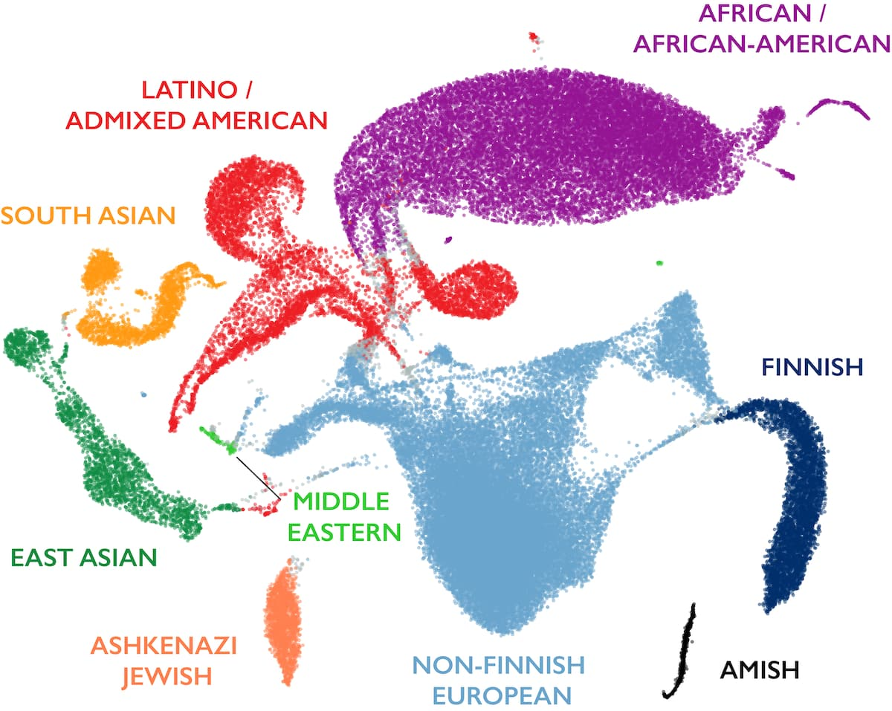

# Chapter 21. Population Structure

Imagine you're standing in a busy airport, watching people from all over the world walk by. You notice that some people look similar to each other—maybe they share certain facial features, skin tones, or body builds. Without knowing anything about where they're from, you might guess that people who look similar probably come from the same region or share common ancestry.

Genetics tells a similar but much more precise story. When we look at DNA instead of physical appearance, we see that people from the same geographic region tend to share certain genetic variants more often than people from distant regions. These patterns aren't sharp boundaries—they're gradual gradients, like colors blending into each other on a map. But they're measurable, and they tell us about human history: ancient migrations, population bottlenecks, and the mixing of groups over thousands of years.

This is what geneticists call **population structure**—systematic differences in allele frequencies among groups. It's not about dividing humans into categories. It's about recognizing that genetic variation isn't randomly distributed. History has left traces in our genomes, and we can read those traces.

Understanding population structure matters for both scientific and ethical reasons. Scientifically, we need to account for it in genetic studies to avoid false conclusions. If a variant is common in one population and rare in another, and you're studying a disease that's also more common in that first population, you might mistakenly think the variant causes the disease when it's just correlated with ancestry. Ethically, we need to be clear that genetic differences among populations are subtle gradients, not fundamental divisions—and that the concept of biological "races" has no basis in genetics.

---

## What Is Population Structure?

**Population structure** refers to the presence of subgroups within a species that differ in their allele frequencies. In humans, we see small frequency differences between continental groups—African, European, East Asian, South Asian, and so on. These differences aren't huge—most genetic variation exists *within* populations, not between them—but they're detectable and meaningful.

How did these differences arise? The answer is history.

Humans evolved in Africa and began migrating out roughly 60,000 to 100,000 years ago. As groups moved to different continents, they became partially isolated from each other. Geographic distance, mountains, oceans, and deserts limited gene flow—the exchange of genetic material through reproduction. When gene flow is restricted, populations accumulate differences over time through several mechanisms:

**Genetic drift**: Random fluctuations in allele frequency from generation to generation. In small populations, drift can be strong. An allele might increase or decrease in frequency just by chance—who happens to have more children, who survives, who doesn't. Over many generations, drift causes populations to diverge even if they start out identical.

**Mutation**: New variants arise randomly in each population. Most mutations are neutral or slightly deleterious and stay rare. But occasionally, a new variant drifts to moderate frequency in one population while remaining absent in others. This creates population-specific variants.

**Natural selection**: Different environments favor different alleles. Selection can drive allele frequency differences between populations when environmental pressures differ.

The result is that populations separated by geography and time develop distinct—but overlapping—patterns of allele frequencies. These patterns form subtle genetic gradients across the globe. There are no sharp boundaries. If you sample people along a transect from West Africa through the Middle East to Europe, you see smooth changes in allele frequencies, not sudden jumps.

This is why geneticists emphasize that **population structure does not reflect biological "races."** Race is a social category based on visible traits like skin color. Genetically, human variation is continuous. Populations blend into each other. Any attempt to draw sharp lines is arbitrary.

---

## Race, Ethnicity, Ancestry, and Population—Different Concepts

In everyday conversation, people use words like "race," "ethnicity," and "ancestry" interchangeably. But in genetics, these terms have distinct meanings, and it's essential to keep them separate.

| Concept | Definition | Nature | Example |
|---------|------------|--------|---------|
| **Race** | Socially defined category based on perceived physical traits | Social construct; varies by culture and time | "Black," "White," "Asian" |
| **Ethnicity** | Cultural identity including language, nationality, traditions | Cultural; may correlate weakly with ancestry | Han Chinese, Yoruba, Navajo |
| **Ancestry** | Genetic lineage reflecting where ancestors lived | Biological and historical; probabilistic | "50% European, 50% East Asian ancestry" |
| **Population** | Group interbreeding more with each other than outsiders | Biological; defined by gene flow patterns | "European population," "East Asian population" |

**Race** has no precise biological definition. There's no set of genes that cleanly separates humans into racial groups. Skin color, for example, is controlled by a handful of genes that vary continuously across populations. Two people classified as "White" might be more genetically different from each other than either is from someone classified as "Black." Because of this imprecision—and because racial categories have been misused historically to justify discrimination—geneticists avoid using race as a biological concept.

**Ethnicity** is primarily about culture, not DNA. You can be ethnically French without having French ancestry, or vice versa.

**Ancestry** is a probabilistic description of where your DNA comes from, not a box you fit into. These percentages reflect which populations contributed to your genetic makeup based on allele frequency patterns.

Modern human genetics focuses on **ancestry** and **population**, not race or ethnicity. This distinction matters both scientifically and ethically. Understanding this helps researchers correct for ancestry-related bias in genetic studies and appreciate human diversity as a product of shared evolutionary history, not rigid divisions.

---

## How Population Structure Arises

Population structure emerges through distinct evolutionary mechanisms, each leaving characteristic signatures in the genome.

### Geographic Isolation and Drift

When populations live far apart—separated by oceans, deserts, or mountain ranges—gene flow between them is limited. Over time, genetic drift and mutation cause their allele frequencies to diverge. Even if the populations start out genetically identical, isolation ensures they'll become different. The longer they're separated, the more different they become.

### Founder Effects

Founder effects happen when a new population is established by a small number of individuals who carry only a fraction of the genetic diversity from their original population. Some alleles might be overrepresented by chance, others might be missing entirely. As the new population grows, it retains this reduced diversity.

The Finnish population exemplifies founder effects and bottlenecks. The population descended from approximately 4,000 founders about 4,000 years ago, followed by a major bottleneck in the 17th century when one-third of the population perished during famine ([Peltonen et al. 1999, Human Molecular Genetics](https://academic.oup.com/hmg/article/8/10/1913/619654)). These events created the Finnish Disease Heritage—36 mostly recessive genetic disorders that are far more common in Finland than elsewhere ([Norio 2003, Human Genetics](https://link.springer.com/article/10.1007/s00439-003-0964-x)). Each disease is typically caused by a single founder mutation that drifted to high frequency during population expansion. This demonstrates how founder effects combined with isolation can dramatically reshape a population's genetic landscape.

### Population Bottlenecks

Population bottlenecks occur when a population's size drops sharply—due to disease, famine, or migration—and then recovers. During the bottleneck, rare alleles are lost just by chance, because only a few individuals survive to reproduce. The recovered population has less genetic diversity than before. Bottlenecks leave signatures in the genome: fewer rare variants, longer stretches of linkage disequilibrium, and reduced overall diversity.

### Admixture

Admixture is the mixing of previously separated populations. When two groups that have been isolated for thousands of years start interbreeding, their offspring inherit a mosaic of alleles from both ancestries. For example, many African Americans have both West African and European ancestry due to historical admixture. Latino populations often show a mix of Indigenous American, European, and African ancestries.

### Selection and Local Adaptation

Selection drives allele frequency differences when environments differ. The lactose tolerance variant (rs4988235 in *LCT*) shows one of the strongest signals of recent positive selection in Europeans. This variant maintains lactase production into adulthood and reaches frequencies of 70-90% in Northern Europe but remains under 10% in East Asian populations ([Tishkoff et al. 2007, Nature Genetics](https://www.nature.com/articles/ng2087)). The frequency gradient across Europe correlates with historical reliance on dairy farming, demonstrating how cultural practices can create selective pressures that shape genetic variation.

---

## Detecting Population Structure

We know populations differ in allele frequencies, but how do we actually measure and visualize those differences?

### The Idea of Distance and Similarity

Start by imagining we're comparing two people's genomes. We look at millions of SNPs across their chromosomes and count how many alleles they share. If they share most of their alleles, they're genetically close. If they differ at many positions, they're genetically distant.

Now scale this up. In a dataset with over 140,000 people and millions of SNPs, you can calculate the genetic distance between every pair of people. People from the same population will be close together. People from different continents will be farther apart.

But here's the problem: you can't visualize millions of dimensions. Each SNP is like a dimension in space. We need a way to simplify this—to collapse all those dimensions down to two or three so we can plot them and see patterns.

That's where dimensionality reduction comes in.

### Principal Component Analysis (PCA)

**PCA** is a mathematical method for simplifying high-dimensional data. It finds new axes—called **principal components (PCs)**—that capture the largest sources of variation in the data.

Think of it like finding the best vantage points to photograph a crowd. PCA identifies angles from which you can see the most variation. The first principal component (PC1) is the direction that shows the biggest differences. The second (PC2) is the next biggest, independent of the first.

**Figure: How PCA finds new axes**. *This simple example shows data points scattered in 2D space. The original axes are horizontal (x) and vertical (y). But the data doesn't spread evenly along these axes—it follows a diagonal pattern. The red arrow shows PC1, the direction of maximum variance (where the data spreads most). The green arrow shows PC2, perpendicular to PC1, capturing the remaining variance. By rotating to these new axes, we can see the data's true structure more clearly. If we wanted to reduce this to 1D, projecting onto PC1 (red arrow) would preserve much more information than projecting onto either original axis. (Image: Wikimedia Commons, CC BY 4.0)*

In genetics, PC1 might separate African from non-African ancestry because that's the biggest split in human history (the out-of-Africa migration). PC2 might separate European from East Asian ancestry. PC3 might capture finer substructure within continents.

When you plot individuals on PC1 vs PC2, you get a scatterplot. Each dot is a person. People with similar ancestry cluster together. People with different ancestry are far apart.

### Uniform Manifold Approximation and Projection (UMAP)

PCA works well, but it's linear. It finds straight-line directions that capture variance. Sometimes the structure in your data isn't linear—it might have curves or complex shapes.

**UMAP** is a more flexible method. It preserves both global structure (large-scale patterns, like continents) and local structure (fine-scale patterns, like subpopulations within continents). UMAP maps your high-dimensional data into 2D or 3D space in a way that keeps nearby points close and distant points far.

### Mapping Human Genetic Diversity

Over 141,000 people from diverse backgrounds were sequenced and their genetic data analyzed using UMAP, revealing the global landscape of human genetic variation ([Karczewski et al. 2020, Nature](https://www.nature.com/articles/s41586-020-2308-7)).

**Figure: Global patterns of human genetic diversity**. *Each point represents one individual's genome plotted in 2D space using UMAP based on millions of genetic variants. Nearby points indicate people with similar allele frequencies. Major ancestral groups form visible clusters: African/African American (purple), European (blue), East Asian (pink), South Asian (green), Latino/Admixed American (orange), and others. Critically, there are no sharp boundaries—populations blend into each other through continuous gradients. The Latino cluster spreads between European, African, and Native American ancestries, demonstrating admixture. The African cluster shows the greatest internal diversity (most spread out), reflecting Africa's status as the ancestral human population with the longest history. Other clusters are tighter, bearing signatures of founder bottlenecks during the out-of-Africa migration. This visualization captures how human genetic variation is structured by history—migration, isolation, and admixture—rather than discrete categories. Source: [gnomAD official blog](https://gnomad.broadinstitute.org/news/2020-10-gnomad-v3-1-new-content-methods-annotations-and-data-availability/)*

Look at the clusters. They're distinct but not isolated. There's overlap at the edges—people of mixed ancestry sit between clusters. The shape of each cluster also tells a story. The African cluster is the most diverse because African populations are the oldest and have had more time to accumulate variation. The other clusters are tighter because they descend from small founder populations that left Africa.

### Why Dimensionality Reduction Matters

PCA and UMAP make genetic relationships visible. These tools also let researchers correct for population structure in genetic studies. If you're doing a GWAS and you don't account for ancestry differences between cases and controls, you'll get false positives. By including PCs as covariates in your analysis, you adjust for ancestry-related allele frequency differences and focus on true disease associations.

They also demonstrate something philosophically important: **human genetic variation is continuous, not categorical**. The clusters aren't rigid boxes. They're fuzzy regions that blend into each other.

---

## Allele Frequency Differences Among Populations

Let's examine specific examples of how evolution has shaped allele frequency differences.

### Lactose Tolerance and Dairy Farming

Adult lactose tolerance represents one of the clearest examples of recent human evolution. The *LCT* gene produces lactase, which digests milk sugar. The regulatory variant rs4988235, located 14kb upstream of *LCT*, keeps lactase production active into adulthood. This variant reaches frequencies of 70-90% in Northern European populations but remains below 10% in East Asian populations, creating a stark frequency gradient ([Bersaglieri et al. 2004, American Journal of Human Genetics](https://www.cell.com/ajhg/fulltext/S0002-9297(07)62319-6)). The allele shows one of the strongest signals of recent positive selection in the human genome, estimated to have been under selection for approximately 7,500 years in European populations where dairy farming was established ([Tishkoff et al. 2007, Nature Genetics](https://www.nature.com/articles/ng2087)). Interestingly, lactose tolerance evolved independently in African pastoral populations through different genetic variants, demonstrating convergent evolution in response to similar selective pressures.

### Malaria Resistance: Sickle Cell and Beyond

The sickle cell allele (HbS) in the *HBB* gene exemplifies balanced polymorphism. In sub-Saharan Africa, allele frequencies reach 10-20% in malaria-endemic regions but are nearly absent elsewhere ([Piel et al. 2010, Nature Communications](https://www.nature.com/articles/ncomms1104)). Heterozygotes (HbAS) gain substantial protection against severe Plasmodium falciparum malaria while avoiding the severe disease seen in homozygotes (HbSS). Evidence shows that malaria continues to exert strong selective pressure maintaining HbS at high frequencies in affected regions ([Gong et al. 2015, PNAS](https://www.pnas.org/doi/10.1073/pnas.1505665112)). The geographic distribution of HbS closely mirrors historical malaria endemicity, providing strong support for the malaria hypothesis of balanced selection. Multiple other hemoglobin variants (HbC, HbE) and G6PD deficiency alleles show similar patterns, demonstrating that malaria has been one of the strongest selective forces in recent human evolution.

### High-Altitude Adaptation in Tibetans

Tibetan highlanders living above 4,000 meters face severe oxygen scarcity. Variants in *EPAS1* (endothelial PAS domain protein 1, also called HIF-2α) and *EGLN1* (involved in oxygen sensing) show the strongest selection signals in the Tibetan genome ([Beall et al. 2010, PNAS](https://www.pnas.org/doi/10.1073/pnas.1002443107); [Yi et al. 2010, Science](https://www.science.org/doi/10.1126/science.1189406)). These variants are associated with lower hemoglobin concentrations in Tibetans, avoiding the polycythemia (excess red blood cells) that causes altitude sickness in lowlanders. The *EPAS1* haplotype is present in ~87% of Tibetans but only ~9% of Han Chinese. Remarkably, this haplotype was likely inherited from Denisovans (archaic hominins) through ancient admixture, representing adaptive introgression—the acquisition of beneficial alleles from another hominin species ([Huerta-Sánchez et al. 2014, Nature](https://www.nature.com/articles/nature13408)). This demonstrates how population structure, admixture, and selection can interact to facilitate rapid adaptation.

### Population-Specific Rare Variants

Many rare variants discovered in large-scale sequencing are population-specific, appearing in only one or a few individuals within a particular ancestry group. These variants are recent—they arose within the last few thousand years and haven't spread elsewhere because gene flow between populations remains limited. As datasets grow, we continue discovering more population-specific variants, enriching our understanding of recent human evolution and local adaptation.

---

## Quantifying Genetic Differentiation: FST

How do we measure how different two populations are? One widely used statistic is **FST** (the Fixation Index). It quantifies how much allele frequencies differ between populations relative to total variation.

FST ranges from 0 to 1:
- **FST = 0**: Populations have identical allele frequencies (no differentiation)
- **FST = 1**: Populations are completely different (no shared variation)

For human populations, FST typically ranges from 0.05 to 0.15 between major continental groups. This means that about **85-95% of human genetic variation exists within populations, not between them**. If you randomly pick two people from the same population, they'll differ at millions of SNPs. If you pick two people from different continents, they'll differ at only slightly more SNPs.

This is a striking finding. It tells us that humans are genetically very similar despite visible diversity. The differences we perceive—skin color, facial features—are controlled by a tiny fraction of the genome. The vast majority of our DNA is shared.

FST also varies across the genome. Some regions have low FST (similar across populations), while others have high FST (more differentiated). High-FST regions often point to local adaptation—selection acting differently in different environments. For example, genes involved in skin pigmentation show high FST between African and European populations because skin color adapted to different levels of UV radiation.

---

## Why Population Structure Matters

Understanding population structure isn't just academic. It has real implications for genetics research and medicine.

### Correcting Confounding in Association Studies

This is the biggest practical concern. Imagine you're running a GWAS to find variants associated with type 2 diabetes. If your cases include more people of one ancestry than your controls, any variant that differs in frequency between ancestries will appear "associated" with diabetes—even if it has nothing to do with the disease. It's a false positive caused by population structure. 

Researchers include principal components (PCs) as covariates in their analysis to adjust for ancestry-related allele frequency differences. Without this correction, GWAS results would be full of spurious findings.

### Tracing Human History

Genetic patterns reveal migration routes, admixture events, and ancient population splits. By comparing allele frequencies and genomic segments, researchers can reconstruct who migrated where and when. Population structure is a record of human history written in DNA.

### Improving Medical Genetics

Allele frequencies determine which variants are likely pathogenic versus benign. A variant that's common in healthy individuals of one ancestry is probably benign, even if it's rare overall. Knowing population-specific background frequencies prevents false clinical interpretations.

### Ensuring Diversity in Research

Most early GWAS and sequencing studies focused on people of European ancestry. This creates two problems. First, polygenic scores and genetic risk predictions trained on European data don't work well in other populations. Second, it's inequitable—people of non-European ancestry don't benefit equally from genomic medicine. Expanding to multi-ancestry cohorts improves both accuracy and equity.

---

## Summary

Population structure—systematic differences in allele frequencies among groups—emerges from human history: migration, isolation, bottlenecks, admixture, and local adaptation over tens of thousands of years.

### Core Concepts

**Distinct but overlapping concepts**: Race is a social construct without biological precision. Ethnicity is cultural identity. Ancestry reflects genetic lineage probabilistically. Population describes groups with shared gene flow. Modern genetics focuses on ancestry and population, not race.

**Multiple mechanisms create structure**: Geographic isolation and drift cause divergence over time. Founder effects (Finnish Disease Heritage) and bottlenecks reduce diversity. Admixture creates mosaic genomes. Natural selection drives local adaptation (lactose tolerance in Europeans, high-altitude variants in Tibetans, malaria resistance in Africans).

**Dimensionality reduction reveals patterns**: PCA and UMAP compress millions of SNPs into visualizable dimensions, showing that human genetic variation forms continuous gradients, not discrete categories. The gnomAD UMAP demonstrates this—populations cluster but blend at edges.

**Most variation is within, not between populations**: FST between continental groups is typically 0.05-0.15, meaning 85-95% of genetic variation exists within any population. Humans are remarkably similar genetically despite visible diversity.

### Why This Matters

**Study design**: PCs correct for ancestry-related confounding in GWAS, preventing false associations. Without correction, population structure creates spurious findings.

**Clinical interpretation**: Population-specific allele frequencies distinguish pathogenic from benign variants. A variant common in healthy individuals of one ancestry is likely benign overall.

**Historical reconstruction**: Allele frequency patterns record human migration, admixture, and adaptation—genetics as an archaeological record.

**Equity in genomics**: Multi-ancestry research ensures genomic medicine benefits everyone, not just European-ancestry populations. It also improves accuracy of risk prediction across populations.

### Looking Ahead

This chapter showed *how* populations differ and *why* those differences arose. But variants don't just vary in frequency—they travel together on chromosomes. Physical proximity on a chromosome creates correlations between variants that persist until recombination breaks them apart.

The next chapter, **Linkage and Recombination**, will explore how genes refuse to assort independently when they're close together, how chromosome swaps during meiosis shuffle the genetic deck, and how these processes create haplotypes—blocks of variants inherited as units. We'll see how Morgan's century-old discovery of genetic linkage scales to modern genomics, revealing recombination hotspots and explaining why some gene pairs stay together through generations while others split apart.

Then we'll learn how all this information—allele frequencies, population structure, haplotypes—is encoded in the universal language of genomics: **VCF format**. Understanding VCF files is essential for working with population-scale data and interpreting genomic variation in research and medicine.

Population structure connects allele frequency (Chapter 20) to the physical architecture of chromosomes (Chapter 22) and the data formats that make modern genomics possible (Chapter 23). Together, these concepts form the foundation for understanding how genetic variation is organized, inherited, and distributed across humanity.