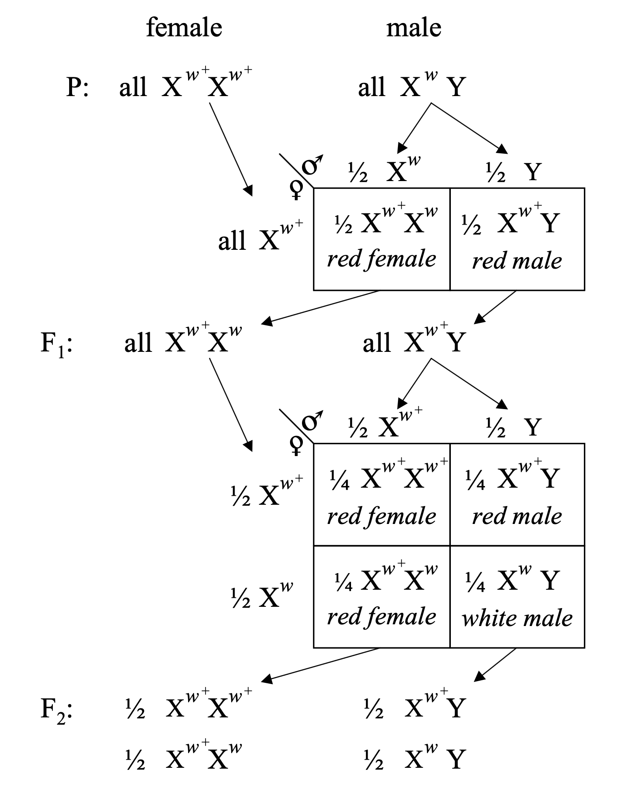
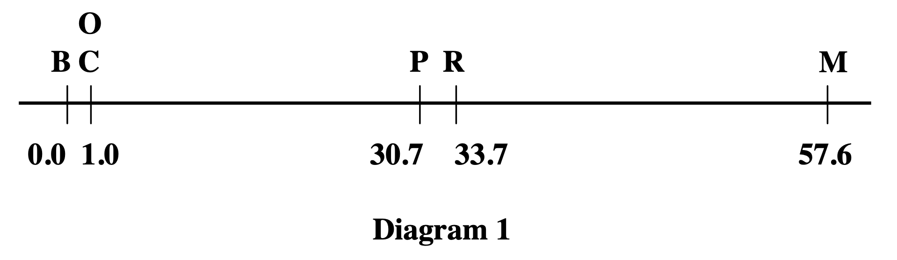
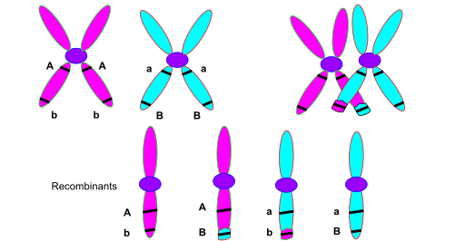
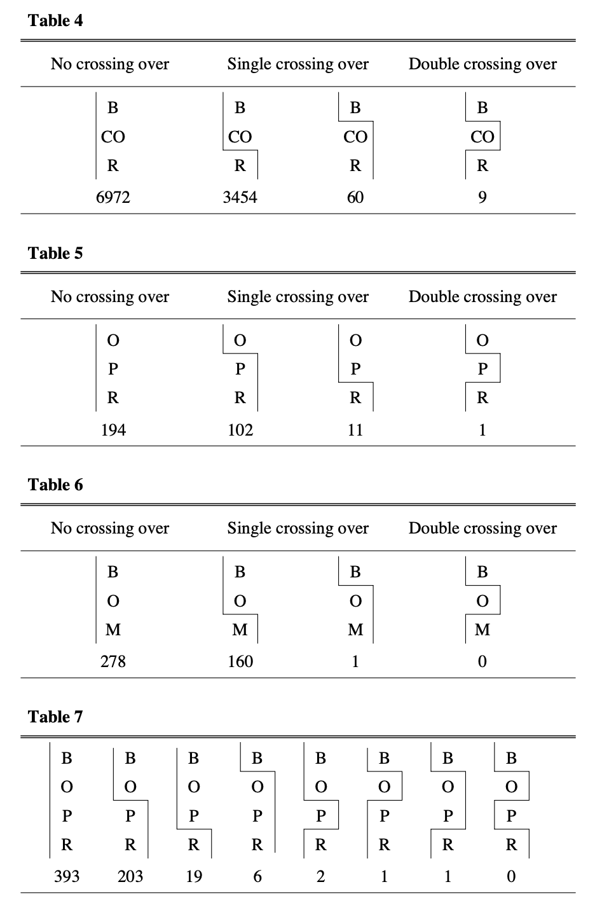

# Chapter 22. From Mendel to Morgan: Discovery of Linkage

Remember Mendel's experiments with pea plants? He discovered two laws of inheritance. The first—segregation—says that each parent contributes one allele to offspring. The second—**independent assortment**—says that different gene pairs segregate independently during gamete formation.

Independent assortment is why, when you cross a plant that's round and yellow (RRYY) with one that's wrinkled and green (rryy), the F₂ generation shows a neat **9:3:3:1 ratio**. Nine are round and yellow, three are round and green, three are wrinkled and yellow, and one is wrinkled and green. The seed shape (R vs r) and color (Y vs y) seem to be inherited completely independently, as if they don't know about each other.

Mendel thought this was a universal rule. And for the traits he studied, it worked perfectly. But here's the catch: Mendel got lucky. The seven traits he picked in pea plants happen to be on different chromosomes (peas have seven chromosome pairs), so they really do assort independently. If he'd picked two traits on the same chromosome, he would have gotten very different results—and genetics history might have taken a different path.

Independent assortment happens because of how chromosomes behave during **meiosis I**. When your cells make eggs or sperm, homologous chromosome pairs line up at the cell's equator. Which chromosome of each pair goes to which side? It's random. Chromosome 1 from your mom might go left while chromosome 2 from your dad goes left. Or both might go right. The combinations shuffle randomly, so genes on different chromosomes assort independently.

But what about genes on the *same* chromosome? They should travel together, right? They're physically attached to the same DNA molecule. And that's exactly what scientists started discovering in the early 1900s. This discovery—that Mendel's second law isn't always true—opened up an entirely new understanding of how genes are organized.

---

## Early Clues: Something Doesn't Add Up

In 1906, two British geneticists were studying sweet pea plants, looking at flower color and pollen shape—two different traits. If Mendel's law of independent assortment held true, they should have seen the classic 9:3:3:1 ratio in the F₂ generation.

But they didn't.

Instead, something strange emerged: certain trait combinations appeared together far more often than expected. When the purple flower allele was present, it tended to come with the long pollen allele. When the red flower allele showed up, it usually brought the round pollen allele along with it. It was as if the alleles were traveling in pairs, sticking together through generations.

The researchers called this pattern **"coupling"**—traits inherited together. When traits separated more often than expected, they called it **"repulsion"**. They knew they'd found an exception to Mendel's law, but they didn't know why. They couldn't explain the mechanism. They just documented the pattern and called it peculiar ([Punnett 1911, Journal of Genetics](https://www.ias.ac.in/public/Volumes/jgen/013/01/0101-0123.pdf)).

What had been discovered was evidence that some genes are **physically connected**. They're on the same chromosome, so they tend to be transmitted together to offspring. But in 1906, nobody understood chromosomes well enough to make that connection. The answer would have to wait a few more years.

---

## Morgan's Fly Room: Where Genetics Got Physical

Enter a skeptical embryologist at Columbia University who wasn't entirely convinced that chromosomes had anything to do with heredity. To test the idea, breeding experiments with fruit flies—*Drosophila melanogaster*—began in milk bottles in a cramped room at Columbia that would become legendary as "the Fly Room."

In 1910, an extraordinary discovery emerged. Among thousands of normal red-eyed flies, one male had white eyes. This was a spontaneous mutation—a new variant that hadn't existed in the fly stock before. The value was immediately recognized, and crosses began: this white-eyed male was bred with normal red-eyed females.

The F₁ generation? All red-eyed. Red was dominant, just like Mendel would have predicted. But in the F₂ generation, something unexpected happened: white eyes appeared only among the **males**. About half the males had white eyes, while all the females had red eyes. This wasn't Mendel's 3:1 ratio. This was something tied to sex.

An explanation emerged based on sex chromosomes. Females have two X chromosomes (XX), while males have one X and one Y (XY). What if the eye-color gene was on the X chromosome? That would explain the pattern perfectly:

- The original white-eyed male had the white allele on his only X chromosome (X^w Y).
- F₁ females inherited one X with the white allele from dad and one X with the red allele from mom (X^w X^+). They looked red because red is dominant.
- But F₁ males inherited the red X from mom and the Y from dad (X^+ Y). They all looked red.
- In the F₂ generation, some males inherited the X^w from their F₁ mothers. Those males were white-eyed because they had no second X to mask it.

**Figure: X-linked inheritance in *Drosophila***. The cross between white-eyed males (X^w Y) and red-eyed females (X^w+ X^w+) demonstrates sex-linked inheritance. In the P generation, white-eyed males are crossed with red-eyed females. The F₁ generation produces all red-eyed offspring (both females X^w+ X^w and males X^w+ Y), since red is dominant. When F₁ individuals are crossed, the F₂ generation shows a characteristic sex-linked pattern: red-eyed females (½ X^w+ X^w+ and ½ X^w+ X^w), red-eyed males (½ X^w+ Y), and white-eyed males (½ X^w Y). Notice that white eyes appear only in males in the F₂ generation, revealing that the eye color gene resides on the X chromosome. Source: Morgan, T. H. (1910). Sex-limited inheritance in Drosophila. Science, 32:120-122. License: Public domain (pre-1923 publication).

This experiment showed that a specific gene resides on a specific chromosome—the X. This was the first time anyone had connected Mendel's abstract "factors" to actual physical structures you could see under a microscope. Genes weren't just mathematical entities. They were real things, located on chromosomes ([Morgan 1910, Science](https://www.science.org/doi/10.1126/science.32.812.120)).

This discovery kicked off the era of **chromosomal genetics**. Genes had addresses. They lived on chromosomes. And if you knew which chromosome a gene was on, you could predict inheritance patterns based on how that chromosome behaved during meiosis.

---

## The Discovery of Linkage

The work didn't stop with one X-linked gene. More were found—genes affecting wing shape, body color, and other traits. And when flies with two X-linked traits at once were crossed, something fascinating emerged.

The traits didn't assort independently. They were linked.

For example, suppose you cross flies that differ in both eye color and wing shape, where both genes are on the X chromosome. If Mendel's law held, you'd expect all four possible combinations in equal frequencies: red eyes with normal wings, red eyes with miniature wings, white eyes with normal wings, white eyes with miniature wings.

But that's not what happened. Instead, **parental combinations appeared far more often**. If the original parents were "red eyes, normal wings" and "white eyes, miniature wings," then those same combinations dominated the offspring. Red with normal stayed together. White with miniature stayed together. Recombinant types—red with miniature, or white with normal—were rare.

The explanation was elegant. Genes on the same chromosome are **physically linked**—they're part of the same DNA molecule. During meiosis, when chromosomes line up and segregate, linked genes travel together. They're like passengers on the same bus. If two genes are on the same chromosome, they generally arrive at the same destination.

But occasionally—and here's the key insight—**crossing over** happens. During meiosis, homologous chromosomes pair up and can exchange DNA segments. It's like two trains running parallel, briefly touching, and swapping a few cars. When a crossover occurs between two linked genes, it breaks the linkage and creates recombinant offspring.

The closer two genes are on a chromosome, the less likely a crossover will land between them. If they're right next to each other, they almost always stay linked. If they're far apart, crossovers are more likely to separate them. This relationship—distance affects recombination—would become the foundation for genetic mapping ([Morgan 1911, Journal of Experimental Zoology](https://onlinelibrary.wiley.com/doi/10.1002/jez.1400110106)).

---

## Sturtevant's Stroke of Genius: The First Genetic Map

One undergraduate student was listening to discussions about linkage and recombination frequencies when inspiration struck: **recombination frequency could measure distance**.

Think about it. If genes A and B are close together on a chromosome, crossovers between them are rare, so recombination frequency is low. If genes B and C are farther apart, crossovers between them are more common, so recombination frequency is higher. You could use recombination as a **genetic ruler**.

The realization emerged that by taking several genes on the same chromosome, measuring how often each pair recombined, and using those frequencies, the linear order of genes along the chromosome could be determined. It's like having several cities and knowing the distances between some pairs. You can reconstruct which cities are in between others by comparing distances.

That night, the problem was worked out. By morning, the first **genetic linkage map** had been constructed—a diagram showing the relative positions of six genes on the *Drosophila* X chromosome. The unit of genetic distance was defined: **1% recombination equals 1 map unit**, later called a **centiMorgan (cM)**.

Here's how it works. Suppose you're studying three genes: A, B, and C, all on the same chromosome. You cross flies and count recombinant offspring:

- **Genes A and B**: Recombination is found in 10% of offspring. That means they're 10 cM apart.
- **Genes B and C**: Recombination occurs in 5% of offspring. They're 5 cM apart.
- **Genes A and C**: If A and C are on opposite sides of B, they should be about 15 cM apart (10 + 5). And when you test it, that's roughly what you find.

So the gene order is A — B — C, with B in the middle. The linear arrangement matches the recombination distances perfectly.

**Figure: The first genetic linkage map**. This diagram shows the linear arrangement of six sex-linked genes on the *Drosophila* X chromosome, with distances measured in map units (now called centiMorgans). B = body color (yellow when recessive), C = color factor, O = eosin eye color, P = vermilion eye color, R = rudimentary wing, M = miniature wing. The numbers (0.0, 1.0, 30.7, 33.7, 57.6) represent genetic distances based on recombination frequencies—1% recombination equals 1 map unit. Note that C and O are positioned at the same location (1.0) because they showed complete linkage—no recombination was detected between them in thousands of flies. This map proved that genes are arranged linearly along chromosomes and that recombination frequency reflects physical distance. Source: Sturtevant, A. H. (1913). The linear arrangement of six sex-linked factors in Drosophila, as shown by their mode of association. Journal of Experimental Zoology, 14:43-59. License: Public domain (pre-1923 publication).

This was monumental. It proved that genes are arranged linearly along chromosomes, like beads on a string. It showed that recombination frequency reflects physical distance. And it gave geneticists a tool to map genes even when they couldn't see them under a microscope. You didn't need to know what the genes did or where they were physically. You just needed to count recombinant offspring ([Sturtevant 1913, Journal of Experimental Zoology](https://onlinelibrary.wiley.com/doi/10.1002/jez.1400140104)).

---

## How Crossing Over Works

Let's zoom in on what's actually happening during crossing over. This process occurs during **meiosis I**, when homologous chromosomes pair up.

Each chromosome has already replicated, so it consists of two sister chromatids joined at the centromere. When homologous chromosomes pair, they align side by side. At various points along their length, the chromosomes physically touch and form structures called **chiasmata** (singular: chiasma). At each chiasma, non-sister chromatids exchange DNA segments.

Think of it like two ribbons lying side by side. You cut both ribbons at the same position and swap the cut ends. Now each ribbon has a segment from the other. That's crossing over.

**Figure: Crossing over during meiosis**. Two homologous chromosomes (blue and red), each consisting of two sister chromatids, pair up during meiosis I. A chiasma forms where non-sister chromatids (one blue, one red) exchange segments. After the crossover, two chromatids remain parental (all blue or all red), while two become recombinant (part blue, part red). If genes are located on opposite sides of the crossover point, they'll be separated and end up in different gametes—that's what creates recombinant offspring. The farther apart two genes are, the more likely a crossover will occur between them. Source: Wikimedia Commons. License: CC BY-SA 3.0.

After crossing over, four gametes are produced. Two carry parental combinations (the original allele combinations from each parent), and two carry recombinant combinations (new mixtures of alleles). The proportion of recombinant gametes is what we measure as recombination frequency.

Genes that are very close together are rarely separated by crossovers—their recombination frequency approaches 0%, and they're said to be tightly linked. Genes that are far apart, or on different chromosomes, recombine about 50% of the time, and they assort independently—just like Mendel observed.

Each chromosome acts as a **linkage group**—a set of genes physically connected and usually inherited together. Humans have 23 linkage groups (22 autosomes plus the X), corresponding to our 23 chromosome pairs.

### Double Crossing Over

Here's a complication: sometimes two crossovers occur in the same chromosome region. When this happens between three genes in a row (say A, B, and C), a crossover between A and B plus another between B and C can make it look like A and C never recombined at all—even though two exchanges actually happened.

**Figure: Evidence for double crossing over**. These tables show crosses involving three or four sex-linked genes simultaneously, revealing that double crossovers do occur but are rarer than expected. The diagrams illustrate no crossing over (parental combinations), single crossing over (one recombination event), and double crossing over (two recombination events). In Table 4, among 10,495 offspring, most showed no crossing over (6,972) or single crossing over (3,454), while only 69 showed double crossovers. Notably, when one crossover occurred, a second crossover in the same chromosome became less likely—a phenomenon called interference. For instance, where B and CO did not separate, the ratio for CO and R crossovers was about 1:2, but when B and CO did separate, it dropped to about 1:6.5. This interference explains why long-distance recombination frequencies are lower than predicted by simply adding shorter distances. Source: Sturtevant, A. H. (1913). The linear arrangement of six sex-linked factors in Drosophila, as shown by their mode of association. Journal of Experimental Zoology, 14:43-59. License: Public domain (pre-1923 publication).

The data revealed something else important: one crossover makes another nearby crossover less likely. This is called **interference**. It's as if the chromosome has a memory—once it's been cut and repaired at one spot, it resists being cut again nearby. This means that for genes far apart on a chromosome, the observed recombination frequency is actually less than you'd predict by adding up the distances between intermediate genes ([Sturtevant 1913, Journal of Experimental Zoology](https://onlinelibrary.wiley.com/doi/10.1002/jez.1400140104)).

---

## Linkage in Humans

The same principles apply to humans, though it took longer to discover because you can't do controlled crosses with people (for obvious ethical reasons). Instead, geneticists had to study families and look for patterns.

In the 1930s, researchers noticed that **nail-patella syndrome** (a disorder affecting nails and kneecaps) and the **ABO blood group** were inherited together in some families more often than expected. This was one of the first demonstrations of linkage in humans. The genes turned out to be on the same chromosome (chromosome 9).

As more genetic markers became available—first blood groups, then protein variants, then microsatellites, and eventually SNPs—geneticists built detailed linkage maps of the human genome. These maps were essential for locating disease genes.

Here's how it works. Suppose a disease runs in a family. You don't know which gene causes it, but you have genetic markers scattered across the genome. You check whether any marker is inherited along with the disease more often than expected. If so, the disease gene is probably on the same chromosome, close to that marker. You've narrowed the search from the whole genome (3 billion base pairs) to a chromosomal region (maybe 10 million base pairs).

This approach led to the discovery of genes for **cystic fibrosis** (chromosome 7), **Huntington's disease** (chromosome 4), and many other disorders. Before the Human Genome Project, linkage mapping was one of the few ways to find disease genes.

The logic is always the same: **genes that are close together are rarely separated**. If a disease gene and a marker show low recombination (say, 1-5%), they're close. If they show high recombination (approaching 50%), they're far apart or on different chromosomes.

---

## Putting It All Together

Let's review the key concepts using everyday language.

**Linkage** means that genes on the same chromosome tend to be inherited together. Think of them as neighbors traveling on the same bus. Unless they get off at different stops, they arrive together.

**Crossing over** is the exchange of DNA between homologous chromosomes during meiosis. It's like two ribbons swapping segments. This process can separate linked genes, creating new allele combinations.

**Recombination frequency** is the fraction of offspring that carry these new combinations. It's a genetic ruler: 1% recombination equals 1 cM of genetic distance. The farther apart two genes are, the more likely they'll be separated by crossing over, and the higher their recombination frequency.

A **linkage group** is all the genes on one chromosome. They're physically connected, so they form a group that tends to be inherited together. Humans have 23 linkage groups—one for each chromosome.

Here are a few examples to make this concrete:

**Very close genes** (recombination frequency near 0%): These are tightly linked. Crossovers between them are rare, so they almost always travel together. If you find one allele, you can predict the other with high confidence.

**Distant genes** (recombination frequency near 50%): These are on opposite ends of a long chromosome or on different chromosomes entirely. They recombine about half the time, so they assort independently—just like Mendel saw. You can't predict one from the other.

**Intermediate distances** (recombination frequency between 1-40%): These genes are on the same chromosome but separated by enough distance that crossovers sometimes land between them. The exact recombination frequency tells you how far apart they are.

---

## From Flies to Genomes

The work in the Fly Room laid the groundwork for everything that came after. The discoveries showed that:

- Genes are physical entities located on chromosomes
- Genes on the same chromosome are linked
- Crossing over can break linkage
- Recombination frequency measures genetic distance
- You can build maps showing gene order and spacing

Today, we don't rely on crossing flies and counting recombinants. We sequence entire genomes and directly measure recombination by tracking which DNA segments are inherited together across thousands of people. But the underlying logic is exactly the same.

Modern recombination maps are built from millions of SNPs genotyped in large populations. We can see which alleles at different loci are inherited together (low recombination) versus independently (high recombination). We can build haplotype maps showing common blocks of linked variants. We can study **linkage disequilibrium**—the statistical association between alleles at different loci—which reflects both recombination history and population history.

All of this traces back to the white-eyed fly and the late-night insight about using recombination as a genetic ruler. What started as a curiosity—why don't these traits follow Mendel's law?—became the foundation for genetic mapping, genome assembly, and our understanding of how DNA is organized and transmitted.

Mendel gave us the laws of inheritance. The early 1900s showed us where those laws break down—and in doing so, revealed something even more interesting: the physical reality of genes and the dynamic reshuffling of genetic material through recombination.