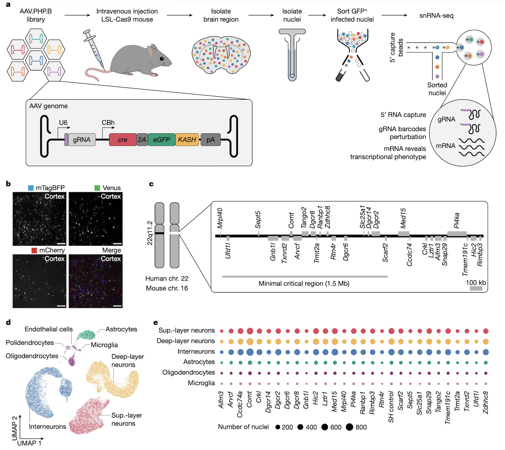
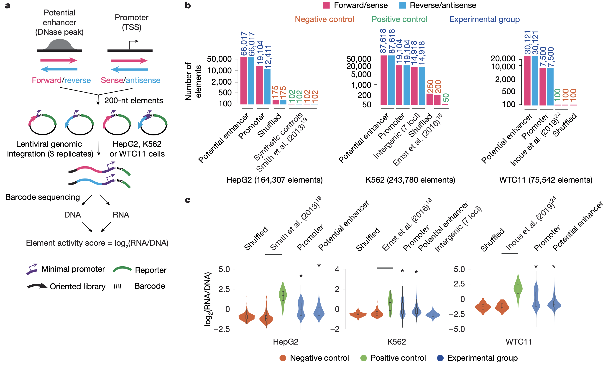

# Chapter 26. Reverse Genetics: From Gene to Function

You've done a burden test and found that *SCN2A* is enriched for loss-of-function mutations in individuals with epilepsy. You're pretty confident this gene matters. But *how* does it matter? What does SCN2A actually do in neurons? What happens when you lose it? Can you fix the problem by restoring its function?

These are the questions that reverse genetics answers. Instead of starting from a phenotype and hunting for genes, you start from a known gene—or even a specific variant—and deliberately manipulate it to see what happens.

Forward genetics got us from disease to gene. Reverse genetics takes us from gene to mechanism.

---

## The logic of reverse genetics

Reverse genetics is essentially controlled experimentation on genes. You pick a gene, you change it (remove it, activate it, edit it), and you observe the result. The goal is to establish causality: does this gene *cause* the phenotype we're interested in?

In model organisms like yeast, flies, or mice, reverse genetics has been around for decades. Scientists could delete genes, overexpress them, or swap in mutant versions to understand their function. But in humans, we obviously can't do those experiments directly. Instead, we use:

1. **Cell models** (human iPSCs, patient-derived cells, organoids)
2. **Animal models** (mice, zebrafish, sometimes non-human primates)
3. **Computational predictions** (when we can't do wet-lab experiments)

The core idea is the same: perturb the gene and measure what changes.

---

## Classic reverse genetic approaches

Before we talk about CRISPR (which has taken over the field), let's quickly review the fundamental types of genetic manipulation. These strategies form the conceptual backbone of reverse genetics, even if the tools have changed.

### Loss of function: what happens when the gene is gone?

The simplest reverse genetic experiment is to remove a gene and see what breaks.

**Knock-out** means completely eliminating the gene—either by deleting it, disrupting its coding sequence, or introducing a premature stop codon. If knocking out a gene causes lethality, that tells you the gene is essential. If it causes a specific defect—like neurons failing to fire action potentials—that tells you what the gene normally does.

**Knock-down** means reducing (but not eliminating) gene expression, often using RNA interference (RNAi). Small RNA molecules bind to the gene's mRNA and trigger its degradation, so less protein gets made. Knock-down is useful when complete knock-out is lethal, or when you want to test partial loss of function.

For example, *SCN2A* knock-out in mouse neurons eliminates sodium currents and prevents action potential generation, revealing that SCN2A encodes a sodium channel required for neuronal excitability.

### Gain of function: what happens when you add more?

The flip side is to increase a gene's activity and see if that's sufficient to drive a phenotype.

**Overexpression** means cranking up gene expression—usually by putting the gene under a strong promoter that forces the cell to make lots of mRNA and protein. If overexpressing a gene causes a phenotype (say, excessive cell division), that tells you this gene is sufficient to trigger that process.

**Ectopic expression** means making a gene active in tissues or developmental stages where it's normally silent. For instance, expressing a neural transcription factor in skin cells might reprogram them into neurons, showing that the factor is sufficient to specify neural identity.

Both approaches test sufficiency: *Can this gene, by itself, produce a particular outcome?*

### Conditional and inducible systems: controlling when and where

Sometimes you need precise control over timing and location. If a gene is required early in development, knocking it out might kill the embryo before you can study its role in adults. The solution? Conditional systems that let you turn genes on or off at will.

**Inducible expression** uses external triggers (like adding a drug) to activate or silence a gene. For example, the tetracycline (tet-on/tet-off) system uses doxycycline to control gene expression. Add the drug, the gene turns on; remove the drug, it turns off. This lets you study time-dependent effects.

**CRE-lox recombination** is a clever genetic trick used mostly in mice. You flank a gene with *loxP* sites (short DNA sequences), then introduce CRE recombinase enzyme in specific tissues. CRE cuts out everything between the loxP sites, deleting the gene—but only in tissues where CRE is expressed. This gives you tissue-specific knock-outs.

These tools have been workhorses of mouse genetics for 30 years. They're still widely used, but they're now often combined with CRISPR-based methods for even greater precision.

---

## CRISPR: a unified platform for reverse genetics

CRISPR changed everything. Instead of needing different tools for different tasks—one system for knock-outs, another for overexpression, another for epigenetic modification—CRISPR provides a single, programmable platform that can do all of it ([Zhang et al 2025, Genomics Proteomics & Bioinformatics](https://doi.org/10.1093/gpbjnl/qzaf034)).

The core mechanism is simple: a guide RNA directs a Cas protein to a specific DNA sequence. What happens next depends on which version of Cas you use.

**Figure: Overview of CRISPR-Cas system technological innovations**. *The CRISPR toolkit has expanded dramatically beyond simple DNA cutting. Base editors use catalytically inactive Cas9 (nCas9) fused to deaminase enzymes to directly convert specific nucleotide bases without creating double-strand breaks. Prime editors combine nCas9 with reverse transcriptase to enable precise insertions, deletions, or base substitutions using a specialized guide RNA template. For epigenome editing, catalytically dead Cas9 (dCas9) is fused to DNA methylases or histone-modifying enzymes to alter gene expression without changing the DNA sequence itself—enabling both gene silencing (CRISPRoff) and activation (CRISPRon). CRISPRi and CRISPRa systems use dCas9 fused to transcriptional repressors (like KRAB domain) or activators (like VP64 domain) to reversibly control gene expression. Finally, RNA-targeting Cas13 systems enable direct editing of RNA sequences, providing transient modifications without permanent genomic changes. Together, these tools provide unprecedented precision in manipulating genetic information at multiple levels. Source: Zhang, X. et al. (2025). CRISPR Technology and Its Emerging Applications. Genomics, Proteomics & Bioinformatics. https://doi.org/10.1093/gpbjnl/qzaf034. License: CC-BY 4.0.*

### CRISPR knock-outs: cutting DNA

The original CRISPR application uses **Cas9**, which cuts both strands of DNA at a target site. The cell tries to repair the break, but often makes mistakes—inserting or deleting a few bases. If this happens in a coding region, it shifts the reading frame and creates a premature stop codon, knocking out the gene.

This is now the standard way to create knock-outs in human cells. You design a guide RNA targeting your gene of interest, deliver it along with Cas9, and wait a few days. Most cells will have frameshift mutations, and you can select the ones where the gene is fully inactivated.

For example, *SCN2A* knock-out in human iPSC-derived neurons using CRISPR confirmed loss of sodium current—validating the mouse experiments.

### Base editing and prime editing: precision changes

Sometimes you don't want to destroy a gene—you want to introduce a specific mutation, like changing a single nucleotide.

**Base editors** are modified versions of Cas9 fused to enzymes that chemically convert one DNA base into another. There are two main types:

- **Cytosine base editors (CBE)** convert C → T (or G → A on the opposite strand)
- **Adenine base editors (ABE)** convert A → G (or T → C)

This is incredibly useful for modeling disease mutations. If a patient has a C-to-T mutation in *SCN2A*, you can use a base editor to introduce that exact change in cultured neurons and study how it affects channel function.

**Prime editors** go even further. They can make small insertions, deletions, or any base-to-base change without cutting the DNA. Think of prime editing as "find and replace" for the genome—you specify the target sequence and the desired replacement, and the editor writes in the new sequence. It's more flexible than base editing but also more complex.

### CRISPRa and CRISPRi: controlling gene expression

What if you don't want to edit the DNA at all? What if you just want to turn a gene up or down?

Enter **dCas9**—a "dead" version of Cas9 that can't cut DNA but can still bind to target sequences. By itself, dCas9 does nothing useful. But if you fuse it to other proteins, it becomes a programmable gene regulator.

**CRISPRa (activation)** uses dCas9 fused to transcriptional activators. Guide the complex to a gene's promoter, and it recruits the transcriptional machinery, turning the gene on. This is essentially targeted overexpression—you're boosting a gene's output without changing its DNA sequence.

**CRISPRi (inhibition)** uses dCas9 to block transcription. The dCas9 complex sits on the promoter like a roadblock, preventing RNA polymerase from transcribing the gene. It's a reversible, tunable knock-down.

These tools are powerful for studying gene regulation, especially in contexts where permanent DNA changes would be problematic. For instance, if a disease is caused by haploinsufficiency (losing one copy of a gene), you could use CRISPRa to boost expression from the remaining copy and potentially rescue the phenotype.

### Cas13: targeting RNA

Most CRISPR systems work on DNA. But there's also **Cas13**, which targets RNA instead.

Cas13 can be used to knock down specific mRNA transcripts without touching the genome. This is like RNAi but more programmable and specific. It's especially useful for studying RNA biology—splicing, localization, stability—or for temporary gene silencing when you don't want permanent edits.

Cas13 is still a newer tool and less commonly used than DNA-targeting systems, but it's expanding the reach of CRISPR into the transcriptome.

---

## High-throughput reverse genetics: screening thousands of genes at once

Traditional reverse genetics tests one gene at a time. But what if you want to know which of 20,000 genes affect a particular phenotype? That's where high-throughput screens come in.

### Pooled CRISPR screens

The idea is simple but powerful: create a library of guide RNAs that target every gene in the genome (or every gene in a pathway). Deliver this library to a large population of cells so that each cell gets one guide RNA and knocks out one gene. Then apply a selective pressure—maybe you treat the cells with a drug, or you sort them for a specific marker—and sequence which guide RNAs are enriched or depleted.

For example, you might screen for genes required for cancer cell survival. Knock out 20,000 genes across millions of cells, then grow them for a few weeks. Guides targeting essential genes will disappear (those cells died), while guides targeting non-essential genes will persist. Sequence the surviving guides, and you have a ranked list of genes required for cell survival.

Pooled screens are now routine and incredibly powerful. They've been used to identify:

- Drug resistance genes (which genes, when lost, make cancer cells sensitive to therapy?)
- Host factors for viral infection (which genes does a virus need to replicate?)
- Developmental regulators (which genes control differentiation into specific cell types?)

### Perturb-seq: linking perturbations to transcriptomes

Pooled screens tell you *which* genes affect a phenotype, but not *how*. Enter **Perturb-seq**, which combines CRISPR perturbations with single-cell RNA sequencing.

Here's the workflow: knock out thousands of genes using a pooled CRISPR library, then do single-cell RNA-seq on the entire population. Each cell's transcriptome tells you (1) which gene was knocked out (because the guide RNA is barcoded) and (2) how the knockout changed the cell's gene expression program.

**Figure: In vivo AAV-Perturb-seq experimental design**. *AAV-Perturb-seq enables direct in vivo CRISPR screening by combining viral delivery with single-nucleus RNA sequencing. The workflow begins with systemic injection of AAV particles carrying pooled gRNA libraries into mice expressing Cas9 or dCas9-KRAB. After allowing time for viral transduction and gene perturbation, brain tissue is harvested and nuclei are isolated. Single-nucleus RNA-seq is then performed using a specialized 5' capture method that simultaneously sequences both the cellular transcriptome and the gRNA identity. This approach reveals which gene was perturbed in each cell while capturing the resulting transcriptional changes. The key innovation is the ability to perform multiplexed genetic screens directly in complex tissues like the adult brain, avoiding the limitations of in vitro systems or developmental-stage restrictions of lentiviral methods. By pairing perturbation identity with phenotypic readout at single-cell resolution, Perturb-seq enables systematic mapping of genotype-phenotype relationships in vivo. Source: Santinha, A.J. et al. (2023). Transcriptional linkage analysis with in vivo AAV-Perturb-seq. Nature. https://doi.org/10.1038/s41586-023-06570-y.*

This is reverse genetics at scale. You can see not just whether knocking out a gene affects a phenotype, but which downstream genes and pathways are affected. For instance, if knocking out a transcription factor causes 500 genes to change expression, you've just mapped its regulatory network ([Santinha et al 2023, Nature](https://doi.org/10.1038/s41586-023-06570-y)).

### MPRA: testing regulatory sequences

CRISPR screens focus on genes. But what about the 98% of the genome that doesn't code for proteins? How do you test whether a non-coding variant in an enhancer region affects gene regulation?

**Massively parallel reporter assays (MPRA)** let you test thousands of DNA sequences simultaneously. You synthesize a library of short DNA fragments—each one containing a different variant or regulatory element—and clone them upstream of a reporter gene (like GFP or a barcode). Transfect the library into cells, measure reporter expression, and you can see which sequences drive high or low expression.

**Figure: Large-scale lentiMPRA experimental strategy**. *Massively parallel reporter assays enable functional testing of thousands of regulatory sequences simultaneously. The process starts with designing a library of 230-nucleotide oligonucleotides representing candidate regulatory elements (cCREs) including both promoters and enhancers. Through PCR amplification, each sequence is linked to a minimal promoter and tagged with random barcodes. These constructs are cloned into a lentiviral vector containing a reporter gene (EGFP). The element-barcode associations are determined by deep sequencing before viral packaging. Cells are then infected with the lentiviral library, allowing genomic integration of the reporter constructs. After three days of culture, both DNA and RNA are extracted from the cells and barcodes are sequenced. By comparing RNA barcode counts (reflecting transcriptional activity) to DNA barcode counts (reflecting integration efficiency), researchers can calculate normalized activity scores for each regulatory element. This "in-genome" lentiviral approach provides more physiologically relevant measurements than transient transfection-based assays and enables testing of regulatory sequences in difficult-to-transfect cell types. Source: Agarwal, V. et al. (2025). Massively parallel characterization of transcriptional regulatory elements. Nature. https://doi.org/10.1038/s41586-024-08430-9.*

For example, if a GWAS identifies a variant in an enhancer near a diabetes-risk gene, you can use MPRA to test whether the risk allele increases or decreases enhancer activity. This connects non-coding variants to functional effects ([Agarwal et al 2025, Nature](https://doi.org/10.1038/s41586-024-08430-9)).

---

## Functional rescue: proving causality

Once you've shown that losing or altering a gene causes a phenotype, the gold standard is to do a **rescue experiment**: restore the normal gene function and see if the phenotype goes away.

Rescue experiments prove causality. They show that the gene isn't just correlated with the phenotype—it's actually responsible for it.

There are three main rescue strategies:

### 1. Gene complementation: adding back a normal copy

The simplest rescue is to introduce a wild-type version of the gene into mutant cells or organisms.

For example, if zebrafish embryos with a *scn2a* mutation show abnormal brain development, you can inject wild-type *SCN2A* mRNA into the embryos. If the brain now develops normally, you've shown that SCN2A is necessary and sufficient for that developmental process.

In human cells, you can do the same thing—knock out a gene with CRISPR, then stably re-introduce a functional copy (often integrated at a safe harbor locus). If the phenotype disappears, the gene is confirmed as causal.

### 2. Gene correction: fixing the mutation

Instead of adding a new copy, you can use CRISPR to directly repair the mutated DNA sequence.

Base editors and prime editors are perfect for this. If a patient has a C-to-T mutation causing disease, you can use a base editor to convert the T back to C. If the cells now function normally, you've proven that this specific nucleotide change is responsible for the phenotype.

This approach is especially powerful because it corrects the mutation in its native genomic context—same promoter, same regulatory elements, same expression level. It's the cleanest possible test of causality.

### 3. Allelic activation: boosting the remaining copy

For haploinsufficiency disorders—where losing one gene copy causes disease because the remaining copy can't produce enough protein—you can use CRISPRa to upregulate the intact allele.

For instance, *SCN2A* haploinsufficiency causes developmental and epileptic encephalopathy. If you use CRISPRa to boost expression of the remaining *SCN2A* allele in patient-derived neurons, and the cells regain normal sodium current, you've demonstrated that simply increasing dosage is sufficient to rescue function.

This has therapeutic implications: instead of replacing a gene with gene therapy, maybe you can just turn up the remaining copy.

---

## Putting it all together: from variant to mechanism

Reverse genetics is the experimental engine that turns genetic discoveries into biological understanding.

Here's the full workflow:

1. **Forward genetics identifies a candidate gene** (GWAS or burden test)
2. **Reverse genetics tests its function** (knock-out, overexpression, CRISPR screen)
3. **Functional rescue confirms causality** (complementation, correction, activation)
4. **Mechanistic studies reveal how it works** (Perturb-seq, live imaging, electrophysiology)

At each step, you're moving from association to causation, from correlation to mechanism.

For example, let's trace the journey of *CHD8*, an autism risk gene:

- **Forward genetics**: Burden tests found that autism cases are enriched for *CHD8* loss-of-function mutations
- **Reverse genetics**: CRISPR knock-out of *CHD8* in human neurons caused abnormal gene expression and synaptic defects
- **Rescue**: Adding back wild-type *CHD8* restored normal function
- **Mechanism**: Perturb-seq showed that *CHD8* regulates hundreds of genes involved in chromatin remodeling and neuronal differentiation

This is how you go from a statistical signal to a mechanistic understanding of disease.

---

## The future: integrating forward and reverse genetics

We've come a long way from Mendel's pea plants. Forward genetics now operates at the scale of millions of genomes. Reverse genetics operates at the scale of genome-wide perturbation screens. And increasingly, the two are merging.

Imagine a future where every GWAS hit is immediately followed by a CRISPR screen to test which genes in the locus actually matter. Or where every rare variant discovered in a patient triggers an automated base-editing experiment in iPSC-derived cells to confirm its pathogenicity.

We're not there yet, but we're close. The tools are ready. The challenge now is integration—building pipelines that seamlessly connect variant discovery to functional validation at scale.

That's the promise of modern human genetics: not just finding genes, but understanding what they do and how to fix them when they break.