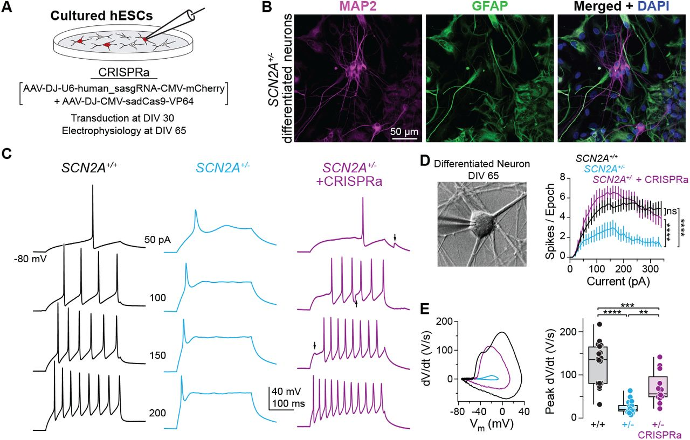

# Chapter 27. CRISPRa Therapy for *SCN2A* Haploinsufficiency

Imagine you're a neuron trying to fire an action potential, but you only have half the sodium channels you need. You can still work, but you're sluggish—your signals are weak, your timing is off, and the whole circuit struggles to function normally. That's what happens in *SCN2A* haploinsufficiency, where losing one functional copy of the gene leaves neurons unable to generate normal electrical activity.

For decades, the standard approach to this kind of genetic problem was either gene replacement therapy (add a new working copy) or gene editing (fix the broken copy). But a 2025 study took a different approach: instead of fixing or replacing the mutant gene, the study simply turned up the expression of the remaining normal copy using **CRISPRa**—CRISPR activation ([Tamura et al. 2025, Nature](https://www.nature.com/articles/s41586-025-09522-w)).

The results were striking. Boost *SCN2A* expression by about 50%, and neurons regain their firing capacity. Mice show fewer seizures, improved social behavior, and normalized brain activity. It's a proof-of-concept that sometimes the best therapy isn't to rewrite the genome—it's just to adjust the volume.

---

## *SCN2A* and the haploinsufficiency problem

*SCN2A* encodes NaV1.2, a voltage-gated sodium channel that's critical for neuronal excitability. When an action potential starts, sodium channels open and let Na⁺ ions rush into the cell, depolarizing the membrane and propagating the electrical signal. NaV1.2 is especially important in early brain development and in certain types of excitatory neurons.

When you lose one working copy of *SCN2A*—through a nonsense mutation, a frameshift, or a splice-site variant—you're left with only 50% of the normal amount of NaV1.2 protein. This is called **haploinsufficiency**: one copy isn't enough to maintain normal function.

```
Normal vs. Haploinsufficient State
==================================

Normal (two functional alleles):
Allele 1: SCN2A → 50% NaV1.2 protein
Allele 2: SCN2A → 50% NaV1.2 protein
Total:           100% protein → Normal neuronal firing

Haploinsufficiency (one functional allele):
Allele 1: SCN2A → 50% NaV1.2 protein  
Allele 2: Loss-of-function → 0% protein
Total:           50% protein → Hypoexcitability

Clinical consequences:
• Developmental delay
• Epilepsy (paradoxical seizures)
• Autism spectrum disorder
• Intellectual disability
```

The consequences? Neurons become hypoexcitable. They fire less frequently, generate weaker action potentials, and struggle to participate in fast, coordinated network activity. Clinically, *SCN2A* haploinsufficiency causes developmental and epileptic encephalopathy, autism spectrum disorder, and intellectual disability.

But here's the key point: the remaining *SCN2A* allele is perfectly normal. It's just not producing enough protein to compensate for the missing copy. So the question becomes: *Can we make the good copy work harder?*

---

## Not all *SCN2A* variants are the same

Before we dive into CRISPRa, it's worth clarifying that *SCN2A* variants come in different flavors, and they cause very different problems.

| Variant Class | Mechanism | Channel Activity | Neuronal Effect | Clinical Phenotype | Examples |
|---------------|-----------|------------------|-----------------|-------------------|----------|
| **Loss-of-function (LoF)** | Premature stop, frameshift, splice defect, destabilizing missense | Reduced or absent | **Hypoexcitability** (neurons can't fire properly) | Developmental delay, ASD, paradoxical seizures | Nonsense, frameshift indels, critical splice sites |
| **Gain-of-function (GoF)** | Increased activation, impaired inactivation | Excessive or prolonged | **Hyperexcitability** (neurons fire too much) | Infantile spasms, early-onset epilepsy | Missense in voltage sensor or inactivation gate |
| **Partial LoF** | Reduced conductance, altered gating | Intermediate | **Mild hypoexcitability** | Variable—depends on remaining function | Some missense variants |

**Loss-of-function (LoF) variants** reduce or eliminate channel activity. These include:
- Nonsense mutations that introduce a premature stop codon
- Frameshift indels that disrupt the reading frame
- Splice-site mutations that skip essential exons
- Some missense variants that destabilize the protein or block its ability to conduct sodium

LoF variants cause **hypoexcitability**—neurons can't fire properly, leading to developmental delays and sometimes paradoxical seizures (because inhibitory circuits are also affected).

**Gain-of-function (GoF) variants**, on the other hand, make channels open too easily or stay open too long. These cause **hyperexcitability**—neurons fire too much, leading to infantile spasms and early-onset epilepsy ([Ben-Shalom et al. 2017, Biological Psychiatry](https://www.biologicalpsychiatryjournal.com/article/S0006-3223(17)30046-1/fulltext)).

The study focused on *SCN2A* haploinsufficiency caused by LoF variants. Electrophysiology experiments confirmed that neurons with only one functional *SCN2A* allele show reduced sodium currents and impaired firing. Combined with haploinsufficiency (only one allele makes protein), you get a severe reduction in total sodium current.


**Figure: CRISPRa restores neuronal firing in SCN2A haploinsufficient neurons**. *The top traces show action potentials (electrical spikes) recorded from neurons when stimulated with current. Wild-type neurons (WT, black) fire many action potentials rapidly—they're healthy and excitable. Haploinsufficient neurons (Scn2a⁺/⁻, cyan) fire much less—they're "tired" with only half the normal sodium channels. After CRISPRa treatment (Scn2a⁺/⁻ + CRISPRa, purple), firing is restored to nearly normal levels. Each spike represents sodium channels opening—more spikes mean more functional channels. The graph at bottom quantifies this: CRISPRa-treated neurons fire as frequently as wild-type, while untreated haploinsufficient neurons show severely reduced firing. This is direct proof that boosting SCN2A expression fixes the fundamental cellular problem. Source: Tamura et al. (2022). CRISPRa rescues Scn2a haploinsufficient neurons. bioRxiv. https://www.biorxiv.org/content/10.1101/2022.03.30.486483v1. License: CC-BY-NC-ND 4.0.*

---

## What is CRISPRa, and how does it work?

CRISPRa stands for **CRISPR activation**. To understand it, let's start with regular CRISPR–Cas9.

In standard genome editing, Cas9 is a molecular scissor. You give it a guide RNA that tells it where to cut, and Cas9 makes a double-strand break in the DNA. The cell tries to repair the break, and you can use that repair process to introduce or correct mutations.

But Cas9 doesn't *have* to cut. If you mutate the catalytic residues in Cas9, you get **dCas9** (dead Cas9)—a protein that can still bind to DNA at the guide RNA's target site, but it can't cut. By itself, dCas9 is useless. But if you fuse it to other proteins, it becomes a programmable platform for manipulating gene activity without editing the DNA sequence.

```
CRISPR Systems Comparison
==========================

Standard CRISPR-Cas9 (Genome Editing)
┌─────────────────────────────────────┐
│  Guide RNA → Cas9 → DNA target      │
│            ↓                        │
│  Double-strand break (DSB)          │
│            ↓                        │
│  DNA repair machinery               │
│            ↓                        │
│  Mutation introduced                │
│                                     │
│  Result: Permanent DNA sequence     │
│          change                     │
└─────────────────────────────────────┘

CRISPRa (Transcriptional Activation)
┌─────────────────────────────────────┐
│  Guide RNA → dCas9-VPR → Promoter  │
│            ↓                        │
│  Recruit transcription factors      │
│            ↓                        │
│  RNA polymerase activation          │
│            ↓                        │
│  Increased transcription            │
│                                     │
│  Result: More mRNA/protein          │
│          (DNA unchanged)            │
└─────────────────────────────────────┘

CRISPRi (Transcriptional Repression)
┌─────────────────────────────────────┐
│  Guide RNA → dCas9-KRAB → Promoter │
│            ↓                        │
│  Block RNA polymerase access        │
│            ↓                        │
│  Transcription blocked              │
│            ↓                        │
│  Decreased transcription            │
│                                     │
│  Result: Less mRNA/protein          │
│          (DNA unchanged)            │
└─────────────────────────────────────┘

Key difference: 
• CRISPR-Cas9 = Permanent genetic change
• CRISPRa/i = Reversible expression change
```

**CRISPRa** uses dCas9 fused to transcriptional activators—proteins like VP64, p65, or VPR (a combination of VP64, p65, and Rta). When you guide this complex to a gene's promoter, it recruits the transcriptional machinery and boosts RNA polymerase activity. The result? More mRNA gets made from that gene, and protein levels go up.

Think of it as a volume knob. The DNA sequence doesn't change, but the gene's output increases. You're essentially amplifying the signal from the normal allele.

**CRISPRi** (CRISPR interference) does the opposite. It uses dCas9 fused to repressor proteins (like KRAB) to block transcription. The dCas9 complex sits on the promoter like a roadblock, preventing RNA polymerase from accessing the gene. Expression goes down.

Both CRISPRa and CRISPRi are **epigenetic tools**. They don't rewrite the genetic code—they just tune how much it's read.

---

## Rescuing *SCN2A* haploinsufficiency with CRISPRa

Here's what the 2025 study demonstrated ([Tamura et al. 2025, Nature](https://www.nature.com/articles/s41586-025-09522-w)).

A mouse model of *SCN2A* haploinsufficiency was generated carrying one wild-type *Scn2a* allele and one mutant allele with a LoF variant. The mice showed reduced sodium currents in cortical neurons, abnormal EEG patterns, and behavioral deficits—essentially a mouse version of the human disorder.

```
Experimental Design
===================

Step 1: Generate haploinsufficient mice
├─ Genotype: Scn2a⁺/⁻ (one WT, one mutant allele)
├─ Phenotype: Reduced Na⁺ current, seizures, social deficits
└─ Baseline measurements: Electrophysiology, EEG, behavior

Step 2: Design CRISPRa system
├─ Target: Scn2a promoter region
├─ Components: dCas9-VPR + guide RNA
└─ Delivery: AAV9 (adeno-associated virus)

Step 3: Administer therapy
├─ Route: Systemic (tail vein or retro-orbital injection)
├─ Timing: Adolescent mice (P30-P60)
└─ Wait 2-4 weeks for expression

Step 4: Measure outcomes
├─ Molecular: Scn2a mRNA and protein levels
├─ Cellular: Sodium currents, action potential firing
├─ Circuit: EEG recordings, seizure susceptibility
└─ Behavioral: Social interaction tests

Step 5: Test in human cells
└─ iPSC-derived neurons carrying SCN2A LoF variant
```

A guide RNA targeting the promoter region of *Scn2a* was designed. This guide RNA along with dCas9–VPR (a strong transcriptional activator) was packaged into an adeno-associated virus (AAV), a common gene therapy delivery vehicle.

The AAV was delivered systemically (via tail vein or retro-orbital injection) to adolescent mutant mice. Several weeks later, the effects were measured.

### Results in mouse neurons

| Measurement | Haploinsufficient (untreated) | After CRISPRa | Recovery |
|-------------|------------------------------|---------------|----------|
| **SCN2A mRNA level** | ~50% of WT | ~80-90% of WT | ✓ Nearly normalized |
| **Sodium current amplitude** | ~50% of WT | ~80-85% of WT | ✓ Nearly normalized |
| **Action potential firing frequency** | Reduced | Restored to WT | ✓ Fully normalized |
| **Neuronal excitability** | Hypoexcitable | Normal | ✓ Phenotype rescued |

- *SCN2A* mRNA levels increased, bringing total expression close to wild-type levels
- Sodium current amplitude in cortical neurons was restored to nearly normal
- Neuronal firing frequency—measured by patch-clamp electrophysiology—recovered
- The neurons looked and behaved like wild-type cells


**Figure: CRISPRa increases SCN2A expression and sodium current**. *(Left panel)* Quantitative PCR measurements show that haploinsufficient mice (Het, cyan bar) have only ~50% of normal SCN2A mRNA compared to wild-type (WT, black bar). After CRISPRa treatment (CRISPRa, purple bar), expression increases to ~80-90% of wild-type levels—nearly complete restoration. (Right panel) This increase in mRNA translates directly to functional sodium channels: voltage-clamp recordings measure the sodium current amplitude (the amount of Na⁺ ions flowing into neurons), which is restored from ~50% to ~85% of normal. Think of it like this: if a neuron needs 100 sodium channels to work properly, haploinsufficient neurons only have 50, but CRISPRa brings it up to 85—enough to function normally. Each dot represents one neuron or one mouse; the boxes show the median and spread of data. This demonstrates the complete chain: more gene expression → more protein → more functional channels. Source: Tamura et al. (2022). CRISPRa rescues Scn2a haploinsufficient neurons. bioRxiv. https://www.biorxiv.org/content/10.1101/2022.03.30.486483v1. License: CC-BY-NC-ND 4.0.*

### Results at the circuit and behavioral level

| Measurement | Haploinsufficient (untreated) | After CRISPRa | Outcome |
|-------------|------------------------------|---------------|---------|
| **Seizure susceptibility** | Elevated (to chemoconvulsants) | Protected | ✓ Therapeutic benefit |
| **Synaptic transmission** | Impaired excitatory input | Restored | ✓ Circuit-level rescue |
| **Behavioral phenotype** | Disease state | Improved | ✓ Behavioral rescue |
| **Overall phenotype** | Disease state | Near-normal | ✓ Comprehensive rescue |

- Mice treated with CRISPRa showed protection against chemoconvulsant-induced seizures (4-aminopyridine challenge)
- Synaptic deficits in neocortical pyramidal cells were corrected
- Behavioral improvements were observed
- Overall, the mice showed phenotypic rescue even when treatment started in adolescence



**Figure: CRISPRa protects against chemically-induced seizures**. *Mice were injected with 4-aminopyridine (4-AP), a drug that triggers seizures by blocking potassium channels—this tests how vulnerable the brain is to seizure activity. The graph shows survival curves over 60 minutes after 4-AP injection. Wild-type mice (WT, black line) survive well because their neurons have enough sodium channels to maintain proper excitatory-inhibitory balance. Haploinsufficient mice (Scn2a⁺/⁻, cyan line) are much more vulnerable—about 60% die from severe tonic-clonic seizures within an hour. But remarkably, CRISPRa-treated haploinsufficient mice (Scn2a⁺/⁻ + CRISPRa, purple line) are strongly protected: their survival curve is nearly identical to wild-type. This isn't just a lab measurement—it demonstrates that CRISPRa treatment provides real, clinically meaningful protection against seizures, the most dangerous symptom of SCN2A haploinsufficiency in human patients. The dramatic difference between cyan and purple lines shows how effective dosage restoration can be. Source: Tamura et al. (2022). CRISPRa rescues Scn2a haploinsufficient neurons. bioRxiv. https://www.biorxiv.org/content/10.1101/2022.03.30.486483v1. License: CC-BY-NC-ND 4.0.*

### Results in human cells

The study also tested CRISPRa in human iPSC-derived neurons carrying *SCN2A* haploinsufficiency. After transduction with the CRISPRa system, *SCN2A* expression increased, sodium currents improved, and the neurons regained normal excitability.

This is important because it shows the approach isn't mouse-specific—it works in human cells too.

---

## Why this matters: dosage restoration therapy

This study demonstrates a new therapeutic concept: **dosage restoration therapy**. Instead of adding a new gene or fixing the mutant allele, you upregulate the endogenous normal allele to compensate for the loss.

Here's why that's powerful:

| Advantage | Explanation | Clinical Benefit |
|-----------|-------------|------------------|
| **No DNA cutting** | CRISPRa doesn't introduce double-strand breaks | Lower risk of off-target mutations or chromosomal rearrangements |
| **Endogenous regulation** | Normal allele remains under native promoter/enhancers | Expression can be modulated by developmental and physiological cues |
| **Tunable and reversible** | Effect is transient; stops when dCas9 expression ceases | Can adjust dose over time or discontinue if side effects occur |
| **Mutation-agnostic** | Works for any LoF mutation as long as one allele is intact | Single approach for diverse mutation types (nonsense, frameshift, splice) |
| **Preserves native protein** | Using patient's own gene, not introducing foreign sequence | No immunogenicity concerns from novel epitopes |
| **Late intervention possible** | Works even when treatment starts in adolescence | Therapeutic window extends beyond early development |

**1. No DNA cutting**  
CRISPRa doesn't introduce double-strand breaks, so there's less risk of off-target mutations or chromosomal rearrangements. You're not permanently altering the genome—you're just changing how much it's used.

**2. Endogenous regulation**  
The normal *SCN2A* allele remains under its native promoter and enhancers. It's still regulated by the cell's normal signaling pathways, so expression can be modulated in response to developmental or physiological cues. This is much cleaner than inserting a transgene with a strong constitutive promoter, which might overexpress the protein at the wrong time or in the wrong cells.

**3. Tunable and reversible**  
CRISPRa is transient. If you stop expressing dCas9 and the guide RNA, gene expression drifts back toward baseline. This means you can potentially adjust the dose over time, or turn the system off if there are side effects. Compare this to a permanent gene edit, which is irreversible.

**4. Applicable to many haploinsufficiency disorders**  
*SCN2A* is just one example. There are hundreds of genes where losing one copy causes disease—*SHANK3*, *CHD8*, *MECP2*, *FOXP1*, and many others. CRISPRa could, in principle, be applied to any of them, as long as boosting the normal allele is sufficient to restore function.

**5. Late intervention is possible**  
Remarkably, the study showed that CRISPRa treatment works even when started in adolescent mice—long after early brain development. This suggests a therapeutic window that extends beyond the critical early developmental period, offering hope for patients who weren't diagnosed until later.

---

## How does this compare to other approaches?

Let's put CRISPRa in context by comparing it to alternative strategies for treating *SCN2A* haploinsufficiency.

| Strategy | Mechanism | Advantages | Disadvantages | Best For |
|----------|-----------|------------|---------------|----------|
| **Gene replacement therapy** | AAV delivers functional SCN2A transgene | Well-established method, no need for precise targeting | Loss of endogenous regulation, AAV size limits (~4.7kb, SCN2A is ~6kb), potential overexpression | Diseases with small genes |
| **Base editing** | Direct correction of point mutation | Fixes root cause, restores mutant allele to WT | Requires delivery to all cells, off-target editing risk, works only for specific mutation types | Single-nucleotide mutations |
| **Prime editing** | Corrects small indels or point mutations | More flexible than base editing | Large editor size, delivery challenges, efficiency varies | Small insertions/deletions |
| **Small molecule drugs** | Pharmacological modulation of channel activity | Non-invasive, reversible, can cross BBB | Non-specific (affects all sodium channels), dosing challenges, limited efficacy | Gain-of-function variants (e.g., NBI-921352 for SCN8A) |
| **CRISPRa** | Boost expression of normal allele | No DNA cutting, preserves regulation, tunable, mutation-agnostic, works in adolescence | Requires viral delivery, large payload (dCas9 ~4kb), potential off-target activation, long-term persistence unknown | Haploinsufficiency with intact second allele |

### Gene replacement therapy

This is the classic approach: use a virus (like AAV) to deliver a functional copy of *SCN2A* into cells. The new gene integrates randomly or remains as an episome, and produces NaV1.2 protein.

**Pros**: Well-established method, doesn't require targeting a specific genomic locus  
**Cons**: The transgene isn't under endogenous regulation, so you risk overexpression or expression in the wrong cell types. AAV has packaging size limits (~4.7 kb), and *SCN2A* is about 6 kb, so you'd need a smaller promoter or a split-AAV approach.

### Base editing or prime editing

If the mutation is a point mutation or small indel, you could use base editors or prime editors to directly correct it.

**Pros**: Fixes the root cause, restoring the mutant allele to wild-type  
**Cons**: Requires delivery of the editor plus guide RNA to every affected cell. Off-target editing is a concern. Works only if the mutation is correctable (not all LoF variants are single-base changes).

### Small molecule drugs

Some sodium channelopathies can be treated with drugs that modulate channel activity.

**Pros**: Non-invasive, reversible, can cross the blood-brain barrier  
**Cons**: Drugs typically act on all sodium channels, not just NaV1.2, leading to off-target effects. Hard to achieve precise dosage.

### CRISPRa

**Pros**: Boosts the normal allele without cutting DNA, preserves endogenous regulation, tunable, works regardless of mutation type (as long as one allele is intact), effective even with late intervention  
**Cons**: Requires viral delivery, dCas9 is large (~4 kb) so packaging can be challenging, potential for off-target activation if guides aren't specific, long-term persistence and safety need evaluation

Each approach has trade-offs. CRISPRa shines when you have a haploinsufficiency disorder with an intact second allele and you want to avoid permanent genome edits.

---

## What does "rescue" mean?

You'll often see the term **"rescue"** in genetics papers. It's worth clarifying what it means.

In molecular biology, a rescue experiment tests whether restoring a missing function can reverse a mutant phenotype. If you knock out a gene and observe a defect, then you add back the normal gene and the defect disappears—that's a rescue. It's strong evidence that the gene is causally responsible for the phenotype.

```
Logic of Rescue Experiments
============================

Step 1: Establish mutant phenotype
Genotype: Loss-of-function mutation
Phenotype: Disease state observed
Conclusion: Gene disruption → phenotype

Step 2: Restore function
Intervention: Add back functional gene/protein
                OR
           Boost remaining normal allele

Step 3: Measure outcome
If phenotype disappears → RESCUE (gene is causal)
If phenotype persists → NOT RESCUED (gene not sufficient)

Example in SCN2A study:
────────────────────────
Mutation:      Scn2a haploinsufficiency
Phenotype:     Weak neuronal firing + seizure susceptibility
Intervention:  CRISPRa to boost normal Scn2a allele
Result:        Normal firing + seizure protection
Conclusion:    ✓ RESCUED → Proves SCN2A dosage 
               is the primary problem
```

In the study by Tamura and colleagues, "rescue" means:

- Neurons that were firing weakly (because of *SCN2A* haploinsufficiency) now fire normally (after CRISPRa upregulates *SCN2A*)
- Mice that had increased seizure susceptibility now show protection against chemoconvulsants
- Synaptic and behavioral deficits improved
- The phenotype was reversed by restoring gene dosage

So "rescue" isn't just a metaphor—it's experimental proof that boosting *SCN2A* expression is sufficient to fix the problem.

---

## Looking ahead: cis-regulatory gene therapy

The study by Tamura and colleagues is part of a broader trend toward **cis-regulatory gene therapy**—treatments that work by modulating the activity of a patient's own genes rather than adding new genetic material ([Tamura et al. 2025, Nature](https://www.nature.com/articles/s41586-025-09522-w)).

```
Cis-Regulatory Gene Therapy Landscape
======================================

Approach: Modulate endogenous gene expression
Goal: Restore balance without introducing foreign DNA

Current Applications:
┌──────────────────────────────────────────────┐
│ CRISPRa (Activation)                         │
│ • SCN2A haploinsufficiency (Tamura 2025)     │
│ • SCN1A in Dravet syndrome (multiple studies)│
│ • MECP2 insufficiency (Rett syndrome)        │
│ • Tumor suppressor reactivation             │
│ • SIM1 in obesity (Matharu 2019)             │
│                                              │
│ CRISPRi (Inhibition)                         │
│ • Huntington's disease (silence HTT repeat)  │
│ • Toxic gain-of-function mutations           │
│ • Oncogene silencing in cancer               │
│                                              │
│ Epigenetic Editors                           │
│ • DNA methylation editing                    │
│ • Histone modification editing               │
│ • Chromatin remodeling                       │
└──────────────────────────────────────────────┘

Principle: Adjust gene expression to restore balance
• Too little expression? → CRISPRa
• Too much expression? → CRISPRi
• Wrong epigenetic state? → Epigenetic editors
```

Other examples include:

- Using CRISPRa to boost *SCN1A* expression in Dravet syndrome ([Colasante et al. 2020, Molecular Therapy](https://www.cell.com/molecular-therapy-family/molecular-therapy/fulltext/S1525-0016(19)30534-7))
- Using CRISPRa to boost *SIM1* in obesity caused by haploinsufficiency ([Matharu et al. 2019, Science](https://www.science.org/doi/10.1126/science.aau0629))
- Using CRISPRi to silence toxic repeat expansions in Huntington's disease
- Using epigenetic editors to reactivate silenced tumor suppressor genes in cancer

The unifying principle is: *adjust gene expression to restore balance*. Sometimes that means turning a gene up (CRISPRa). Sometimes it means turning a gene down (CRISPRi). Either way, you're fine-tuning the system rather than rewriting it.

CRISPRa for *SCN2A* haploinsufficiency is a proof-of-concept that this strategy can work for neurological disorders caused by gene dosage imbalance. The next steps—moving toward clinical trials, optimizing delivery, ensuring long-term safety—are already underway.

And if it works for *SCN2A*, it might work for dozens of other haploinsufficiency disorders too.

---

## Key takeaways

- **Haploinsufficiency** means one gene copy isn't enough—neurons need more protein than a single allele can provide
- **CRISPRa** uses dead Cas9 fused to activators to boost gene expression without cutting DNA
- Boosting *SCN2A* expression restores neuronal firing and protects against seizures in mice ([Tamura et al. 2025, Nature](https://www.nature.com/articles/s41586-025-09522-w))
- This approach is **tunable, reversible, and preserves endogenous regulation**—advantages over traditional gene therapy
- **Treatment works even when started in adolescence**, suggesting a broad therapeutic window
- **Cis-regulatory therapy** represents a new paradigm: instead of replacing or editing genes, adjust their expression to restore balance

---

## Key terms

- **Loss-of-function (LoF)**: A mutation that reduces or eliminates protein activity
- **Gain-of-function (GoF)**: A mutation that increases or alters protein activity inappropriately
- **Haploinsufficiency**: A condition where one functional gene copy is not enough for normal function
- **CRISPRa (CRISPR activation)**: A system using dead Cas9 to increase gene transcription
- **CRISPRi (CRISPR interference)**: A system using dead Cas9 to decrease gene transcription
- **dCas9 (dead Cas9)**: Catalytically inactive Cas9 that binds DNA but doesn't cut
- **Rescue**: An experiment showing that a mutant phenotype can be reversed by restoring the missing function
- **Cis-regulatory therapy**: Treatment that modulates gene expression by targeting regulatory sequences
- **Dosage restoration therapy**: Therapeutic strategy that upregulates the normal allele to compensate for haploinsufficiency
- **VPR**: A transcriptional activator domain (VP64-p65-Rta fusion) used in CRISPRa