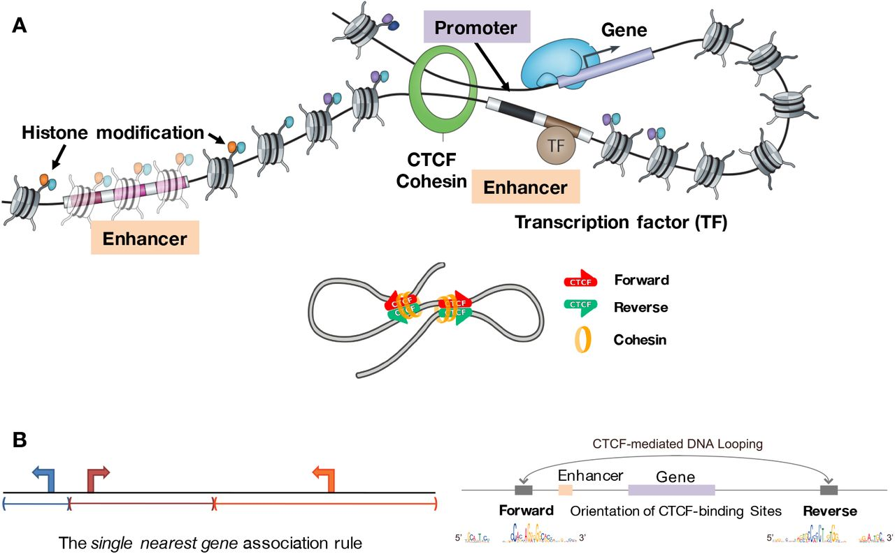

# Chapter 28. Gene Regulation: How Cells Read the Same Book Differently

Your liver cells and your neurons have exactly the same DNA. So do your immune cells, your skin cells, and every other cell in your body. They all carry the same 20,000 protein-coding genes. Yet a liver cell looks nothing like a neuron, and a T cell behaves completely differently from a muscle cell.

How is this possible? The answer is **gene regulation**—the process that controls which genes are turned on or off in each cell type. Think of the genome as a massive library. Every cell has access to the same collection of books, but each cell type reads a different subset. Neurons read the synapse chapter. Liver cells read the metabolism chapter. Immune cells read the defense chapter.

Gene regulation determines what a cell is and what it does. It's not just about whether a gene is on or off—it's about how much, when, and where. And understanding gene regulation is the key to understanding how genetic variants affect biology, because most disease-associated variants don't change protein sequences—they change *when* and *how much* genes are expressed.

---

## The central dogma, revisited

The classic central dogma says: DNA → RNA → protein. That's true, but incomplete. The interesting question isn't *can* DNA be transcribed into RNA—it's *is* it transcribed, and how much?

Gene expression has multiple control points:

```
Gene Expression Control Points
===============================

DNA (Genome)
    ↓
1. TRANSCRIPTIONAL REGULATION ⭐ (Primary control)
    │
    ├─ Promoters (local control)
    ├─ Enhancers (long-range control)
    ├─ Silencers (repression)
    └─ Chromatin state (accessibility)
    ↓
pre-mRNA
    ↓
2. RNA PROCESSING
    │
    ├─ Alternative splicing (exon selection)
    ├─ 5' capping
    ├─ 3' polyadenylation
    └─ RNA editing
    ↓
mature mRNA
    ↓
3. mRNA STABILITY
    │
    ├─ 3' UTR regulatory elements
    ├─ RNA-binding proteins
    └─ microRNA targeting
    ↓
mRNA in cytoplasm
    ↓
4. TRANSLATION
    │
    ├─ Ribosome recruitment
    ├─ Translation initiation factors
    └─ Codon usage
    ↓
Protein
    ↓
5. PROTEIN STABILITY
    │
    ├─ Post-translational modifications
    ├─ Ubiquitination (degradation signal)
    └─ Protein folding/chaperones
    ↓
Functional Protein

⭐ = Most fundamental control point
    (If not transcribed, nothing downstream matters)
```

The first step—transcriptional regulation—is the most fundamental. If a gene isn't transcribed, nothing downstream matters. And transcriptional regulation is mostly controlled by two things: **promoters** (local control) and **enhancers** (long-range control).

---

## Promoters: where transcription starts

A **promoter** is the DNA region immediately upstream of a gene where RNA polymerase II and its associated transcription factors assemble to begin transcription. Think of it as the on-ramp to the gene.

Promoters contain short DNA sequences (motifs) that serve as binding sites for the transcriptional machinery:

| Promoter Element | Location | Sequence | Function | Notes |
|-----------------|----------|----------|----------|-------|
| **TATA box** | ~30 bp upstream of TSS | TATAAA | Recruits TATA-binding protein (TBP) | Classic element, but not universal (~10-20% of genes) |
| **Initiator (Inr)** | Overlaps TSS | PyPyA+1NT/APyPy | Positions RNA polymerase | Found in TATA-less promoters |
| **CpG islands** | -200 to +200 bp around TSS | High CG content | Marks housekeeping genes | Usually unmethylated when active |
| **DPE (Downstream Promoter Element)** | +28 to +32 bp | RGWYV | Alternative to TATA box | Common in Drosophila |
| **BRE (TFIIB Recognition Element)** | Flanking TATA box | G/C-rich | TFIIB binding site | Modulates transcription level |

For transcription to start, RNA polymerase II doesn't just land on the DNA and start copying. It needs help from a set of **general transcription factors (GTFs)**—proteins like TFIIA, TFIIB, TFIID, TFIIE, TFIIF, and TFIIH. Together, they form the **pre-initiation complex (PIC)** at the promoter:

```
Pre-Initiation Complex Assembly
================================

Step 1: TFIID (contains TBP) binds TATA box
    ↓
Step 2: TFIIB binds, recognizing BRE elements
    ↓
Step 3: RNA Polymerase II + TFIIF arrive
    ↓
Step 4: TFIIE joins the complex
    ↓
Step 5: TFIIH arrives (has helicase activity)
    ↓
Step 6: TFIIH unwinds DNA double helix
    ↓
Step 7: RNA Pol II begins transcription
    ↓
Step 8: PROMOTER-PROXIMAL PAUSING (~20-60 bp downstream)
    │
    ├─ Paused Pol II waits for signal
    ├─ P-TEFb phosphorylates Pol II CTD
    └─ Pause released → productive elongation
    ↓
Transcription proceeds into gene body
```

Interestingly, RNA polymerase often pauses shortly after it starts transcribing—about 20-60 base pairs downstream of the TSS. This **promoter-proximal pausing** is a regulatory checkpoint. Paused polymerase is like a runner in the starting blocks, ready to go but waiting for a signal. Factors like P-TEFb can release the pause and allow the polymerase to proceed into the gene body. This pause-release mechanism allows rapid gene activation in response to signals—important for genes like *FOS* and *JUN* that need to be turned on quickly during stress or immune responses.

---

## Enhancers: long-range control

Promoters are local regulators—they sit right next to the gene. But most of the interesting regulatory complexity comes from **enhancers**—DNA elements that can be located hundreds of thousands of base pairs away from the genes they control.

Enhancers are short (50-1500 bp) sequences that serve as binding platforms for transcription factors (TFs). When multiple TFs bind to an enhancer, they recruit co-activator proteins—like the **Mediator complex** and histone acetyltransferases like **p300/CBP**—that physically loop through space to contact the promoter and boost transcription.

### Key properties of enhancers

| Property | Description | Example |
|----------|-------------|---------|
| **Distance-independent** | Can be 1 Mb away, upstream/downstream/intronic | *SHH* gene regulated by ZRS enhancer >1 Mb away |
| **Orientation-independent** | Work in both forward and reverse orientation | Unlike promoters which are directional |
| **Combinatorial logic** | Require multiple TFs binding simultaneously | Muscle enhancers: MYOD + MEF2 + SRF |
| **Cell-type specific** | Active only in cells expressing right TF combination | Neuron enhancers: NEUROD + REST + SOX |
| **H3K27ac marked** | Active enhancers have this histone acetylation | Universal signature across cell types |
| **H3K4me1 marked** | All enhancers (active and poised) have this mark | Distinguishes enhancers from promoters |
| **Produce eRNAs** | Active enhancers transcribe short enhancer RNAs | Bidirectional, unstable transcripts |
| **Rapidly evolving** | Sequence changes faster than coding regions | 50-60% human-mouse similarity |
| **Functionally conserved** | Important developmental enhancers deeply conserved | *HOX* enhancers similar across vertebrates |

### They work at a distance

An enhancer can be 1 megabase away from its target gene. It doesn't matter if it's upstream, downstream, or even inside an intron. As long as it can physically contact the promoter via chromatin looping, it can activate transcription.

For example, the *SHH* (sonic hedgehog) gene—essential for limb and brain development—is regulated by an enhancer called ZRS that's located over 1 million base pairs away. Mutations in ZRS cause polydactyly (extra fingers) in humans because the enhancer fails to properly activate *SHH* in developing limbs.

### They integrate multiple signals

Enhancers typically bind multiple transcription factors simultaneously. This creates **combinatorial logic**: the enhancer is only active when the right combination of factors is present.

```
Enhancer Combinatorial Logic Example: Muscle Gene
==================================================

Enhancer DNA: [MYOD site] [MEF2 site] [SRF site]
                   ↓           ↓          ↓
           
In Muscle Cells (all 3 factors present):
    MYOD + MEF2 + SRF → Enhancer ACTIVE
              ↓
    Recruit Mediator + p300
              ↓
    Chromatin loops to promoter
              ↓
    Gene TRANSCRIBED

In Liver Cells (factors absent):
    No MYOD, No MEF2, No SRF → Enhancer INACTIVE
              ↓
    No looping
              ↓
    Gene SILENT

This is why the same DNA produces different cell types:
• Same genome
• Different transcription factor combinations
• Different active enhancers
• Different gene expression programs
```

For example, muscle-specific enhancers require binding of **MYOD**, **MEF2**, and **SRF**. Neuron-specific enhancers need **NEUROD**, **REST**, and **SOX** factors. This combinatorial binding allows precise spatial and temporal control—muscle enhancers are active only in muscle cells because only muscle cells express the right combination of TFs.

### They're marked by specific histone modifications

Active enhancers are marked by **H3K27ac** (histone H3 lysine 27 acetylation) and **H3K4me1** (histone H3 lysine 4 monomethylation). These are molecular signatures that say "this is an active regulatory region." Chromatin profiling studies can identify thousands of enhancers across the genome by looking for regions with these marks.

Interestingly, many active enhancers also produce short RNAs called **enhancer RNAs (eRNAs)**. These are often unstable and don't code for proteins, but their production correlates with enhancer activity. Whether eRNAs are just a byproduct or actually help activate transcription is still debated.

### They evolve rapidly but functionally important ones are conserved

Enhancer sequences evolve much faster than protein-coding genes. You can align human and mouse coding sequences and see 85-90% identity, but many enhancers are only 50-60% similar. This makes sense: changing an enhancer might alter *when* or *where* a gene is expressed without breaking the protein itself.

Despite this rapid evolution, some enhancers are deeply conserved across hundreds of millions of years. These **conserved noncoding elements (CNEs)** usually regulate essential developmental genes. For example, enhancers controlling *HOX* genes (which define body segment identity) are remarkably similar across vertebrates—fish, mice, and humans share recognizable *HOX* enhancers.

At the same time, species-specific enhancers drive evolutionary diversity. Changes in enhancer activity can rewire gene regulatory networks without changing proteins. This is thought to underlie much of human brain evolution—not new genes, but new patterns of gene expression driven by enhancer changes.

---

## How enhancers contact promoters: 3D chromatin looping

Enhancers are far away in linear DNA sequence, but they get physically close to promoters through **chromatin looping**. DNA isn't a straight line in the nucleus—it's folded into complex 3D structures.



**Figure: CTCF motif orientation determines chromatin loop formation**. *Panel A shows how enhancers and promoters are brought together through CTCF- and cohesin-mediated chromatin looping. The cohesin complex (orange ring) physically embraces DNA and extrudes loops until it encounters CTCF proteins (green = reverse orientation; red = forward orientation) bound at specific genomic sites. Transcription factors (TF, brown) bind to enhancers, which are marked by specific histone modifications (colored dots on nucleosomes). When an enhancer and promoter are brought into proximity by looping, gene transcription is activated. The lower schematic demonstrates that CTCF orientation matters: loops form preferentially when CTCF binding sites are in convergent orientation (forward facing reverse, indicated by red-green arrows pointing toward each other). Panel B illustrates the "single nearest gene association rule" showing how CTCF boundaries define regulatory domains. In the linear genome view (left), genes may be equidistant from an enhancer. However, the 3D chromatin structure (right) determines function: convergently oriented CTCF sites create a loop that brings the enhancer to a specific gene promoter, while genes outside this loop are excluded from regulation by that enhancer. The CTCF motif sequences (shown at bottom) reveal the asymmetric DNA-binding preference that enables directional loop formation. This convergent orientation rule is fundamental to proper genome organization—over 90% of chromatin loops occur at convergent CTCF sites. Source: Osato, D. (2019). Discovery of biased orientations of human DNA motif sequences affecting enhancer-promoter interactions and transcription of genes. bioRxiv 290825. https://www.biorxiv.org/content/10.1101/290825v12.full. License: CC-BY 4.0.*

```
Components of Chromatin Architecture:
━━━━━━━━━━━━━━━━━━━━━━━━━━━━━━━━━━━
CTCF: DNA-binding protein
• Acts as insulator and loop anchor
• Recognizes specific asymmetric DNA sequence motifs
• ~40,000-60,000 sites per genome
• ORIENTATION MATTERS: N-terminus blocks cohesin
• Convergent orientation (><) creates stable loops

Cohesin: Ring-shaped protein complex
• Physically holds DNA loops together
• Extrudes loops bidirectionally until stopped by CTCF
• Can slide along DNA ("loop extrusion")
• Stopped by CTCF's N-terminus (directional blocking)

TADs (Topologically Associating Domains):
• Size: 100 kb to few Mb
• Function: Insulated neighborhoods
• Enhancers contact promoters WITHIN same TAD
• Rare interactions ACROSS TAD boundaries
• Bordered by convergent CTCF sites (>90% of cases)

The Convergent Orientation Rule:
• >< (convergent) = LOOP FORMS (cohesin stops at both ends)
• <> (divergent) = NO LOOP (cohesin passes through both)
• >> or << (tandem) = WEAK LOOP (cohesin stops at one end)
```

The main architectural proteins involved are:

- **CTCF**: A DNA-binding protein that acts as an insulator and anchor point for chromatin loops
- **Cohesin**: A ring-shaped protein complex that holds DNA loops together

Together, CTCF and cohesin create loop structures that bring enhancers and promoters into contact. These loops occur within larger genomic neighborhoods called **Topologically Associating Domains (TADs)**—regions of the genome (typically 100 kb to a few megabases) where DNA interactions are frequent. Enhancers and promoters within the same TAD can contact each other, but interactions across TAD boundaries are rare.

This structure prevents enhancers from accidentally activating the wrong genes. For instance, if an enhancer controlling a developmental gene is in TAD A, and an oncogene is in TAD B, the enhancer won't activate the oncogene—they're in separate neighborhoods.

But sometimes things go wrong. **Enhancer hijacking** occurs when a chromosomal rearrangement (like a translocation or deletion) brings an enhancer into a new TAD:

```
Enhancer Hijacking in Cancer
=============================

NORMAL:
TAD A: [Enhancer]──controls──[Developmental Gene]
                              (appropriate target)
TAD B:                        [MYC oncogene]
                              (normally low expression)

AFTER CHROMOSOMAL REARRANGEMENT:
TAD A:                        [Developmental Gene]
                              (lost control, silenced)
Broken TAD: [Enhancer]────────[MYC oncogene]
            (super-enhancer)  (massive overexpression)
                                     ↓
                              T-cell leukemia

Example: T-ALL (T-cell Acute Lymphoblastic Leukemia)
• t(8;14) translocation
• Brings T-cell receptor enhancer near MYC
• MYC overexpression drives cancer
```

A classic example: in some T-cell leukemias, a rearrangement brings a super-enhancer near the *MYC* oncogene, causing massive overexpression and driving cancer.

### A real example: IGF2/H19 imprinting

The IGF2/H19 locus provides a beautiful example of how 3D chromatin architecture controls gene expression (see Figure above). This locus contains two genes—*IGF2* (insulin-like growth factor 2) and *H19* (a long noncoding RNA)—that are regulated by genomic imprinting, meaning they're expressed differently depending on whether they came from mom or dad.

Both genes share the same distal enhancer, but CTCF-mediated looping determines which gene gets activated:

**Paternal chromosome (IGF2 ON, H19 OFF)**:
- The DMR (differentially methylated region) between the genes is methylated
- CTCF cannot bind to methylated DNA
- Without CTCF insulation, the enhancer loops directly to the *IGF2* promoter
- *IGF2* is expressed, *H19* is silenced

**Maternal chromosome (IGF2 OFF, H19 ON)**:
- The DMR is unmethylated
- CTCF binds and creates an insulator boundary
- This blocks the enhancer from reaching *IGF2*
- The enhancer instead loops to the *H19* promoter
- *H19* is expressed, *IGF2* is silenced

This demonstrates a crucial principle: **the same DNA sequence can produce opposite outcomes depending on 3D chromatin structure**. The enhancer's activity doesn't change—what changes is which promoter it can physically contact.

Chromatin loops are dynamic. They form and dissolve in response to developmental cues or environmental signals. For example, when neurons are activated, enhancer-promoter loops rapidly form to turn on immediate early genes like *FOS*. This allows fast transcriptional responses without having to rebuild the entire regulatory architecture.


**Figure: 3D chromatin architecture brings distant regulatory elements together at the IGF2/H19 locus**. *The imprinted IGF2/H19 locus illustrates how chromatin loops create functional regulatory neighborhoods. In the linear genome (bottom), the IGF2 and H19 promoters (dark blue) are separated by a differentially methylated region (DMR, red insulator) and a distal enhancer (light blue). The 3D organization differs between parental alleles: On the paternal allele (left loop), the DMR is methylated and CTCF cannot bind, inactivating the insulator. This allows the enhancer to loop to and activate the IGF2 promoter through cohesin-mediated contacts (indicated by Mediator and Nipbl-cohesin complexes, yellow dots). On the maternal allele (right loop), the unmethylated DMR binds CTCF, which blocks enhancer-IGF2 communication. Instead, CTCF creates an insulated boundary that redirects the enhancer to activate H19, silencing IGF2. The loops are stabilized by cohesin complexes (gray circles representing nucleosomes with chromatin marks) that physically hold enhancers and promoters together in 3D space. This demonstrates how chromatin architecture—not just DNA sequence—determines which genes are expressed. Source: Merkenschlager, M. & Odom, D.T. (2013). CTCF and Cohesin: Linking Gene Regulatory Elements with Their Targets. [Cell 152(6):1285-1297](https://www.cell.com/cell/fulltext/S0092-8674(13)00218-3).*

---

## Key takeaways

- **Cell identity is defined by gene expression, not DNA sequence**—every cell has the same genome, but different cells express different genes
- **Promoters** control local transcription initiation, while **enhancers** provide long-range, combinatorial regulation
- Enhancers work through **chromatin looping**, bringing distant regulatory elements into physical contact with promoters
- **TADs** (Topologically Associating Domains) create genomic neighborhoods that constrain enhancer-promoter interactions
- **Histone modifications** mark active enhancers (H3K27ac + H3K4me1) and distinguish them from promoters
- Enhancers use **combinatorial logic**—requiring multiple transcription factors to bind simultaneously for activation
- **Enhancer hijacking** through chromosomal rearrangements can cause cancer by activating oncogenes

---

## Key terms

- **Gene regulation**: Control of gene expression in response to developmental, environmental, or cellular cues
- **Promoter**: DNA region upstream of a gene where transcription initiates
- **Enhancer**: Distal regulatory element that increases gene expression, often from great distances
- **Chromatin looping**: 3D folding that brings distant DNA elements into physical contact
- **CTCF**: CCCTC-binding factor—architectural protein that creates chromatin loop anchors
- **Cohesin**: Ring-shaped protein complex that holds chromatin loops together
- **TAD (Topologically Associating Domain)**: Genomic neighborhood where chromatin interactions are frequent
- **H3K27ac**: Histone modification marking active enhancers and promoters
- **H3K4me1**: Histone modification marking all enhancers (active and poised)
- **eRNA**: Enhancer RNA—short transcripts produced from active enhancers
- **Combinatorial logic**: Requirement for multiple transcription factors to activate an enhancer
- **Pre-initiation complex (PIC)**: Assembly of RNA polymerase II and general transcription factors at promoters