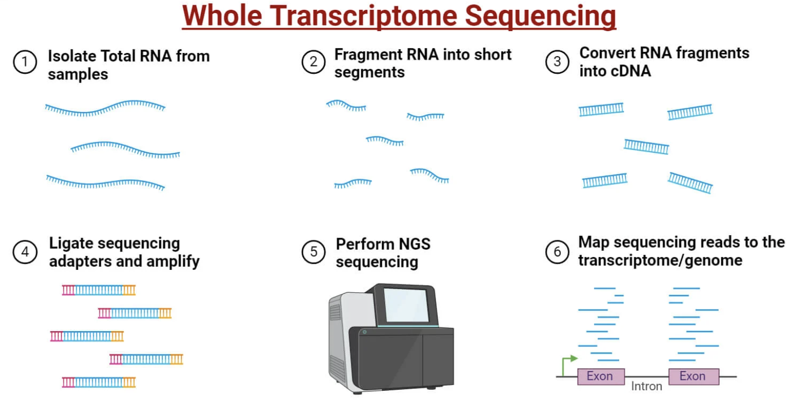
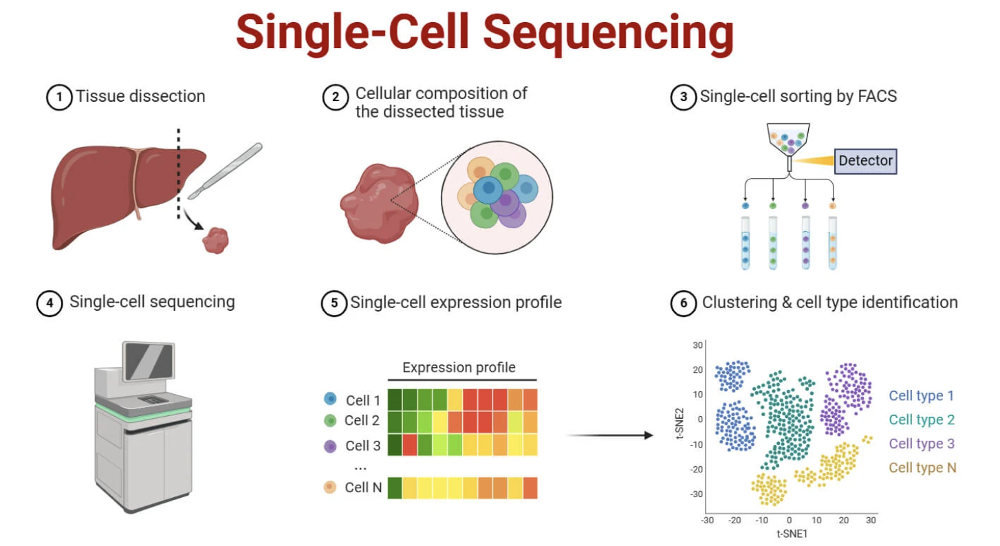
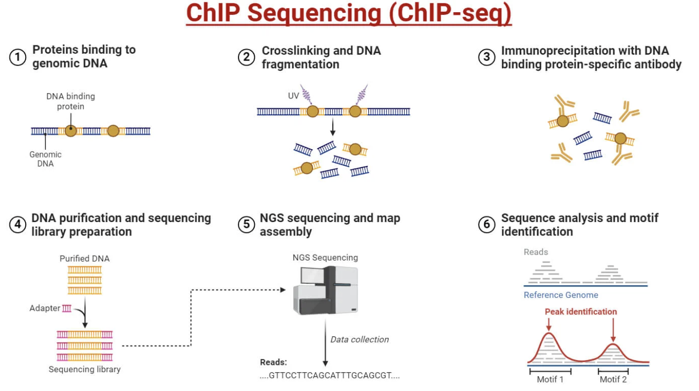
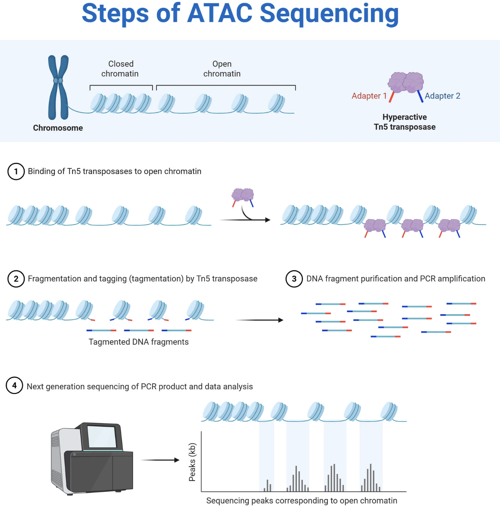
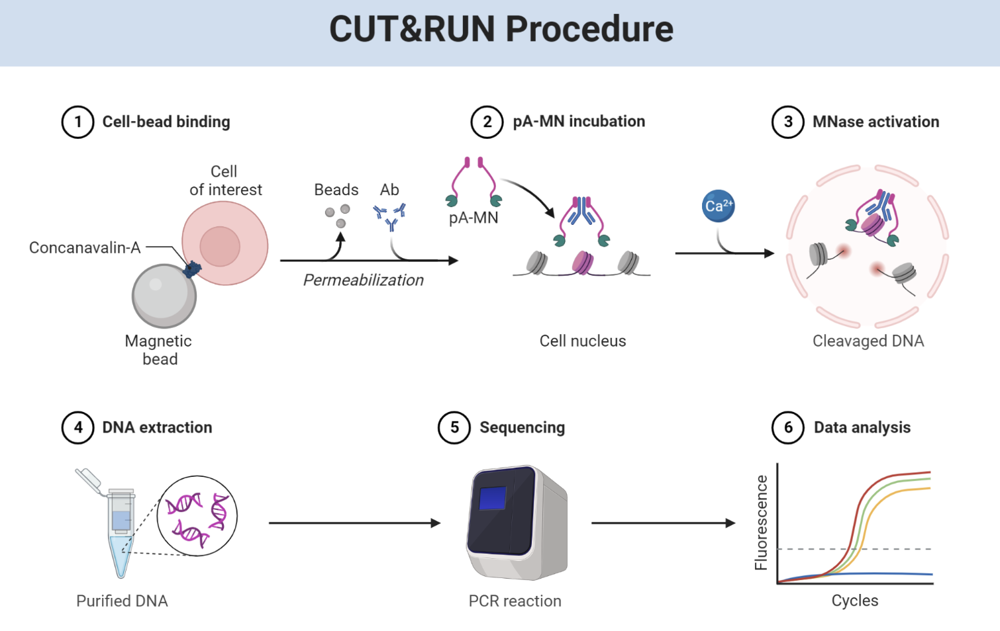

# Chapter 29. Gene Regulation: Methods and Applications

In the previous chapter, we learned how cells with identical genomes create different identities through gene regulation—using promoters, enhancers, and 3D chromatin architecture. Now we'll explore how scientists actually measure and study these regulatory mechanisms in living cells.

This chapter covers the experimental toolkit that has revolutionized our understanding of gene regulation: methods to measure what genes are expressed, where regulatory elements are located, and which regions of chromatin are accessible. These technologies have transformed genomics from reading static DNA sequences to understanding dynamic gene regulation across cell types, developmental stages, and disease states.

---

## Measuring gene expression: RNA-seq

If gene regulation determines what a cell is, then measuring gene expression tells you what's actually being produced. The workhorse method for this is **RNA sequencing (RNA-seq)**.

Here's how it works:

```
RNA-seq Workflow
================

Step 1: RNA Extraction
├─ Isolate total RNA from cells/tissue
├─ Can select: total RNA, mRNA (polyA+), or specific RNAs
└─ Quality check (RIN score for RNA integrity)

Step 2: Library Preparation
├─ Reverse transcribe RNA → cDNA
├─ Fragment cDNA to 200-500 bp
├─ Add sequencing adapters (for cluster generation)
└─ PCR amplification (if needed)

Step 3: Sequencing
├─ Load library onto flow cell
├─ Cluster generation (bridge amplification)
├─ Sequence-by-synthesis
└─ Generate millions of short reads (50-150 bp)

Step 4: Bioinformatics
├─ Quality control (FastQC)
├─ Align reads to reference genome (STAR, HISAT2)
├─ Count reads per gene (featureCounts, HTSeq)
└─ Normalize (CPM, FPKM, TPM)

Step 5: Analysis
├─ Differential expression (DESeq2, edgeR)
├─ Visualization (heatmaps, volcano plots)
└─ Pathway enrichment (GO, KEGG)
```



**Figure: Bulk RNA-seq workflow for measuring gene expression**. RNA is extracted from a population of cells (left)—this could be tissue, cultured cells, or sorted cell populations. The RNA is converted to complementary DNA (cDNA) through reverse transcription, then fragmented into short pieces. Sequencing adapters are added to these fragments, allowing them to bind to the flow cell for sequencing. Millions of short sequence reads (typically 50-150 base pairs) are generated and aligned back to the reference genome to identify which genes they came from. The number of reads mapping to each gene reflects its expression level—more reads mean more mRNA, indicating higher gene activity. This gives you an **average** expression profile across all cells in the sample—you can't see differences between individual cells, only the population average. This is powerful for comparing tissues (liver vs. brain) or conditions (healthy vs. diseased), but it masks cellular heterogeneity within the sample. [Source: Microbe Notes. Whole Transcriptome Sequencing](https://microbenotes.com/whole-transcriptome-sequencing-wts-total-rna-seq/).

The output is a **count matrix**: for each gene, you get a number representing how many sequencing reads mapped to that gene. More reads = more mRNA = higher expression.

But raw counts aren't directly comparable across genes or samples because:
- Longer genes generate more reads (simply because there's more RNA to sequence)
- Some samples might have been sequenced deeper than others

So we normalize the data:

| Normalization Method | Formula | What It Corrects | When To Use |
|---------------------|---------|------------------|-------------|
| **CPM** (Counts Per Million) | (Counts / Total reads) × 10⁶ | Sequencing depth | Comparing samples from same experiment |
| **RPKM/FPKM** (Reads/Fragments Per Kilobase per Million) | (Counts × 10⁹) / (Gene length × Total reads) | Depth + gene length | Comparing genes within one sample |
| **TPM** (Transcripts Per Million) | (Counts / Gene length) / (Sum of all Counts/Length) × 10⁶ | Depth + length (better scale) | Cross-sample comparisons, preferred over FPKM |
| **DESeq2 normalization** | Median-of-ratios method | Depth + RNA composition | Differential expression analysis |

- **CPM (Counts Per Million)**: Scales counts by total sequencing depth. If sample A has 10 million reads and sample B has 20 million, CPM accounts for that difference.
  
- **FPKM/RPKM (Fragments/Reads Per Kilobase per Million)**: Normalizes for both sequencing depth and gene length. A 10 kb gene will naturally produce more reads than a 1 kb gene even if they're expressed at the same level, so FPKM corrects for that.

- **TPM (Transcripts Per Million)**: Similar to FPKM but rescaled so that all TPM values in a sample sum to 1 million. This makes cross-sample comparisons more intuitive.

Once you have normalized expression values, you can compare conditions. Tools like **DESeq2** and **edgeR** perform statistical tests to identify **differentially expressed genes (DEGs)**—genes that are significantly up- or downregulated between two conditions (e.g., disease vs healthy, or cell type A vs cell type B).

RNA-seq can also measure **alternative splicing**—the process where different combinations of exons are joined together to create multiple mRNA isoforms from a single gene. Some genes produce dozens of isoforms, each potentially coding for a slightly different protein. By counting reads that span exon junctions, you can quantify which isoforms are present.

---

## Bulk vs single-cell RNA-seq

Traditional RNA-seq (bulk RNA-seq) sequences RNA from thousands or millions of cells at once. You get an average expression profile for the population. This is great for comparing tissues—liver shows high expression of metabolic genes like *ALB* (albumin) and *CYP3A4*, while skeletal muscle shows high expression of structural genes like *ACTA1* (actin).

But bulk RNA-seq hides cellular heterogeneity. If you sequence a piece of brain tissue, you're mixing neurons, astrocytes, microglia, oligodendrocytes, and endothelial cells. The resulting profile is an average that doesn't represent any single cell type.

```
Bulk vs Single-Cell RNA-seq
============================

BULK RNA-SEQ:
Input: 1,000,000 mixed cells
       ↓
Extract total RNA (average across all cells)
       ↓
Sequence
       ↓
Output: One average profile
       (Hides which cells express which genes)

Example brain tissue result:
• Gene A: 50 TPM ← but which cells express it?
• Gene B: 100 TPM ← neurons? glia? both?
• Can't distinguish cell types

SINGLE-CELL RNA-SEQ:
Input: 1,000,000 mixed cells
       ↓
Isolate individual cells → Barcode each cell
       ↓
Sequence (with cell-specific barcodes)
       ↓
Output: 1,000,000 individual profiles
       (Each cell's transcriptome preserved)

Example brain tissue result:
• Cluster 1 (neurons): Gene A high, Gene B low
• Cluster 2 (astrocytes): Gene A low, Gene C high
• Cluster 3 (microglia): Gene D high
• Can identify 10-50+ cell types/states
```

**Single-cell RNA-seq (scRNA-seq)** solves this by profiling individual cells. Here's the workflow:

```
Single-Cell RNA-seq Workflow (10x Genomics Droplet Method)
===========================================================

Step 1: Cell Suspension
└─ Dissociate tissue into single cells

Step 2: Droplet Generation
├─ Encapsulate each cell in oil droplet
├─ Each droplet contains:
│  ├─ One cell
│  ├─ One gel bead with unique barcode
│  └─ Lysis buffer + RT reagents
└─ Result: ~10,000 droplets/run

Step 3: In-Droplet Reactions
├─ Cell lyses, releasing mRNA
├─ mRNA captured by oligo-dT on gel bead
├─ Reverse transcription → cDNA
└─ Cell barcode + UMI attached to every cDNA molecule

Step 4: Pool and Sequence
├─ Break droplets, pool all cDNA
├─ PCR amplification
├─ Sequence (Illumina)
└─ Barcodes trace reads back to cells of origin

Step 5: Computational Analysis
├─ Demultiplex by cell barcode
├─ Count UMIs (unique molecular identifiers)
├─ Quality control (filter empty droplets, doublets)
├─ Normalization
├─ Dimensionality reduction (PCA, UMAP)
├─ Clustering (identify cell types)
└─ Differential expression (between clusters)

Key Innovation: BARCODING
• Each cell gets unique 16-bp barcode
• Enables multiplexing thousands of cells
• Can trace each sequencing read to its cell
```



**Figure: Single-cell RNA-seq captures individual cellular identities**. Unlike bulk RNA-seq, single-cell approaches isolate individual cells before sequencing. In droplet-based methods (like 10x Genomics, shown here), each cell is encapsulated in a tiny oil droplet along with a gel bead carrying a unique barcode sequence. When the cell lyses inside the droplet, its mRNA molecules are captured and tagged with that cell's specific barcode during reverse transcription. This means that even though all cells are pooled together for sequencing, every sequencing read can be traced back to its cell of origin using the barcode. The result is a **cell-by-gene matrix** where each row represents one cell's complete transcriptome. This reveals cellular heterogeneity that's completely hidden in bulk RNA-seq—you can discover rare cell types, transitional states, and cell-to-cell variability that bulk sequencing averages away. For example, in brain tissue, single-cell RNA-seq can distinguish dozens of neuronal subtypes, glial populations, and vascular cells that all look identical when bulk-sequenced. [Source: Microbe Notes. Single Cell Sequencing](https://microbenotes.com/single-cell-sequencing/).

The output is a **cell-by-gene matrix**: each row is a cell, each column is a gene, and each value is the expression level in that cell.

By clustering cells with similar expression profiles, you can identify distinct cell types. For example, scRNA-seq of blood reveals T cells (high *CD3*, *CD4*, *CD8*), B cells (high *CD19*, *MS4A1*), monocytes (high *CD14*, *LYZ*), and NK cells (high *NCAM1*, *NKG7*).

In the brain, scRNA-seq distinguishes excitatory neurons (high *SLC17A7*), inhibitory neurons (high *GAD1*), astrocytes (high *GFAP*), oligodendrocytes (high *MBP*), and microglia (high *CX3CR1*). All these cells have the same genome, but they express completely different gene sets.

Single-cell data are often visualized using dimensionality reduction—methods like **UMAP** or **t-SNE** that project thousands of genes down to 2D space while preserving similarities. Cells that are transcriptionally similar cluster together, revealing the diversity of cell states within a tissue.

The takeaway: **cell identity is defined by gene expression, not by DNA sequence**. What makes a neuron a neuron isn't a unique genome—it's the specific combination of genes that are active at any given time.

---

## Measuring gene regulation: chromatin profiling

RNA-seq tells you *what* is expressed. But to understand *how* expression is controlled, you need to measure the regulatory landscape—where transcription factors bind, which regions of chromatin are open, and which genes are wrapped in repressive or active histone marks.

### Chromatin states and histone modifications

DNA in eukaryotic cells is wrapped around histone proteins to form nucleosomes. Each nucleosome is ~147 bp of DNA wound around a protein core made of histones H2A, H2B, H3, and H4. This packaging organizes the genome but also restricts access to transcription factors and RNA polymerase.

Cells control gene expression by modifying histones through chemical tags—acetylation, methylation, phosphorylation, and others. These modifications recruit different proteins that either open chromatin (making it accessible) or compact it (silencing genes).

| Histone Mark | Location | Function | Chromatin State | Biological Meaning |
|--------------|----------|----------|-----------------|-------------------|
| **H3K4me3** | Promoters | Active transcription start site | Open, active | Gene is being transcribed |
| **H3K27ac** | Promoters & Enhancers | Active regulatory regions | Open, active | Enhancer/promoter is ON |
| **H3K4me1** | Enhancers | Poised or active enhancers | Variable | Marks all enhancers (add H3K27ac = active) |
| **H3K36me3** | Gene bodies | Elongating transcription | Open | RNA Pol II is actively transcribing |
| **H3K27me3** | Regulatory regions | Polycomb repression | Closed, repressed | Developmental genes silenced |
| **H3K9me3** | Heterochromatin | Constitutive silencing | Closed, compacted | Permanent repression (centromeres, repeats) |
| **H3K9me2** | Facultative heterochromatin | Reversible silencing | Closed | Temporarily silenced genes |
| **H3K79me2** | Gene bodies | Transcription elongation | Open | Active transcription marker |

Some key histone marks explained:

**H3K4me3** (histone H3, lysine 4, trimethylated): Marks active promoters. If you see a sharp peak of H3K4me3 at a gene's TSS, that gene is likely being transcribed.

**H3K27ac** (histone H3, lysine 27, acetylated): Marks active enhancers and promoters. Acetylation neutralizes the positive charge on histones, loosening their grip on DNA and making it more accessible. H3K27ac is the signature of active regulatory regions.

**H3K4me1** (histone H3, lysine 4, monomethylated): Marks enhancers. By itself, it indicates a "poised" enhancer—one that's ready to be activated but not yet fully active. Add H3K27ac, and it becomes an active enhancer.

**H3K36me3** (histone H3, lysine 36, trimethylated): Found in gene bodies during active transcription. It's a mark of elongating RNA polymerase and helps recruit RNA splicing machinery.

**H3K27me3** (histone H3, lysine 27, trimethylated): A repressive mark deposited by Polycomb complexes. It silences developmental genes that aren't needed in a particular cell type. For example, in neurons, genes involved in liver development are marked with H3K27me3 to keep them off.

**H3K9me3** (histone H3, lysine 9, trimethylated): Marks constitutive heterochromatin—permanently silenced regions like centromeres and repetitive DNA. This is the most repressive chromatin state.

These marks create a **histone code**—a combinatorial system where different patterns of modifications define different chromatin states:

```
Chromatin States Based on Histone Marks
========================================

ACTIVE PROMOTER:
H3K4me3 (high) + H3K27ac + Open chromatin
→ Gene is being transcribed

ACTIVE ENHANCER:
H3K4me1 + H3K27ac + Open chromatin
→ Enhancer is driving gene expression

POISED ENHANCER:
H3K4me1 + NO H3K27ac + Accessible chromatin
→ Enhancer ready but not yet active

POISED PROMOTER:
H3K4me3 + H3K27me3 (bivalent domain)
→ Developmental gene ready for activation

POLYCOMB-REPRESSED:
H3K27me3 (high) + Closed chromatin
→ Gene silenced but can be reactivated

CONSTITUTIVE HETEROCHROMATIN:
H3K9me3 + HP1 binding + Very closed
→ Permanently silenced (repeats, centromeres)

TRANSCRIBED GENE BODY:
H3K36me3 + H3K79me2
→ RNA Pol II is elongating

INACTIVE/NEUTRAL:
Low all marks + Closed chromatin
→ Gene not expressed, no regulatory activity
```

---

### ChIP-seq: mapping protein-DNA interactions

**ChIP-seq** (Chromatin Immunoprecipitation Sequencing) identifies where specific proteins—transcription factors or modified histones—bind to the genome.

Here's the protocol:

```
ChIP-seq Protocol
=================

Step 1: CROSSLINKING
├─ Add formaldehyde to living cells
├─ Creates covalent bonds between proteins and DNA
└─ Freezes protein-DNA interactions in place

Step 2: CELL LYSIS & CHROMATIN FRAGMENTATION
├─ Lyse cells, isolate nuclei
├─ Sonicate or use MNase to fragment chromatin
└─ Result: 200-500 bp DNA fragments with bound proteins

Step 3: IMMUNOPRECIPITATION (IP)
├─ Add antibody specific to target protein
│  (e.g., anti-H3K27ac, anti-CTCF, anti-p53)
├─ Antibody binds protein of interest
├─ Pull down with magnetic beads (Protein A/G)
└─ Wash away unbound fragments

Step 4: REVERSE CROSSLINKS
├─ Heat sample to 65°C overnight
├─ Breaks formaldehyde crosslinks
└─ Protein-DNA complexes dissociate

Step 5: DNA PURIFICATION & SEQUENCING
├─ Remove proteins (proteinase K)
├─ Purify DNA
├─ Build sequencing library
└─ Sequence (typically 25-50M reads)

Step 6: BIOINFORMATICS
├─ Align reads to genome
├─ Call peaks (identify enriched regions)
├─ Annotate peaks (promoter? enhancer? intergenic?)
└─ Visualize as genome browser tracks
```



**Figure: ChIP-seq maps where proteins bind across the genome**. The technique starts with living cells, where proteins are chemically crosslinked to the DNA they're bound to using formaldehyde—this "freezes" the protein-DNA interactions so they survive the subsequent harsh extraction steps. The chromatin is then fragmented into small pieces (typically 200-500 base pairs) using sonication or enzymatic digestion. An antibody specific to your protein of interest—whether that's a transcription factor like p53, a histone modification like H3K27ac, or an architectural protein like CTCF—is added to the fragmented chromatin. The antibody binds to its target protein, and magnetic beads coated with Protein A or G are used to pull down the antibody-protein-DNA complexes. After washing away everything else, the crosslinks are reversed and the DNA is purified and sequenced. **The key step is the immunoprecipitation**: only DNA fragments that were bound by your target protein are enriched and sequenced, giving you a genome-wide map of where that protein acts. The output is a "peak profile"—genomic regions with high read counts indicate where the protein was bound. For example, H3K27ac ChIP-seq reveals all active enhancers and promoters in a cell type; CTCF ChIP-seq shows all insulator sites; transcription factor ChIP-seq maps where that factor regulates genes. [Source: Microbe Notes. ChIP Sequencing (ChIP-seq](https://microbenotes.com/chip-sequencing/).

The output is a **peak profile**—regions with high read density indicate where the protein was bound. For example:

- ChIP-seq for H3K27ac identifies active enhancers and promoters
- ChIP-seq for H3K4me3 marks active promoters
- ChIP-seq for CTCF reveals insulator sites and loop anchors
- ChIP-seq for a transcription factor like p53 shows where p53 binds across the genome

By integrating multiple ChIP-seq datasets, you can build **epigenomic maps** that annotate the function of every region in the genome—promoter, enhancer, silencer, insulator, or repressed heterochromatin.

---

### ATAC-seq: mapping chromatin accessibility

**ATAC-seq** (Assay for Transposase-Accessible Chromatin) measures how open or closed chromatin is at each genomic position.

The method uses a hyperactive transposase enzyme called **Tn5**. Tn5 cuts DNA and simultaneously inserts sequencing adapters, but it can only do this where chromatin is accessible—where nucleosomes are absent or loosely bound.

```
ATAC-seq Protocol
=================

Step 1: CELL PREPARATION
├─ Start with fresh or frozen cells
├─ Permeabilize cell/nuclear membrane
└─ Keep nuclei intact (do NOT lyse completely)

Step 2: TAGMENTATION
├─ Add Tn5 transposase (loaded with adapters)
├─ Tn5 binds to accessible chromatin
├─ Simultaneously:
│  ├─ Cuts DNA (at open regions only)
│  └─ Inserts sequencing adapters
└─ Duration: 30 minutes at 37°C

Step 3: DNA PURIFICATION
├─ Stop reaction (SDS, EDTA)
├─ Purify tagmented DNA
└─ Result: Library-ready fragments

Step 4: PCR AMPLIFICATION
├─ Amplify using adapter primers
├─ Add sample barcodes (for multiplexing)
└─ Typically 5-12 cycles (minimal bias)

Step 5: SIZE SELECTION
├─ Remove very short fragments (<100 bp)
├─ Remove very long fragments (>1000 bp)
└─ Enrich for nucleosome-size fragments

Step 6: SEQUENCING
└─ Paired-end sequencing (2×50 bp or 2×75 bp)

Step 7: ANALYSIS
├─ Align to genome
├─ Call peaks (accessible regions)
├─ Measure fragment size distribution:
│  ├─ Nucleosome-free: <147 bp (TF binding sites)
│  ├─ Mononucleosome: ~200 bp
│  └─ Dinucleosome: ~400 bp
└─ Footprinting: identify TF binding sites

Key Advantages:
• FAST: ~3 hours from cells to library
• LOW INPUT: Works with 500-50,000 cells
• NO ANTIBODY: Unlike ChIP-seq
• MAPS: Promoters, enhancers, insulators
```



**Figure: ATAC-seq reveals open chromatin regions across the genome**. The assay uses a hyperactive transposase called Tn5 that's pre-loaded with sequencing adapter sequences. When added to permeabilized nuclei, Tn5 binds to accessible (open) chromatin—regions where DNA is not tightly wrapped around nucleosomes or blocked by other proteins. In a single "tagmentation" reaction, Tn5 simultaneously cuts the DNA and inserts sequencing adapters, preparing the library in one step. Critically, **Tn5 can only access open chromatin**—it cannot cut DNA that's wrapped tightly around nucleosomes or buried in condensed heterochromatin. This selectivity is what makes ATAC-seq work: you sequence only the accessible regions, creating a genome-wide map of open vs. closed chromatin. Sharp peaks in the data indicate open promoters, active enhancers, and transcription factor binding sites. Valleys indicate closed, inaccessible chromatin. The beauty of ATAC-seq is its simplicity and speed: the entire library preparation takes about 3 hours, requires very few cells (as little as 500), and doesn't need antibodies like ChIP-seq does. This makes it ideal for profiling rare cell types or doing single-cell chromatin accessibility profiling (scATAC-seq). [Source: Microbe Notes. ATAC-Seq (Assay for Transposase-Accessible Chromatin using Sequencing](https://microbenotes.com/atac-seq/).

The output is an **accessibility map**:

- Sharp peaks indicate open promoters and enhancers
- Valleys indicate closed chromatin
- The width of peaks can tell you about nucleosome positioning

ATAC-seq is fast, requires very little input (as few as 500 cells), and works well for rare cell types. It's now widely used in single-cell form (**scATAC-seq**) to profile chromatin accessibility in thousands of individual cells, revealing cell-type-specific regulatory landscapes.

By looking for enriched transcription factor motifs within ATAC-seq peaks, you can infer which TFs are likely driving gene expression in that cell type—even if you don't have ChIP-seq data for those factors.

---

### CUT&RUN: high-resolution chromatin profiling

**CUT&RUN** (Cleavage Under Targets and Release Using Nuclease) is a newer method that combines the best features of ChIP-seq and ATAC-seq while avoiding some of their limitations.

Instead of crosslinking and fragmenting chromatin, CUT&RUN uses a different strategy:

```
CUT&RUN Protocol
================

Step 1: CELL BINDING
├─ Bind cells to magnetic beads (Concanavalin A)
├─ Keeps cells immobilized during washes
└─ Cells remain intact (no lysis)

Step 2: PERMEABILIZATION
├─ Permeabilize cells (digitonin)
└─ Allows antibodies to enter nucleus

Step 3: ANTIBODY INCUBATION
├─ Add primary antibody (e.g., anti-H3K27ac)
├─ Antibody binds target protein
└─ Overnight at 4°C

Step 4: pA-MNase BINDING
├─ Add Protein A-Micrococcal Nuclease fusion
├─ pA binds to antibody Fc region
└─ Positions MNase right at binding site

Step 5: ACTIVATION & CLEAVAGE
├─ Add Ca²⁺ to activate MNase
├─ MNase cuts DNA immediately adjacent to protein
├─ 2-hour incubation on ice
└─ Only small DNA fragments released

Step 6: DNA EXTRACTION
├─ DNA fragments diffuse out of nuclei
├─ Collect supernatant
└─ Purify DNA (no crosslink reversal needed!)

Step 7: LIBRARY PREP & SEQUENCING
├─ Add sequencing adapters
├─ PCR amplification
└─ Sequence

Key Advantages over ChIP-seq:
• NO CROSSLINKING (no artifacts)
• LOW BACKGROUND (targeted cleavage)
• SHARP PEAKS (precise cutting)
• LOW INPUT (fewer cells needed)
• WORKS FOR TFs (better than ChIP for many factors)
```



**Figure: CUT&RUN provides high-resolution maps of protein-DNA binding**. Unlike ChIP-seq, CUT&RUN doesn't require formaldehyde crosslinking or sonication. Instead, cells are gently permeabilized and incubated with an antibody targeting your protein of interest (for example, a histone modification like H3K27ac or a transcription factor like CTCF). A Protein A-Micrococcal Nuclease (pA-MNase) fusion protein is then added, which binds to the antibody's Fc region, positioning the nuclease right at the site where your target protein sits on the DNA. When calcium is added to activate the MNase, it cuts the DNA immediately adjacent to the binding site—typically within 50-100 base pairs. These small DNA fragments diffuse out of the nucleus into the surrounding buffer, where they're collected and sequenced. **The key innovation is targeted cleavage**: instead of fragmenting all the chromatin and then selecting bound fragments (like ChIP-seq), CUT&RUN only cuts DNA right where your protein binds, giving you extremely sharp, high-resolution peaks with very low background noise. The lack of crosslinking also means no artifacts from protein-protein crosslinks, and the method works with far fewer cells than ChIP-seq (as few as 100 cells). This makes CUT&RUN particularly powerful for studying rare cell types, difficult-to-ChIP transcription factors, and generating clean, publication-quality chromatin profiles. [Source: BioRender. CUT&RUN Procedure](https://www.biorender.com/template/cut-run-procedure).

Because the nuclease cuts right at the binding site, CUT&RUN produces very sharp peaks with high signal-to-noise ratio. It requires less material than ChIP-seq, doesn't need crosslinking (which can introduce artifacts), and works well for both histone marks and transcription factors.

---

### Putting it all together: integrated epigenomics

Each technique provides a different layer of regulatory information:

| Method | What It Measures | Output | Best For | Input Needed |
|--------|-----------------|--------|----------|--------------|
| **RNA-seq** | Gene expression (mRNA levels) | Transcript counts per gene | Identifying which genes are ON/OFF | 100 ng RNA (~1M cells) |
| **scRNA-seq** | Single-cell gene expression | Cell-by-gene matrix | Cell type identification, heterogeneity | 500-50K single cells |
| **ChIP-seq** | Protein-DNA binding | Peak locations (where protein binds) | Mapping TF binding, histone marks | 10-50M cells |
| **ATAC-seq** | Chromatin accessibility | Open vs. closed regions | Identifying regulatory elements | 500-50K cells |
| **CUT&RUN** | High-res protein-DNA binding | Sharp binding peaks | Precise TF/histone localization | 100-10K cells |
| **Hi-C** | 3D chromatin structure | Contact frequency matrix | TAD boundaries, enhancer-promoter loops | 1-25M cells |

- **RNA-seq**: What genes are expressed?
- **ChIP-seq**: Where are transcription factors and histone marks located?
- **ATAC-seq**: Which regions of chromatin are open?
- **CUT&RUN**: High-resolution mapping of specific chromatin features

By combining these datasets, you can reconstruct the regulatory logic of a cell:

```
Integrated Epigenomic Analysis
===============================

Example: Identifying an Active Enhancer

Data Integration:
┌────────────────────────────────────────┐
│ ATAC-seq:    ███████ (open chromatin)  │
│ H3K27ac:     ███████ (active mark)     │
│ H3K4me1:     ███████ (enhancer mark)   │
│ RNA Pol II:  ─────── (not at enhancer) │
│ Gene 500kb:  ███████ (high expression) │
└────────────────────────────────────────┘
           ↓
    INTERPRETATION:
    Active Enhancer
    • Open chromatin = accessible
    • H3K27ac = active
    • H3K4me1 = enhancer identity
    • Likely controls nearby gene

Example: Identifying Polycomb-Repressed Gene

Data Integration:
┌────────────────────────────────────────┐
│ ATAC-seq:    ─────── (closed)          │
│ H3K27me3:    ███████ (repressive)      │
│ H3K4me3:     ─────── (no activation)   │
│ Gene expr:   ─────── (silent)          │
└────────────────────────────────────────┘
           ↓
    INTERPRETATION:
    Polycomb-Silenced Gene
    • Closed chromatin
    • H3K27me3 repression
    • Developmental gene OFF in this cell type

Example: Identifying Active Promoter

Data Integration:
┌────────────────────────────────────────┐
│ ATAC-seq:    ███████ (open)            │
│ H3K4me3:     ███████ (sharp peak at TSS)│
│ H3K27ac:     ███████ (active)          │
│ RNA Pol II:  ███████ (at promoter)     │
│ RNA-seq:     ████████ (high expression)│
└────────────────────────────────────────┘
           ↓
    INTERPRETATION:
    Actively Transcribed Gene
    • All marks of active transcription
    • Pol II present
    • mRNA being produced
```

For example:

- A region with open chromatin (ATAC peak), bound by RNA polymerase II (ChIP peak), and marked with H3K27ac (CUT&RUN peak) is likely an **active enhancer or promoter**
  
- A region with closed chromatin and marked with H3K27me3 is **repressed** by Polycomb

- A region with H3K4me1 but no H3K27ac is a **poised enhancer**—ready to be activated but not yet active

When you integrate these data with RNA-seq, you can link chromatin state to gene expression: genes near active enhancers are transcribed; genes in repressed chromatin are silent.

This integrated view reveals how the same genome produces different cell types. Neurons have open chromatin at neuron-specific enhancers and closed chromatin at liver enhancers. Liver cells have the opposite pattern. The DNA is the same, but the regulatory architecture is completely different.

---

## Why this matters for genetics

Most disease-associated genetic variants identified by GWAS fall in non-coding regions—often in enhancers. A single nucleotide change can disrupt a transcription factor binding site, weakening or eliminating enhancer activity and reducing expression of a nearby gene.

```
How Non-Coding Variants Cause Disease
======================================

Normal Enhancer:
[TF1 site][TF2 site][TF3 site]
    ↓       ↓       ↓
  TF1 + TF2 + TF3 bind
         ↓
   Active enhancer
         ↓
   Gene expressed
         ↓
   Normal function

SNP in Enhancer (breaks TF2 site):
[TF1 site][TF2-X][TF3 site]
    ↓       X       ↓
  TF1 + ─── + TF3 bind
         ↓
   Weak enhancer
         ↓
   Reduced gene expression (50%)
         ↓
   Insufficient protein
         ↓
   DISEASE

Example: Type 2 Diabetes GWAS hits
• Most are in pancreatic islet enhancers
• Reduce insulin gene expression by 10-20%
• Small effect per variant
• But 100+ variants add up → disease risk
```

For example, many type 2 diabetes risk variants are in enhancers that control pancreatic beta-cell genes. The variants don't break the genes—they just turn down the volume, reducing insulin production slightly. Over time, that small reduction contributes to disease risk.

Understanding gene regulation is also essential for interpreting rare variants. If you find a de novo variant in a patient and it's in a conserved non-coding region marked by H3K27ac, there's a good chance it's disrupting an enhancer. Functional validation (using reporter assays or CRISPR deletion of the enhancer) can confirm whether the variant is causal.

Finally, gene regulation is a therapeutic target. If a disease is caused by insufficient gene expression, maybe you can use CRISPRa to boost expression of the normal allele—as we saw with *SCN2A* in previous chapters. If a disease is caused by overexpression, maybe you can use CRISPRi to turn it down. Understanding the regulatory landscape tells you where and how to intervene.

---

## Key takeaways

- **RNA-seq** measures gene expression genome-wide; **single-cell RNA-seq** reveals cellular heterogeneity within tissues
- **Normalization** (CPM, TPM, FPKM) is essential for comparing expression across genes and samples
- **Bulk RNA-seq** gives average expression across millions of cells; **scRNA-seq** profiles individual cells to identify distinct cell types and states
- **Histone modifications** create a combinatorial code that defines chromatin states (active, poised, repressed)
- **ChIP-seq** maps where specific proteins bind to DNA using antibody-based enrichment
- **ATAC-seq** measures chromatin accessibility using Tn5 transposase—fast, low input, no antibodies needed
- **CUT&RUN** provides high-resolution protein-DNA binding maps with minimal background
- **Integration of multiple epigenomic datasets** reveals the complete regulatory logic of cell types
- Most disease-associated variants affect **gene regulation, not protein sequence**—understanding the regulatory code is essential for interpreting genetic variation
- Cell identity is defined by **which enhancers are active**, not by DNA sequence

---

## Key terms

- **RNA-seq**: RNA sequencing—quantifies gene expression genome-wide
- **Single-cell RNA-seq (scRNA-seq)**: RNA-seq performed on individual cells to reveal cellular heterogeneity
- **CPM, TPM, FPKM**: Normalization methods for RNA-seq data
- **Differential expression**: Statistical comparison to identify genes with changed expression between conditions
- **Chromatin**: DNA wrapped around histone proteins; can be open (accessible) or closed (repressed)
- **Histone modifications**: Chemical marks (e.g., acetylation, methylation) that regulate chromatin state
- **ChIP-seq**: Chromatin Immunoprecipitation Sequencing—maps where proteins bind to DNA
- **ATAC-seq**: Assay for Transposase-Accessible Chromatin—measures chromatin accessibility
- **CUT&RUN**: Cleavage Under Targets and Release Using Nuclease—high-resolution method to profile chromatin features
- **H3K4me3**: Histone mark indicating active promoters
- **H3K27ac**: Histone mark indicating active enhancers and promoters
- **H3K4me1**: Histone mark indicating all enhancers (active or poised)
- **H3K27me3**: Repressive histone mark deposited by Polycomb complexes
- **Epigenomic map**: Integrated dataset showing chromatin states across the genome