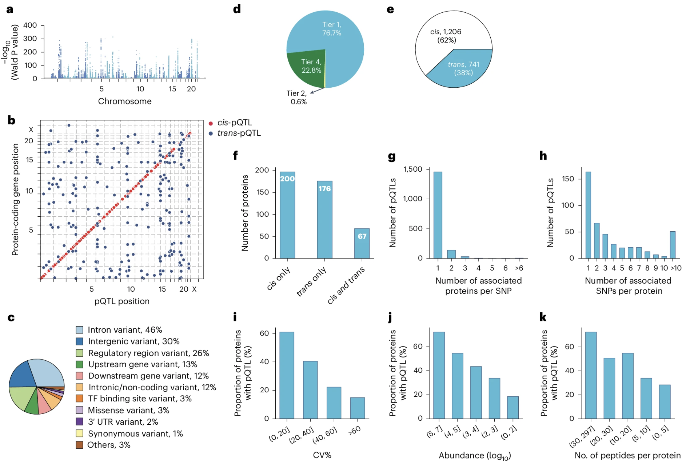
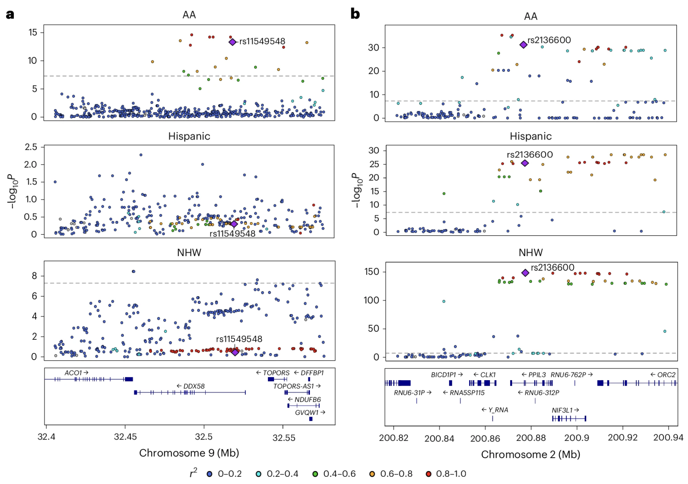

# Chapter 30. QTLs: Connecting alleles to Molecular Traits

You've learned about GWAS, which connects genetic variants to diseases. You've learned about gene regulation, which controls how much RNA and protein gets made. Now let's connect those two worlds.

Here's the question: if you carry a particular genetic variant, does it change how much of a gene gets expressed? Does it change how much protein is made? And if so, by how much?

This is what **Quantitative Trait Locus (QTL)** analyses answer. QTLs measure whether genetic variants affect molecular traits—like RNA levels (**expression QTLs** or **eQTLs**) or protein levels (**protein QTLs** or **pQTLs**). They're the bridge between genotype and molecular phenotype, and they're essential for understanding how DNA variation actually works.

---

## What is a QTL?

A QTL is a genetic variant that's statistically associated with variation in a quantitative trait. That trait could be anything you can measure numerically—height, blood pressure, cholesterol levels. In this chapter, we're focusing on **molecular traits**: gene expression (mRNA levels) or protein abundance.

Here's the basic idea. You have 100 people. You measure the expression of a gene—let's say *APOE*—in their liver tissue using RNA-seq. Some people have high *APOE* expression, some have low expression. Now you genotype a nearby SNP. You notice that people with the **A** allele have higher *APOE* expression on average, while people with the **G** allele have lower expression.

That SNP is an **eQTL** for *APOE*. It's associated with variation in *APOE* mRNA levels across individuals.

---

## How QTL mapping works

The mechanics are straightforward. You need three things:

1. **Genotype data** for a bunch of genetic variants (usually millions of SNPs across the genome)
2. **Molecular phenotype data**—RNA-seq for eQTLs, mass spectrometry for pQTLs
3. **Statistical tests** to see if genotype predicts phenotype

For each gene, you test whether any nearby (or distant) SNPs are associated with its expression or protein level.

### Encoding genotypes

Genotypes are usually coded as 0, 1, or 2, representing the number of copies of the alternate allele:

- **0** = homozygous for the reference allele (e.g., AA)
- **1** = heterozygous (e.g., AG)
- **2** = homozygous for the alternate allele (e.g., GG)

This is called an **additive model** (or **additive encoding**) because it assumes each copy of the alternate allele has an additive effect. If one copy raises expression by 10%, two copies raise it by 20%.

### The molecular phenotype matrix

Expression or protein data are organized as a matrix: rows are genes (or proteins), columns are individuals, and each cell contains a normalized expression value (like TPM for RNA or normalized intensity for proteins).

For example, if you measured 20,000 genes in 500 people, you'd have a 20,000 × 500 matrix. Each row is a gene's expression profile across those 500 people.

### Linear regression

The simplest QTL test is linear regression:

```
Expression = β₀ + β₁ × Genotype + error
```

Where:
- **β₁** is the effect size—how much expression changes per copy of the alternate allele
- **β₀** is the baseline expression level

If β₁ is significantly different from zero, you've found a QTL.

In practice, you add covariates to control for confounding factors—things like sex, age, sequencing batch, or population structure. These can create spurious associations if not accounted for.

### Cis vs trans QTLs

QTLs come in two flavors:

**Cis-QTLs** are variants located near the gene they regulate—usually within ±1 megabase. These are the easiest to detect and interpret. If a SNP is 50 kb upstream of a gene and affects its expression, it's probably in a promoter or enhancer.

**Trans-QTLs** are variants that affect genes far away—on different chromosomes or many megabases distant. These are much weaker and harder to find. Trans-QTLs often work through intermediate factors, like transcription factors or signaling molecules. For example, a variant in a transcription factor gene might affect the expression of hundreds of downstream target genes.

### Multiple testing

When you test millions of SNPs against thousands of genes, you're doing billions of statistical tests. Most will be noise. To avoid false positives, **False Discovery Rate (FDR)** correction or permutation-based thresholds are used to determine which associations are real.

---

## eQTLs: genetic effects on RNA

eQTLs are the most common type of QTL. They tell you whether a genetic variant changes how much mRNA is produced from a gene.

Most disease-associated variants from GWAS are actually eQTLs. They don't change protein sequences—they change gene expression. A single nucleotide change in an enhancer can reduce expression by 20-30%, and that's enough to shift disease risk.

For example, many type 2 diabetes risk variants fall in enhancers that regulate genes in pancreatic beta cells. The variants don't break the genes—they just turn down the volume slightly, reducing insulin production over time.

eQTLs are tissue-specific. A variant might affect expression in the liver but not in the brain, because different tissues use different enhancers and have different chromatin states. The GTEx project mapped eQTLs across 54 human tissues and found that most eQTLs are active in only a subset of tissues ([GTEx Consortium et al 2020, Science](https://www.science.org/doi/10.1126/science.aaz1776)).

---

## pQTLs: genetic effects on protein

pQTLs take things one step further. Instead of measuring RNA, you measure protein levels—usually in blood plasma using mass spectrometry.

Proteins are closer to phenotype than RNA is. RNA tells you what the cell is *trying* to make; protein tells you what it *actually made*. And because proteins are subject to additional layers of regulation—translation efficiency, protein stability, secretion, degradation—pQTLs capture effects that eQTLs might miss.

Interestingly, only about **40-60% of eQTLs** have a corresponding pQTL for the same gene. This discordance happens because:

- **Translation efficiency varies**: Some mRNAs are translated more efficiently than others
- **Protein half-life differs**: Some proteins are quickly degraded after synthesis
- **Post-translational regulation**: Proteins can be modified, sequestered, or secreted in ways that don't depend on RNA levels

So eQTLs tell you about transcriptional control, while pQTLs tell you about the realized protein output after all regulatory layers.

---

## Example 1: Developmental plasma pQTLs in children

Plasma protein levels were measured in **2,147 children and adolescents** using mass spectrometry, identifying 1,216 high-confidence proteins. About **70% of these proteins** were influenced by at least one factor—genetics, age, sex, or BMI ([Niu et al 2025, Nature Genetics](https://www.nature.com/articles/s41588-025-02089-2)).

Genetic effects were widespread: **one-third of all proteins** had at least one significant pQTL. Some variants changed protein levels by just a few percent; others caused up to **30-fold changes**.

The pQTLs mapped to key biological pathways:

- **Growth**: Variants affecting IGF1 and IGFALS (part of the growth hormone axis)
- **Inflammation**: Variants affecting CRP, complement proteins, and coagulation factors
- **Metabolism**: Variants affecting ANGPTL3, APOE, and LBP (lipopolysaccharide-binding protein)

Using Mendelian randomization—a statistical method that uses genetic variants as natural experiments—the study linked **41 causal genes** to **33 cardiometabolic traits** like cholesterol, blood sugar, and inflammatory markers.

The key finding? Genetic control of protein levels is established early in life and persists into adulthood. When the analysis was replicated in adults, the same pQTLs were still active. This means that genetic variants shaping metabolism and immunity in childhood continue to influence lifelong health.



**Figure: Genome-wide pQTLs identified in children and adolescents**. *Panel (a) displays primary pQTLs across all chromosomes, where each point represents a genetic variant tested for association with protein levels—the higher the point, the stronger the association. Panel (b) shows where these pQTLs are located relative to the genes encoding their target proteins, revealing that most pQTLs cluster near their corresponding genes (cis-pQTLs). Panel (c) categorizes pQTLs by variant type—most are non-coding variants in introns or intergenic regions, with only 3% being missense mutations that alter protein sequences. Panel (e) distinguishes between cis-pQTLs (variants within ±1 Mb of the gene) and trans-pQTLs (variants on different chromosomes or far from the gene), showing that local regulation dominates. This demonstrates the pervasive genetic control of the plasma proteome, where genetic variants—mostly in regulatory regions—shape protein abundance throughout development. Source: Niu, L. et al. (2025). Plasma proteome variation and its genetic determinants in children and adolescents. Nature Genetics. https://www.nature.com/articles/s41588-025-02089-2. License: CC-BY 4.0.*

---

## Example 2: Parent-of-origin effects in pQTLs

Most genetic analyses assume that a variant has the same effect whether it comes from your mother or your father. But that's not always true. Some genes are **imprinted**, meaning only one parental copy is expressed.

UK Biobank data were used to test whether pQTLs show **parent-of-origin effects (POEs)**—cases where the maternal and paternal alleles have different effects on protein levels or disease risk ([Hofmeister et al 2025, Nature](https://www.nature.com/articles/s41586-025-09357-5)).

The study analyzed ~109,000 participants and tested over 14,000 known pQTLs for parent-specific effects. More than **30 significant POEs** were identified, including classic imprinted loci like:

- **H19-IGF2**: Involved in growth; the paternal allele of IGF2 is expressed while the maternal allele is silenced
- **KCNQ1**: A potassium channel gene implicated in diabetes; shows parent-specific regulation
- **KLF14/MEST**: Two nearby genes with opposite imprinting patterns—KLF14 is maternally expressed, MEST is paternally expressed

What's striking is that **40% of these POEs showed antagonistic effects**—the maternal and paternal alleles pushed traits in opposite directions. For example, at one locus, the maternal allele increased triglycerides while the paternal allele decreased them.

This matters because standard additive models miss these effects. If you average over maternal and paternal contributions, you underestimate the true variance explained by genetics.

The findings were replicated in the Estonian Biobank (~85,000 people) and Norwegian MoBa cohort (~42,000 offspring), with **~87% of associations confirmed**.

---

## Example 3: Multi-ancestry brain pQTLs

Most QTL studies have been done in European-ancestry populations, but genetic architecture can differ across ancestries. Brain pQTLs were mapped in a multi-ancestry cohort: **1,362 brain donors** from African-American, Hispanic/Latino, and non-Hispanic White backgrounds ([Wingo et al 2025, Nature Genetics](https://www.nature.com/articles/s41588-025-02291-2)).

The study quantified ~11,750 proteins and identified **858 fine-mapped causal pQTLs**. By integrating these pQTLs with GWAS data for neurological and psychiatric diseases, **119 pQTL-protein-trait triads** were found linking genetic variants to protein levels to disease risk.

The causal proteins fell into several functional categories:

- **Synaptic signaling**: Proteins involved in neurotransmitter release and receptor trafficking
- **Immune and complement pathways**: Inflammation in the brain, especially relevant for Alzheimer's disease
- **Mitochondrial metabolism**: Energy production and oxidative stress

About **29% of causal pQTLs** were in coding regions (missense or nonsense variants that directly change the protein). The rest were in **promoters, UTRs, or enhancers**, showing that both transcriptional and post-transcriptional regulation shape brain protein levels.

Importantly, **ancestry-specific signals** were found. For example, novel loci for alcohol use disorder appeared only in African-ancestry data. This highlights that genetic architecture isn't universal—some regulatory variants are population-specific.

Predictive models trained on one ancestry generally worked well in others, but not perfectly. This means multi-ancestry studies are essential for capturing the full picture of genetic regulation.



**Figure: Population-specific and shared brain pQTLs across ancestries**. *These LocusZoom plots illustrate genetic regulation patterns across populations. Panel (a) shows the DDX58 locus on chromosome 9, where a pQTL (purple diamond) is specific to African Americans—the variant strongly associates with DDX58 protein levels in the AA population but not in Hispanic or non-Hispanic white populations. Panel (b) shows the PPIL3 locus on chromosome 2, where a pQTL is shared across all three populations, demonstrating multiancestry regulation. Each point represents a genetic variant, with the y-axis showing association strength (−log P value) and the x-axis showing genomic position. Point colors indicate linkage disequilibrium (r²) with the lead causal variant (purple diamond), helping distinguish true causal signals from correlated variants. This comparison reveals that while most causal pQTLs are shared across ancestries, some regulatory variants show population-specific effects, underscoring the importance of multi-ancestry studies for understanding protein regulation. Source: Wingo, T. S. et al. (2025). Multiancestry brain pQTL fine-mapping and integration with genome-wide association studies of 21 neurologic and psychiatric conditions. Nature Genetics. https://www.nature.com/articles/s41588-025-02291-2. License: CC-BY 4.0.*

---

## Interpreting QTLs: what they tell you (and what they don't)

QTLs are powerful, but they come with caveats.

### Association is not causation

A significant QTL means a variant correlates with a molecular trait. But correlation doesn't prove the variant directly causes the change. The variant might be in linkage disequilibrium with the true causal variant, or it might act through an intermediate factor.

For example, the famous *FTO* locus is associated with obesity. But the causal mechanism doesn't involve *FTO* itself—it involves a distant enhancer that regulates *IRX3*, a gene involved in energy metabolism. The *FTO* variants are just markers tagging the real functional element.

To prove causality, you need functional validation: CRISPR perturbations, reporter assays, or colocalization with disease GWAS signals.

### Tissue and cell-type specificity

Most QTL effects are context-dependent. A variant might regulate expression only in specific tissues or cell types.

For example:
- An *APOE* eQTL in the liver affects cholesterol metabolism
- An *IL2RA* eQTL in T cells affects immune activation, but only after cytokine stimulation
- A *KLF14* pQTL in adipose tissue regulates insulin sensitivity, but only in females

This is why eQTL databases like GTEx provide tissue-specific data. If you want to understand a diabetes risk variant, you should look at pancreatic islet eQTLs, not brain eQTLs.

### eQTLs don't always predict pQTLs

RNA and protein levels are correlated, but not perfectly. Many eQTLs have no corresponding pQTL because:

- **Post-transcriptional regulation**: mRNA splicing, stability, or localization can change without affecting protein
- **Translation efficiency**: Some mRNAs are translated more efficiently than others
- **Protein stability**: Some proteins are rapidly degraded after synthesis

So eQTLs tell you about *potential* protein changes, while pQTLs tell you about *realized* protein output.

### Effect sizes are usually small

Most QTLs have modest effects. A typical cis-eQTL explains 5-20% of variance in gene expression. Trans-QTLs explain less than 1%. pQTLs tend to be even smaller—1-5% per locus—because additional regulatory layers dilute the genetic signal.

But small effects matter. Complex traits are shaped by thousands of small-effect variants, and the cumulative burden adds up. That's the essence of polygenic architecture.

### Statistical challenges

QTL mapping involves testing millions of SNP-gene pairs, so multiple testing correction is essential. Population structure can also create spurious associations if not controlled. And measurement noise—batch effects in RNA-seq, variability in proteomics—can obscure real signals or inflate false ones.

Large sample sizes help. For trans-QTLs and rare-variant effects, you need tens of thousands of samples to achieve statistical power.

---

## Integrating QTLs with GWAS: finding causal genes

The real power of QTLs emerges when you combine them with GWAS.

Here's the workflow:

1. **GWAS identifies a disease-associated locus**—let's say a region on chromosome 19 linked to Alzheimer's disease
2. **eQTL/pQTL mapping shows that the same variants affect *APOE* and *CLU* expression** in astrocytes
3. **Colocalization analysis tests whether the GWAS signal and the QTL signal are driven by the same causal variant**
4. **If they colocalize, you have strong evidence that dysregulation of *APOE* and *CLU* mediates Alzheimer's risk**

This approach has identified causal genes for hundreds of GWAS loci. Without QTL data, GWAS can only point to a genomic region—it can't tell you which gene in that region actually matters.

**Mendelian randomization** takes this further. It uses genetic variants as instrumental variables to test whether changing a molecular trait causally affects disease risk. For example, if raising *APOE* protein levels reduces Alzheimer's risk, that suggests APOE is a therapeutic target.

---

## QTLs in systems biology: building regulatory networks

QTLs don't act in isolation. They're part of larger regulatory networks where transcription factors, signaling pathways, and chromatin modifiers interact.

By integrating eQTLs, pQTLs, and protein-protein interaction data, you can map how genetic variants propagate through molecular layers:

```
DNA variant → RNA expression (eQTL) → Protein level (pQTL) → Pathway activity → Cellular phenotype → Disease risk
```

This systems view reveals:
- **Master regulators**: Variants in transcription factors that affect hundreds of downstream genes
- **Shared regulation**: Gene modules that are co-regulated by the same variants
- **Pathway-level effects**: How variants influence entire biological processes, not just individual genes

For example, variants in immune genes often form trans-eQTL hotspots—single loci affecting dozens of immune response genes. This suggests they regulate a shared immune pathway rather than acting on each gene independently.

---

## Summary

QTLs bridge the gap between DNA variation and molecular traits, transforming human genetics from a static "gene → disease" model to a dynamic "variant → regulation → molecular trait → disease" framework. eQTLs measure genetic effects on RNA levels while pQTLs measure genetic effects on protein levels, revealing that most disease-associated GWAS variants work by changing gene expression rather than protein sequences. These effects are highly tissue-specific and context-dependent, with only 40-60% of eQTLs showing corresponding pQTLs—demonstrating that RNA and protein regulation operate as distinct regulatory layers. Individual QTL effect sizes are usually small, explaining just 1-20% of variance in molecular traits, but thousands of these small effects accumulate across the genome to shape complex traits and disease risk.

The power of QTLs lies in their ability to explain GWAS hits, reveal tissue-specific disease mechanisms, guide drug development, and connect biological layers. Most GWAS variants are non-coding and work through gene regulation, making QTLs essential for identifying which genes they actually regulate and in which cell types the action occurs. When a pQTL shows that raising a protein level reduces disease risk, that protein becomes a therapeutic target. By measuring both RNA and protein, QTLs reveal how genetic effects propagate through regulatory networks, and inter-individual variation in drug response can be traced to eQTLs and pQTLs affecting drug-metabolizing enzymes and targets—enabling precision medicine approaches.

Key discoveries from QTL studies include parent-of-origin effects where imprinted genes show maternal versus paternal allele-specific regulation, ancestry-specific regulatory variants that differ across populations, and developmental timing effects where genetic control established in childhood persists throughout life. Integrating QTLs with GWAS through colocalization and Mendelian randomization has identified causal genes for hundreds of disease loci—without QTL data, GWAS can only point to broad genomic regions, but QTLs pinpoint which genes actually matter and how to target them therapeutically.